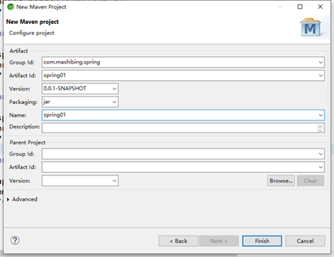

# IoC与动态代理

## 课程主要内容

- Maven管理项目依赖

- 工厂方法

- 自动注入

- 注解

- Aop概念与代理

# Maven方式创建Spring工程

## 工程创建

1.新建项目 选择Maven Project

​                                                  

2.勾选 Create a simple project

   

3.添加项目信息

   

- Group id ：包名

- Artifact id：标识名

- Name：项目名

## 依赖引入

### Maven 中央仓库

地址https://mvnrepository.com/

### 使用国内镜像

创建一个maven的配置文件

参照：

http://maven.apache.org/settings.html

   

### Pom.xml

    ```xml
		<!-- https://mvnrepository.com/artifact/org.springframework/spring-beans -->
		<dependency>
			<groupId>org.springframework</groupId>
			<artifactId>spring-beans</artifactId>
			<version>5.1.7.RELEASE</version>
		</dependency>
		<!-- https://mvnrepository.com/artifact/org.springframework/spring-context -->
		<dependency>
			<groupId>org.springframework</groupId>
			<artifactId>spring-context</artifactId>
			<version>5.1.7.RELEASE</version>
		</dependency>
		<!-- https://mvnrepository.com/artifact/org.springframework/spring-core -->
		<dependency>
			<groupId>org.springframework</groupId>
			<artifactId>spring-core</artifactId>
			<version>5.1.7.RELEASE</version>
		</dependency>
		<!-- https://mvnrepository.com/artifact/org.apache.commons/commons-lang3 -->
		<dependency>
			<groupId>org.apache.commons</groupId>
			<artifactId>commons-lang3</artifactId>
			<version>3.9</version>
		</dependency>


    ```


 

 

# 空值注入

## Value标签

标识空值 或空字符串 “”

```
<property name="name"><value></value></property>
```


## Null标签

标识Null

```
<property name="name"><null></null></property>
```


# 工厂方式注入

为满足更复杂的需求，Spring也提供了工厂方式来创建更加灵活的Bean。

**留意观察工厂类和实现类的创建次数**

## 动态工厂

抽象接口 Car

```java
public interface Car {

     public String getName();

     public String getPrice();

}
```

实现类 BMW车

```java
public class Bmw implements Car{

 

     public String getName() {

            // TODO Auto-generated method stub

            return "别摸我";

     }

     public String getPrice() {

            // TODO Auto-generated method stub

            return "500000RMB";

     }

}
```


汽车工厂类 CarFactory

```java
public class CarFactory {

	public Car getCar(String name) throws Exception{
		
		if (name.endsWith("bmw")) {
			return new Bmw();
		}else {
				throw new Exception("car not fond");
		}
	}
}

```


Bean配置

```xml
<bean id="carFactory" class="com.msb.CarFactory"></bean>
<bean id="car" factory-bean="carFactory" factory-method="getCar" >
	<constructor-arg value="bmw"></constructor-arg>
</bean>

```


## 静态工厂

 

Bean配置

```xml
<bean id="carStatic" class="com.msb.CarFactoryStatic" factory-method="getCar">
 <constructor-arg value="bmw"></constructor-arg>
</bean>

```


工厂类

```java
public class CarFactoryStatic {

	public static Car getCar(String name) throws Exception{
		
		if (name.endsWith("bmw")) {
			return new Bmw();
		}else {
				throw new Exception("car not fond");
		}
	}
}

```


# autowire自动注入

使用自动需要在配置文件中bean上添加**autowire**

```xml
<bean id="person" class="com.msb.Person" autowire="byName">
</bean>
<bean id="pet" class="com.msb.Pet">
 	<property name="name" value="kele"></property>
</bean>

```

 

**实体**

```java
public class Person {

	private String name;
	private Pet pet;
}
public class Pet {

	private String name;
}

```


可选两种类型

## byName

byName方式自动注入：要求注入的bean的id必须和被注入的bean对象的属性名一致

## byType

byType方式自动注入：要求注入的bean的对象类型与被注入的bean对象类型一致，并且在配置文件中的Bean相同类型必须唯一

如果存在多个，会抛异常：

No qualifying bean of type 'com.msb.Pet' available: expected single matching bean but found 2: pet,pet2

## 全局自动注入

在首行Beans标签下添加default-autowire属性。

```xml
<beans xmlns="http://www.springframework.org/schema/beans"
	xmlns:xsi="http://www.w3.org/2001/XMLSchema-instance"
	xmlns:p="http://www.springframework.org/schema/p"
	xsi:schemaLocation="http://www.springframework.org/schema/beans           http://www.springframework.org/schema/beans/spring-beans.xsd"
	
	default-autowire="byType"
	>

```


# annotation注解注入

使用注解需要导入AOP包

在配置文件中添加Context约束

```xml
<beans xmlns="http://www.springframework.org/schema/beans"
	xmlns:xsi="http://www.w3.org/2001/XMLSchema-instance"
	xmlns:p="http://www.springframework.org/schema/p"
	xmlns:context="http://www.springframework.org/schema/context"
	xsi:schemaLocation="
	http://www.springframework.org/schema/beans           http://www.springframework.org/schema/beans/spring-beans.xsd
	http://www.springframework.org/schema/context			http://www.springframework.org/schema/context/spring-context.xsd
	"
	>

```


## **<context:component-scan>**


```xml
<context:component-scan base-package="com.msb"></context:component-scan>
```

**component-scan**可以自动扫描包内容，并注册Bean到Spring容器

## @Component

在需要注册到容器的类上添加@Component标签，标识这个类由Spring容器接管

### 约定大于配置

在一个类上添加@Component默认会使用首字母小写的类名作为ID注册到Spring容器。

如果需要手动指定Bean Id可以使用**@Component("p")**

### 同属@Component的额外三个注解

@Controller @Service @Repository

这三个注意在MVC开发中会经常用到，除了注解名字和Component不一样之外，其余功能都一样。

Spring额外提供这三个注解的目的主要是为了区分MVC中每个类的区别。

## @Scope

使用注解注册Bean 默认的作用域还是singleton，可以使用@Scope("prototype")改变对象作用域

## @Value

 

在使用注解给对象注入值的时候，不再需要Get/Set方法

### 基础类型

使用@Value注解

```java
	@Value("小明")
	private String name;

```


 

### 对象引用

```java
	@Autowired
	private Pet MyPet;
```

使用@Autowired注解

默认是ByType的，如果需要ByName需要配合@Qualifier注解