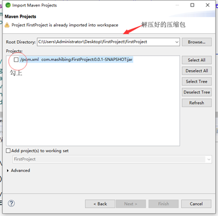
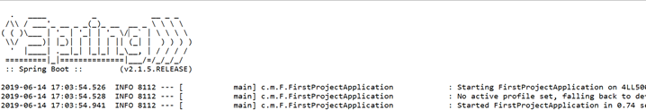
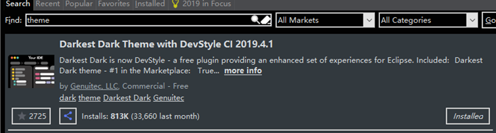
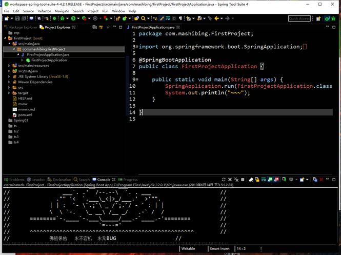
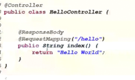
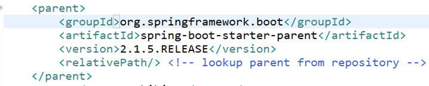
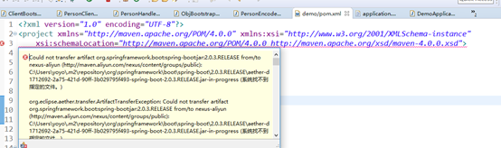

# 《SpringBoot 2.x》入门：框架介绍与HelloWorld

- MVC架构思想
- 使用STS构建SpringBoot项目
- 使用SpringBoot构建Mvc web项目
- MVCWeb项目中的注入
- 热部署

# 介绍

SpringBoot主要解决的是在微服务的架构下简化配置（有快速配置）、前后端分离、快速开发

优点：

- 提供了快速启动入门

- 开箱即用、提供默认配置

- 内嵌容器化web项目

- 没有冗余代码生成和xml配置要求

## 2.运行Demo

### 创建项目

创建SpringBoot项目的几种方式：

- 官网的Initializr

- 使用Eclipse、STS、Idea等IDE创建Maven项目并引入依赖

- 使用STS插件的Spring Initializr创建项目


访问http://start.spring.io/  进入Spring项目Initializr

​                                                  

生成下载demo.zip

### 导入项目

#### 1.Import一个Maven项目

   

#### 2.选择要导入的文件

   

#### 3.项目骨架

   

### 启动项目

- 直接run启动程序里的Main（）方法

- 安装过STS插件或使用STS可以在项目上右键RunAS->Spring Boot APP

运行成功提示信息：

   

如果运行报错，请参照常见问题。

## 个性化

### 修改启动banner

在resources目录下新建banner.txt

http://www.network-science.de/ascii/  英文

https://www.degraeve.com/img2txt.php 图片

 

### Eclipse的皮肤

菜单栏中

Help -> EclipseMarketplace

搜索Theme

   

傻瓜式安装这个，安装完成会提示重启，跟随指引选择喜欢的风格。

   

## 简单使用

### application.properties

把所有的配置全放在这个文件里，方便统一管理，maven也可以做到

### 修改tomcat端口

`server.port=90`

### 修改项目路径

`server.servlet.context-path=/demo `

   

 

### 多个入口main方法，打包之后找不到入库类

```xml
<build>
   <plugins>
      <plugin>  
          <groupId>org.springframework.boot</groupId>  
          <artifactId>spring-boot-maven-plugin</artifactId>  
                <configuration>  
                    <mainClass>com.mashibing.MyApp</mainClass>  
                </configuration>  
            </plugin>  
        </plugins>
</build>


```


 

### HelloWorld

#### RestController

`RestController = @Controller+@ResponseBody`

   

一个效果

 

```java
@RestController

public class MyAppController {

	@RequestMapping("/")
	public Map<String, String>  index() {
		Map<String, String> map = new HashMap<>();
		
		map.put("aaa", "bbb");
		map.put("aaa", "bbb");
		map.put("aaa", "bbb");
		map.put("aaa", "bbb");
		return map;
	}

```


 

#### 使用thymeleaf模板引擎

##### Pom.xml引用

```xml
		<dependency>
			<groupId>org.springframework.boot</groupId>
			<artifactId>spring-boot-starter-thymeleaf</artifactId>
		</dependency>

```


##### Controller代码

```java
@Controller
public class IndexController {

	@RequestMapping("/")
	public String index(ModelMap map) {

		// 加入一个属性，用来在模板中读取
		map.addAttribute("msg", "nihao~");
		return模板文件的名称，对应src/main/resources/templates/index.html

		return "index";
	}

```


##### 模板文件代码

```html
<h1 th:text="${msg}">hi!</h1>
```


 

### 稍微复杂的restful api应用

#### UserRestfulController

```java
UserRestfulController
@RequestMapping("/")
@RestController
public class UserRestfulController {

	static Map<Long, User> users = Collections.synchronizedMap(new HashMap<Long,User>());
	@RequestMapping(value="/User",method=RequestMethod.GET)
	public List<User> getUserList(){
		ArrayList<User> list = new ArrayList<>(users.values());
		return 	list;
		
	}
	
	@RequestMapping(value="User",method=RequestMethod.POST)
	public String addUser(@ModelAttribute User user) {
		users.put(user.getId(), user);
		return "addUser Success";
		
	}
}

```


#### User

```java
public class User {

	private Long id;
	private String loginName;
	private String password;
	private String nickName;

```


### 注入Service

#### UserRestfulController

```java
	@Autowired
	private UserService userSrv;
	
	
	@RequestMapping(value="/User",method=RequestMethod.GET)
	public List<User> getUserList(){

		return 	userSrv.getUserList();
	}
	
	@RequestMapping(value="User",method=RequestMethod.POST)
	public String addUser(@ModelAttribute User user) {
		String msg = userSrv.addUser(user);
		return msg;
		
	}

```


#### UserService

```java
@Service
public class UserService {
	static Map<Long, User> users = Collections.synchronizedMap(new HashMap<Long,User>());

	public List<User> getUserList() {
		ArrayList<User> list = new ArrayList<>(users.values());
		return list;
	}

	public String addUser(User user) {
		users.put(user.getId(), user);
		return "addUser Success";
		}
}

```


### 前端模板显示

```html
  <h1>User list</h1>

  <table>
    <tr>
      <th>NAME</th>
      <th>loginName</th>
      <th>nickName</th>
    </tr>
    <tr th:each="user : ${list}">
      <td th:text="${user.id}">id</td>
      <td th:text="${user.loginName}">loginName</td>
      <td th:text="${user.nickName}">nickName</td>
    </tr>
  </table>

  <p>
    <a href="../home.html" th:href="@{/}">Return to home</a>
  </p>

```


 

## 常见问题

### Pom.xml

Springboot项目必须要继承的parnet

   

### Pom.xml第一行报错 

   

进入本地库

for /r %i in (*.lastUpdated) do del %i   

然后update

### 缺少或包错误

   

删掉 重新update

### 找不到主类

   

所有错误都解决后

Jar方式运行 首先得有这个jar包

先clean package 生成jar文件，然后再run main方法

 

### 找不到jdk

   

   

把jre的路径换成jdk的

 

### 启动后自动停止

   

 