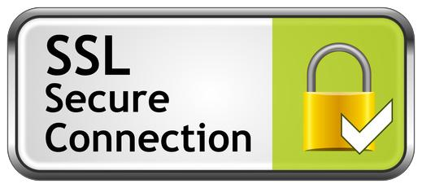
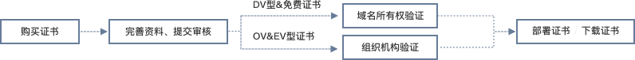

# Tengine 补充

[TOC]


## 开机启动

```
chkconfig --list
chkconfig --add nginx
chkconfig nginx on
```

## 时间问题

```
service ntpd status

```


## 虚拟目录

       location /www {
            alias  /var/data/www1;
            index  index.html index.htm a.html;
        }
## 自动索引

       location /art {
            alias  /var/data/www1/;
              autoindex on;
       
        }
## 动静分离

```
      location / {
		proxy_pass http://192.168.150.11:803;
    
        }

     
     
     location ~ .*\.(gif|jpg|jpeg|png|bmp|swf|html|htm|css|js)$ {
            root  /var/data/www1/;
	       
        }

```

# SSL




SSL 能够帮助系统在客户端和服务器之间建立一条安全通信通道。SSL 安全协议是由 Netscape Communication 公司在 1994 年设计开发，SSL 依赖于加密算法、极难窃听、有较高的安全性，因此 SSL 协议已经成为网络上最常用的安全保密通信协议，该安全协议主要用来提供对用户和服务器的认证；对传送的数据进行加密和隐藏；确保数据在传送中不被改变，即数据的完整性，现已成为该领域中全球化的标准。

### SSL 和 TLS

所有的X.509证书包含以下数据：

1、X.509版本号：指出该证书使用了哪种版本的X.509标准，版本号会影响证书中的一些特定信息。目前的版本是3。

2、证书持有人的[公钥](https://baike.baidu.com/item/公钥)：包括证书持有人的公钥、算法(指明密钥属于哪种密码系统)的标识符和其他相关的密钥参数。

3、证书的序列号：由CA给予每一个证书分配的唯一的数字型编号，当证书被取消时，实际上是将此证书序列号放入由CA签发的CRL（Certificate Revocation List证书作废表，或证书黑名单表）中。这也是序列号唯一的原因。

4、主题信息：证书持有人唯一的标识符(或称DN-distinguished name)这个名字在 Internet上应该是唯一的。DN由许多部分组成，看起来象这样：

CN=Bob Allen, OU=Total Network Security Division

O=Network Associates, Inc.

C=US

这些信息指出该科目的通用名、组织单位、组织和国家或者证书持有人的姓名、服务处所等信息。

5、证书的有效期：证书起始日期和时间以及终止日期和时间；指明证书在这两个时间内有效。

6、认证机构：证书发布者，是签发该证书的实体唯一的CA的X.509名字。使用该证书意味着信任签发证书的实体。(注意：在某些情况下，比如根或顶级CA证书，发布者自己签发证书)

7、发布者的数字签名：这是使用发布者[私钥](https://baike.baidu.com/item/私钥)生成的签名，以确保这个证书在发放之后没有被撰改过。

8、签名算法标识符：用来指定CA签署证书时所使用的签名算法。算法标识符用来指定CA签发证书时所使用的[公开密钥](https://baike.baidu.com/item/公开密钥)算法和HASH算法。


## 抓包工具

### 青花瓷

https://www.charlesproxy.com/latest-release/download.do

## 对称加密与非对称加密

非对称加密算法需要两个密钥：公开密钥（publickey）和私有密钥（privatekey），公开密钥与私有密钥是一对，如果用公开密钥对数据进行加密，只有用对应的私有密钥才能解密；如果用私有密钥对数据进行加密，那么只有用对应的公开密钥才能解密。因为加密和解密使用的是两个不同的密钥，所以这种算法叫作非对称加密算法。

## CA（Certificate Authority）

CA 是负责签发证书、认证证书、管理已颁发证书的机关。它要制定政策和具体步骤来验证、识别用户身份，并对用户证书进行签名，以确保证书持有者的身份和公钥的拥有权。



常见的ca厂商

- Symantec
- Comodo
- Godaddy
- GlobalSign
- Digicert
- VeriSign

- GeoTrust
- Thawte
- Network Solutions

 CA 供应商之间的区别主要有：机构品牌、证书加密方式、保险额度、服务与质量、浏览器支持率等

## 证书种类


- DV（Domain Validation）证书只进行域名的验证，一般验证方式是提交申请之后CA会往你在whois信息里面注册的邮箱发送邮件，只需要按照邮件里面的内容进行验证即可。

- OV（Organization Validation）证书在DV证书验证的基础上还需要进行公司的验证，一般他们会通过购买邓白氏等这类信息库来查询域名所属的公司以及这个公司的电话信息，通过拨打这个公司的电话来确认公司是否授权申请OV证书。

- EV证书一般是在OV的基础上还需要公司的金融机构的开户许可证，不过不同CA的做法不一定一样，例如申请人是地方政府机构的时候是没有金融机构的开户证明的，这时候就会需要通过别的方式去鉴别申请人的实体信息。


## 多网站公用同一证书

## OPenSSL 自签名

certmgr.msc


- key  私钥  =  明文 自己生成的
- csr 公钥    = 由私钥生成 
- crt 证书    = 公钥 + 签名

下载 

http://slproweb.com/products/Win32OpenSSL.html

### 生成私钥

genrsa

制台输入 genrsa，会默认生成一个 2048 位的私钥

```
openssl genrsa -des3 -out server.key 1024
```


### 由私钥生成公钥

```
openssl req -new -key c:/dev/my.key -out c:/dev/my.csr
openssl req -new -key server.key -out server.csr
```

查看证书

 Common Name，这里输入的域名即为我们要使用 HTTPS 访问的域名

```
req -text -in c:/dev/my.csr -noout
```


生成解密的key 

```
openssl rsa -in server.key -out server.key.unsecure
```


### 签名

工具

https://sourceforge.net/projects/xca/

```
 x509 -req -days 365 -in c:/dev/my.csr -signkey c:/dev/my.key -out c:/dev/sign.crt
 openssl x509 -req -days 365 -in server.csr -signkey server.key.unsecure -out server.crt

```

查看证书

```
x509 -text -in c:\openSSLDemo\fd.crt -noout
```

- Country Name (2 letter code) [XX]:CN           #请求签署人的信息
- State or Province Name (full name) []: #请求签署人的省份名字
- Locality Name (eg, city) [Default City]:# 请求签署人的城市名字
- Organization Name (eg, company) [Default Company Ltd]:#请求签署人的公司名字
- Organizational Unit Name (eg, section) []:#请求签署人的部门名字
- Common Name (eg, your name or your server's hostname) []:#这里一般填写请求人的的服务器域名， 


问题

```
4928:error:2807106B:UI routines:UI_process:processing error:crypto\ui\ui_lib.c:543:while reading strings
4928:error:0906906F:PEM routines:PEM_ASN1_write_bio:read key:crypto\pem\pem_lib.c:357:
```


## SSL/TLS协议四次握手


SSL/TSL协议基本过程：

1.  客户端向服务器端索要并验证公钥。
2.  双方协商生成"对话密钥"。
3.  双方采用"对话密钥"进行加密通信。


SSL/TSL通过四次握手，主要交换三个信息：

1.  数字证书：该证书包含了公钥等信息，一般是由服务器发给客户端，接收方通过验证这个证书是不是由信赖的CA签发，或者与本地的证书相对比，来判断证书是否可信；假如需要双向验证，则服务器和客户端都需要发送数字证书给对方验证；
2. 三个随机数：这三个随机数构成了后续通信过程中用来对数据进行对称加密解密的“对话密钥”。首先客户端先发第一个随机数N1，然后服务器回了第二个随机数N2（这个过程同时把之前提到的证书发给客户端），这两个随机数都是明文的；而第三个随机数N3（这个随机数被称为Premaster secret），客户端用数字证书的公钥进行非对称加密，发给服务器；而服务器用只有自己知道的私钥来解密，获取第三个随机数。这样，服务端和客户端都有了三个随机数N1+N2+N3，然后两端就使用这三个随机数来生成“对话密钥”，在此之后的通信都是使用这个“对话密钥”来进行对称加密解密。因为这个过程中，服务端的私钥只用来解密第三个随机数，从来没有在网络中传输过，这样的话，只要私钥没有被泄露，那么数据就是安全的。
3. **加密通信协议：**就是双方商量使用哪一种加密方式，假如两者支持的加密方式不匹配，则无法进行通信；


### 客户端发出请求（ClientHello）

首先，客户端（通常是浏览器）先向服务器发出加密通信的请求，这被叫做ClientHello请求。

在这一步，客户端主要向服务器提供以下信息。

```html
（1） 支持的协议版本，比如TLS 1.0版。
（2） 一个客户端生成的随机数，稍后用于生成"对话密钥"。
（3） 支持的加密方法，比如RSA公钥加密。
（4） 支持的压缩方法。
```

### 服务器回应（SeverHello）


```
（1） 确认使用的加密通信协议版本，比如TLS 1.0版本。如果浏览器与服务器支持的版本不一致，服务器关闭加密通信。
（2） 确认使用的加密方法，比如RSA公钥加密，返回加密公钥
（3） 服务器证书
```


### 客户端回应

```

a) 验证证书的合法性（颁发证书的机构是否合法，证书中包含的网站地址是否与正在访问的地址一致等），如果证书受信任，则浏览器栏里面会显示一个小锁头，否则会给出证书不受信的提示。
b) 如果证书受信任，或者是用户接受了不受信的证书，浏览器会生成一串随机数的密码，并用证书中提供的公钥加密。
c) 使用约定好的HASH计算握手消息，并使用生成的随机数对消息进行加密，最后将之前生成的所有信息发送给网站。
```

### 服务器

```
a) 使用自己的私钥将信息解密取出密码，使用密码解密浏览器发来的握手消息，并验证HASH是否与浏览器发来的一致。
b) 使用密码加密一段握手消息，发送给浏览器。
```


## 自制CA证书

我们用的操作系统（windows, linux, unix ,android, ios等）都预置了很多信任的根证书，比如我的windows中就包含VeriSign的根证书，那么浏览器访问服务器比如支付宝www.alipay.com时，SSL协议握手时服务器就会把它的服务器证书发给用户浏览器，而这本服务器证书又是比如VeriSign颁发的，自然就验证通过了。

### 创建CA证书


因为要创建根证书，这里选择序号为1的自认证证书，签名算法选择SHA 256，证书模版选择默认CA，再点击Apply all（这个不能漏）


再切到Subject页面，填好各个字段，都可以随便填，再点击Generate a new key生产私钥


最后点击OK，CA证书做好了，有效期默认10年


将根证书导出成只包含公钥的证书格式，这本根证书就是放在网站上供用户下载安装，或主动安装到客户机器中的：


### 制作服务器证书、客户端证书

选择已经制作好的根CA，然后点击New Certificate


选择服务器端证书，


填好信息并创建私钥

