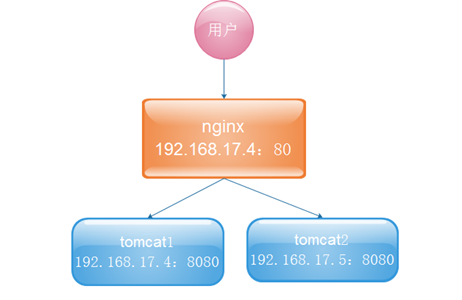

[TOC]


# Tengine

## Nginx和Tengine

### Nginx

Nginx ("engine x") 是一个高性能的 **HTTP** 和 **反向代理** 服务器，也是一个 IMAP/POP3/SMTP 代理服务器。

•第一个公开版本0.1.0发布于2004年10月4日。

  其将源代码以类BSD许可证的形式发布，因它的稳定性、丰富的功能集、示例配置文件和低系统资源的消耗而闻名

  官方测试nginx能够支撑5万并发链接，并且cpu、内存等资源消耗却非常低，运行非常稳定

2011年6月1日，nginx 1.0.4发布。

  Nginx是一款轻量级的Web 服务器/反向代理服务器及电子邮件（IMAP/POP3）代理服务器，并在一个BSD-like 协议下发行。由俄罗斯的程序设计师Igor Sysoev所开发，

  其特点是占有内存少，并发能力强，事实上nginx的并发能力确实在同类型的网页服务器中表现较好，中国大陆使用nginx网站用户有：新浪、网易、腾讯等。


功能：

- web服务器

- web reverse proxy

- smtp reverse proxy

  

### Nginx和apache的优缺点

#### nginx相对于apache的优点：

- 轻量级，同样起web 服务，比apache 占用更少的内存及资源 
- 抗并发，nginx 处理请求是异步非阻塞的，而apache 则是阻塞型的，在高并发下nginx 能保持低资源低消耗高性能 
- 高度模块化的设计，编写模块相对简单
- 社区活跃，各种高性能模块出品迅速

####  apache 相对于nginx 的优点：

- rewrite ，比nginx 的rewrite 强大
- 模块超多，基本想到的都可以找到
- 少bug ，nginx 的bug 相对较多 


Nginx 配置简洁, Apache 复杂 

最核心的区别在于apache是同步多进程模型，一个连接对应一个进程；

nginx是异步的，多个连接（万级别）可以对应一个进程

## Nginx解决的问题

- 高并发

- 负载均衡

- 高可用
- 虚拟主机
- 伪静态
- 动静分离

## 安装

### 准备工作

#### 操作系统

最好使用linux操作系统，课上使用VirtualBox或VMware虚拟机搭建centos6.x做实验。

系统依赖组件 ``` gcc openssl-devel pcre-devel zlib-devel```

安装：``yum install gcc openssl-devel pcre-devel zlib-devel ``


#### Tengine下载和文档

http://tengine.taobao.org/

#### Nginx官网和文档

http://nginx.org

上传Nginx压缩包到服务器，一般安装在/usr/local目录下

### 编译安装

``` shell
./ configure --prefix=/安装路径

make && make install
```


## 启动服务

### 脚本自启动

拷贝附件提供的Nginx启动脚本文件内容到`/etc/init.d/nginx`这个文件中

目录下如果没有这个文件的话需要手动创建

#### 修改可执行权限

chmod 777 nginx

#### 启动服务

service Nginx start  启动服务

service Nginx stop 停止

service Nginx status 状态

service Nginx reload 动态重载配置文件

#### 脚本内容：

```shell
#!/bin/sh
#
# nginx - this script starts and stops the nginx daemon
#
# chkconfig:   - 85 15 
# description:  Nginx is an HTTP(S) server, HTTP(S) reverse \
#               proxy and IMAP/POP3 proxy server
# processname: nginx
# config:      /etc/nginx/nginx.conf
# config:      /etc/sysconfig/nginx
# pidfile:     /var/run/nginx.pid
 
# Source function library.
. /etc/rc.d/init.d/functions
 
# Source networking configuration.
. /etc/sysconfig/network
 
# Check that networking is up.
[ "$NETWORKING" = "no" ] && exit 0
 
nginx="/usr/local/tengine/sbin/nginx"
prog=$(basename $nginx)
 
NGINX_CONF_FILE="/usr/local/tengine/conf/nginx.conf"
 
[ -f /etc/sysconfig/nginx ] && . /etc/sysconfig/nginx
 
lockfile=/var/lock/subsys/nginx
 
make_dirs() {
   # make required directories
   user=`nginx -V 2>&1 | grep "configure arguments:" | sed 's/[^*]*--user=\([^ ]*\).*/\1/g' -`
   options=`$nginx -V 2>&1 | grep 'configure arguments:'`
   for opt in $options; do
       if [ `echo $opt | grep '.*-temp-path'` ]; then
           value=`echo $opt | cut -d "=" -f 2`
           if [ ! -d "$value" ]; then
               # echo "creating" $value
               mkdir -p $value && chown -R $user $value
           fi
       fi
   done
}
 
start() {
    [ -x $nginx ] || exit 5
    [ -f $NGINX_CONF_FILE ] || exit 6
    make_dirs
    echo -n $"Starting $prog: "
    daemon $nginx -c $NGINX_CONF_FILE
    retval=$?
    echo
    [ $retval -eq 0 ] && touch $lockfile
    return $retval
}
 
stop() {
    echo -n $"Stopping $prog: "
    killproc $prog -QUIT
    retval=$?
    echo
    [ $retval -eq 0 ] && rm -f $lockfile
    return $retval
}
 
restart() {
    configtest || return $?
    stop
    sleep 1
    start
}
 
reload() {
    configtest || return $?
    echo -n $"Reloading $prog: "
    killproc $nginx -HUP
    RETVAL=$?
    echo
}
 
force_reload() {
    restart
}
 
configtest() {
  $nginx -t -c $NGINX_CONF_FILE
}
 
rh_status() {
    status $prog
}
 
rh_status_q() {
    rh_status >/dev/null 2>&1
}
 
case "$1" in
    start)
        rh_status_q && exit 0
        $1
        ;;
    stop)
        rh_status_q || exit 0
        $1
        ;;
    restart|configtest)
        $1
        ;;
    reload)
        rh_status_q || exit 7
        $1
        ;;
    force-reload)
        force_reload
        ;;
    status)
        rh_status
        ;;
    condrestart|try-restart)
        rh_status_q || exit 0
            ;;
    *)
        echo $"Usage: $0 {start|stop|status|restart|condrestart|try-restart|reload|force-reload|configtest}"
        exit 2
esac

```

## Nginx配置解析

### 定义Nginx运行的用户和用户组

`user www www;`

### 进程数

建议设置为等于CPU总核心数。

`worker_processes 8;`

### 全局错误日志

全局错误日志定义类型，[ debug | info | notice | warn | error | crit ]

`error_log /var/log/nginx/error.log info;`

### 进程文件

`pid /var/run/nginx.pid;`

### 打开的最多文件描述符

一个nginx进程打开的最多文件描述符数目，理论值应该是最多打开文件数（系统的值ulimit -n）与nginx进程数相除，但是nginx分配请求并不均匀，所以建议与ulimit -n的值保持一致。

`worker_rlimit_nofile 65535;`


### event

#### 单个进程最大连接数

并发总数是 worker_processes 和 worker_connections 的乘积

即 max_clients = worker_processes * worker_connections

在设置了反向代理的情况下，max_clients = worker_processes * worker_connections / 4  为什么
为什么上面反向代理要除以4，应该说是一个经验值根据以上条件，正常情况下的Nginx Server可以应付的最大连接数为：4 * 8000 = 32000worker_connections 值的设置跟物理内存大小有关

因为并发受IO约束，max_clients的值须小于系统可以打开的最大文件数

```
工作模式与连接数上限
events
{
参考事件模型，use [ kqueue | rtsig | epoll | /dev/poll | select | poll ]; epoll模型是Linux 2.6以上版本内核中的高性能网络I/O模型，如果跑在FreeBSD上面，就用kqueue模型。
use epoll;
单个进程最大连接数（最大连接数=连接数*进程数）
worker_connections 65535;
}

```

**可以打开的文件句柄数是多少**

`–$ cat /proc/sys/fs/file-max`

输出：`97320`

并发连接总数小于系统可以打开的文件句柄总数，这样就在操作系统可以承受的范围之内

所以，worker_connections 的值需根据 worker_processes 进程数目和系统可以打开的最大文件总数进行适当地进行设置,使得并发总数小于操作系统可以打开的最大文件数目

–    # 其实质也就是根据主机的物理CPU和内存进行配置

当然，理论上的并发总数可能会和实际有所偏差，因为主机还有其他的工作进程需要消耗系统资源。

**查看系统限制** `ulimit -a`

#### 打开文件句柄数量限制

是Linux操作系统对一个进程打开的文件句柄数量的限制(也包含打开的SOCKET数量，可影响MySQL的并发连接数目)

系统总限制： `/proc/sys/fs/file-max` 当前使用句柄数：`/proc/sys/fs/file-nr `

修改句柄数：`ulimit -SHn 65535`

### http


include mime.types; #文件扩展名与文件类型映射表

default_type application/octet-stream; #默认文件类型

charset utf-8; #默认编码

client_header_buffer_size 32k; #上传文件大小限制

#### sendfile 

sendfile on; #开启高效文件传输模式，sendfile指令指定nginx是否调用sendfile函数来输出文件，对于普通应用设为 on，如果用来进行下载等应用磁盘IO重负载应用，可设置为off，以平衡磁盘与网络I/O处理速度，降低系统的负载。注意：如果图片显示不正常把这个改成off。

sendfile()还能够用来在两个文件夹之间移动数据

`tcp_nopush` 在linux/Unix系统中优化tcp数据传输，仅在sendfile开启时有效

`autoindex on; `#开启目录列表访问，合适下载服务器，默认关闭。

`keepalive_timeout 120; `#长连接超时时间，单位是秒

#### gzip

`gzip on;` 开启gzip压缩输出

`gzip_min_length 1k;`  设置允许压缩的页面最小字节数，页面字节数从header头得content-length中进行获取。默认值是0，不管页面多大都压缩。建议设置成大于2k的字节数，小于2k可能会越压越大。  

`gzip_buffers 4 16k;` 设置系统获取几个单位的缓存用于存储gzip的压缩结果数据流。 例如 4 4k 代表以4k为单位，按照原始数据大小以4k为单位的4倍申请内存。 4 8k 代表以8k为单位，按照原始数据大小以8k为单位的4倍申请内存。    如果没有设置，默认值是申请跟原始数据相同大小的内存空间去存储gzip压缩结果。

`gzip_http_version 1.0; `压缩版本（默认1.1，前端如果是squid2.5请使用1.0）

`gzip_comp_level 2;` 压缩级别，1-10，数字越大压缩的越好，也越占用CPU时间  

`gzip_types text/plain application/x-javascript text/css application/xml;`
#压缩类型，默认就已经包含text/html，所以下面就不用再写了，写上去也不会有问题，但是会有一个warn。

 默认值: gzip_types text/html (默认不对js/css文件进行压缩) 

压缩类型，匹配MIME类型进行压缩 

设置哪压缩种文本文件可参考 conf/mime.types

 `gzip_disable "MSIE [1-6]\.";   `E6及以下禁止压缩

`gzip_vary on;  `给CDN和代理服务器使用，针对相同url，可以根据头信息返回压缩和非压缩副本  

### server

` listen       80;`  监听端口
`server_name www.mashibing.com mashibing.com; ` 域名可以有多个，用空格隔开

`charset koi8-r;` 编码集

 ```access_log  logs/host.access.log  main;
日志相关
access_log  "pipe:rollback logs/host.access_log interval=1d baknum=7 maxsize=2G"  main;
 ```

`index index.html index.htm index.jsp;` 默认页
`root /data/www/ha97;` 主目录

#### 虚拟主机

虚拟主机是一种特殊的软硬件技术，它可以将网络上的每一台计算机分成多个虚拟主机，每个虚拟主机可以独立对外提供www服务，这样就可以实现一台主机对外提供多个web服务，每个虚拟主机之间是独立的，互不影响的


通过nginx可以实现虚拟主机的配置，nginx支持三种类型的虚拟主机配置

- 基于ip的虚拟主机， （一块主机绑定多个ip地址）
- 基于域名的虚拟主机（servername）
- 基于端口的虚拟主机（listen如果不写ip端口模式）

```
http{
	server{
		#表示一个虚拟主机
	}
}

```


##### location

映射/虚拟目录

```
location = / {
    [ configuration A ]
}

location / {
    [ configuration B ]
}

location /documents/ {
    [ configuration C ]
}

location ^~ /images/ {
    [ configuration D ]
}

location ~* \.(gif|jpg|jpeg)$ {
    [ configuration E ]
}
```

location [ = | ~ | ~* | ^~ ] uri { ... }

`location URI {}` 对当前路径及子路径下的所有对象都生效；

`location = URI {}` 注意URL最好为具体路径。  精确匹配指定的路径，不包括子路径，因此，只对当前资源生效；

`location ~ URI {}   location ~* URI {} `  模式匹配URI，此处的URI可使用正则表达式，~区分字符大小写，~*不区分字符大小写；

`location ^~ URI {}` 禁用正则表达式

**优先级**：= > ^~ > ~|~* >  /|/dir/

###### location配置规则

location 的执行逻辑跟 location 的编辑顺序无关。
矫正：这句话不全对，“普通 location ”的匹配规则是“最大前缀”，因此“普通 location ”的确与 location 编辑顺序无关；

但是“正则 location ”的匹配规则是“顺序匹配，且只要匹配到第一个就停止后面的匹配”；

“普通location ”与“正则 location ”之间的匹配顺序是？先匹配普通 location ，再“考虑”匹配正则 location 。

注意这里的“考虑”是“可能”的意思，也就是说匹配完“普通 location ”后，有的时候需要继续匹配“正则 location ”，有的时候则不需要继续匹配“正则 location ”。两种情况下，不需要继续匹配正则 location ：

- （ 1 ）当普通 location 前面指定了“ ^~ ”，特别告诉 Nginx 本条普通 location 一旦匹配上，则不需要继续正则匹配；
- （ 2 ）当普通location 恰好严格匹配上，不是最大前缀匹配，则不再继续匹配正则

### IP访问控制

```
location  {
	   deny  IP /IP段
	   deny  192.168.1.109;
	   allow 192.168.1.0/24;192.168.0.0/16;192.0.0.0/8
	}

```

### 用户认证访问

模块ngx_http_auth_basic_module 允许使用“HTTP基本认证”协议验证用户名和密码来限制对资源的访问。

```
        location ~ (.*)\.avi$ {
                 auth_basic  "closed site";
                 auth_basic_user_file conf/users;
        }

```

### **httpd-tools**

```
yum install httpd

htpasswd -c -d /usr/local/users zhangyang
```


### nginx访问状态监控

```
location /basic_status {
    stub_status on;
}
```

### 反向代理

通常的代理服务器，只用于代理内部网络对Internet的连接请求，客户机必须指定代理服务器,并将本来要直接发送到Web服务器上的http请求发送到代理服务器中由代理服务器向Internet上的web服务器发起请求，最终达到客户机上网的目的。

反向代理（Reverse Proxy）方式是指以代理服务器来接受internet上的连接请求，然后将请求转发给内部网络上的服务器，并将从服务器上得到的结果返回给internet上请求连接的客户端，此时代理服务器对外就表现为一个反向代理服务器


#### 经典的反向代理结构




```
Proxy_pass http://192.168.43.152/
```


301重定向问题

#### upstream

反向代理配合upstream使用

```
  upstream httpds {
    server 192.168.43.152:80;
    server 192.168.43.153:80;
}

```


##### **weight(权重)**

指定轮询几率，weight和访问比率成正比，用于后端服务器性能不均的情况。

```
upstream httpds {
    server 127.0.0.1:8050       weight=10 down;
    server 127.0.0.1:8060       weight=1;
     server 127.0.0.1:8060      weight=1 backup;
}
```

- down：表示当前的server暂时不参与负载 
- weight：默认为1.weight越大，负载的权重就越大。 
- backup： 其它所有的非backup机器down或者忙的时候，请求backup机器。


##### **max_conns**

可以根据服务的好坏来设置最大连接数，防止挂掉，比如1000，我们可以设置800

```
upstream httpds {
    server 127.0.0.1:8050    weight=5  max_conns=800;
    server 127.0.0.1:8060    weight=1;
}
```

##### **max_fails、 fail_timeout**

max_fails:失败多少次 认为主机已挂掉则，踢出，公司资源少的话一般设置2~3次，多的话设置1次

max_fails=3 fail_timeout=30s代表在30秒内请求某一应用失败3次，认为该应用宕机，后等待30秒，这期间内不会再把新请求发送到宕机应用，而是直接发到正常的那一台，时间到后再有请求进来继续尝试连接宕机应用且仅尝试1次，如果还是失败，则继续等待30秒...以此循环，直到恢复。

```
upstream httpds {
    server 127.0.0.1:8050    weight=1  max_fails=1  fail_timeout=20;
    server 127.0.0.1:8060    weight=1;
}
```

##### 负载均衡算法

**轮询+weight**  **ip_hash** **url_hash** **least_conn** **least_time** 

#### 健康检查模块

配置一个status的location

```
location /status {
            check_status;
 
        }

```

在upstream配置如下

```
check interval=3000 rise=2 fall=5 timeout=1000 type=http;
check_http_send "HEAD / HTTP/1.0\r\n\r\n";
check_http_expect_alive http_2xx http_3xx;

```

### session共享

#### Memcached

##### 安装

- 安装libevent
- 安装memcached

可以用yum方式安装 `yum –y install memcached`

##### 启动memcached

```
memcached -d -m 128 -u root -l 192.168.43.151 -p 11211 -c 256 -P /tmp/memcached.pid
memcached-tool 192.168.2.51:11211
参数解释：
	-d:后台启动服务
	-m:缓存大小
	-p：端口
	-l:IP
	-P:服务器启动后的系统进程ID，存储的文件
	-u:服务器启动是以哪个用户名作为管理用户

```

#### Nginx配置

```
upstream tomcat{
        server 192.168.2.52:8080;
        server 192.168.2.53:8080;
      }

        location /tomcat {
        proxy_pass http://tomcat/;
      } 

```

#### Tomcat配置

到tomcat的lib下，jar包见附件

每个tomcat里面的context.xml中加入

```
<Manager className="de.javakaffee.web.msm.MemcachedBackupSessionManager" 
	memcachedNodes="n1:192.168.43.151:11211" 
    sticky="false" 
    lockingMode="auto"
    sessionBackupAsync="false"
	requestUriIgnorePattern=".*\.(ico|png|gif|jpg|css|js)$"
    sessionBackupTimeout="1000" transcoderFactoryClass="de.javakaffee.web.msm.serializer.kryo.KryoTranscoderFactory" 
/>

```

### http_proxy 本地磁盘缓存

```
proxy_cache_path /path/to/cache levels=1:2 keys_zone=my_cache:10m max_size=10g inactive=60m use_temp_path=off;
server {
     set $upstream http://ip:port
          location / {
                   proxy_cache my_cache;
                   proxy_pass $upstream;
                }
}


	/path/to/cache  #本地路径，用来设置Nginx缓存资源的存放地址
	levels          #默认所有缓存文件都放在同一个/path/to/cache下，但是会影响缓存的性能，因此通常会在/path/to/cache下面建立子目录用来分别存放不同的文件。假设levels=1:2，Nginx为将要缓存的资源生成的key为f4cd0fbc769e94925ec5540b6a4136d0，那么key的最后一位0，以及倒数第2-3位6d作为两级的子目录，也就是该资源最终会被缓存到/path/to/cache/0/6d目录中
	key_zone        #在共享内存中设置一块存储区域来存放缓存的key和metadata（类似使用次数），这样nginx可以快速判断一个request是否命中或者未命中缓存，1m可以存储8000个key，10m可以存储80000个key
	max_size        #最大cache空间，如果不指定，会使用掉所有disk space，当达到配额后，会删除最少使用的cache文件
	inactive        #未被访问文件在缓存中保留时间，本配置中如果60分钟未被访问则不论状态是否为expired，缓存控制程序会删掉文件。inactive默认是10分钟。需要注意的是，inactive和expired配置项的含义是不同的，expired只是缓存过期，但不会被删除，inactive是删除指定时间内未被访问的缓存文件
	use_temp_path   #如果为off，则nginx会将缓存文件直接写入指定的cache文件中，而不是使用temp_path存储，official建议为off，避免文件在不同文件系统中不必要的拷贝
	proxy_cache     #启用proxy cache，并指定key_zone。另外，如果proxy_cache off表示关闭掉缓存。

```

# 课后作业

1 . 在虚拟机里 搭上Nginx环境

2. location 