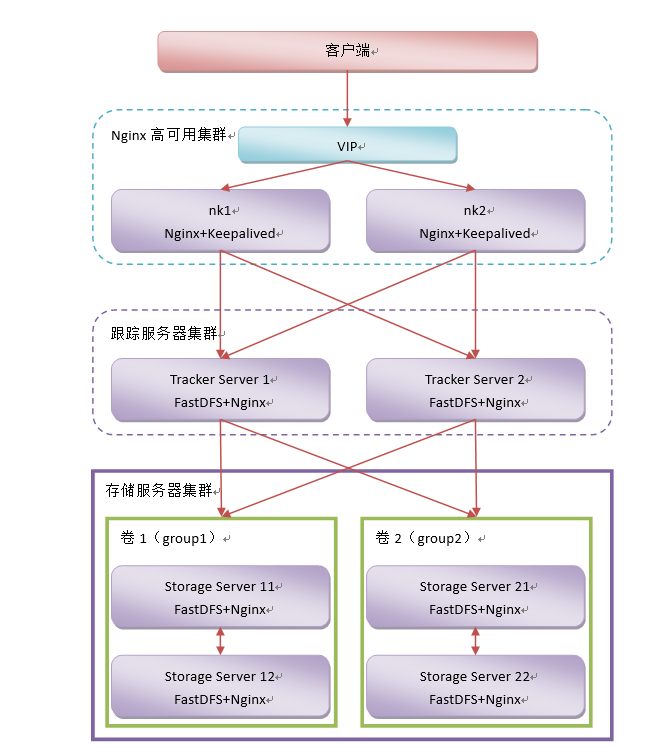

# FastDFS 集群



## 克隆虚拟机

VMware修改mac

- 修改 ip地址
- rm -f /etc/udev/rules.d/70-persistent-net.rules

- reboot


## Tracker集群搭建

克隆出来之前已经装好的两台虚拟机做Tracker节点

tarcker 节点 ip 131、132

启动两个Tracker节点

```
/etc/init.d/fdfs_trackerd start
```


查看端口

```
netstat -unltp |grep fdfs
```

启动日志

```
tail -100f trackerd.log
```


## Storage集群搭建

复制4台虚拟机

第一组 ip： 181、182   对应 group1

第二组 ip： 191、192    对应 group2

修改配置文件```/etc/fdfs/storage.conf```

修改tracker_server 的ip地址，多个 tracker 直接添加多条配置

```
tracker_server=192.168.150.131:22122
tracker_server=192.168.150.132:22122

```

启动Storage服务

/etc/init.d/fdfs_storaged start

fdfsMonitor

```
/usr/bin/fdfs_monitor /etc/fdfs/storage.conf
```

查看端口：`netstat -unltp | grep fdfs`

使用FastDFS中的Monitor查看：在所有的Storage启动成功后执行下述命令

`/usr/bin/fdfs_monitor /etc/fdfs/storage.conf`

## 测试FastDfs集群

测试文件上传

```
fdfs_upload_file /etc/fdfs/client.conf tmp.sh
```

修改tracker.conf文件中group的负载策略

修改配置文件中的store_lookup，这个属性的可选值有0,1,2。分别代表：

```
# 0: 轮询

# 1: 指定卷，通过卷名指定访问某一个卷

# 2: 访问空闲磁盘空间较大的。是默认的负载策略。
```


## Nginx集群搭建

FastDFS 通过 Tracker 服务器,将文件放在 Storage 服务器存储，但是同组存储服务器之间需要进入文件复制，有同步延迟的问题。假设 Tracker 服务器将文件上传到了 S1，上传成功后文件 ID已经返回给客户端。

此时 FastDFS 存储集群机制会将这个文件同步到同组存储 S2，在文件还没有复制完成的情况下，客户端如果用这个文件 ID 在 S2 上取文件,就会出现文件无法访问的错误。

而 fastdfs-nginx-module 可以重定向文件连接到源服务器（S1）取文件,避免客户端由于复制延迟导致的文件无法访问错误。

### Storage节点Nginx反向代理

在每个Storage节点安装配置Nginx

#### 修改配置文件mod_fastdfs.conf

```
connect_timeout=10

#181、182 对应 group 1
#191、192 对应 group 2
group_name=

tracker_server=192.168.150.131:22122
tracker_server=192.168.150.132:22122

group_count = 2

# group settings for group #1
# since v1.14
# when support multi-group, uncomment following section
[group1]
group_name=group1
storage_server_port=23000
store_path_count=1
store_path0=/var/data/fastdfs-storage/store
#store_path1=/home/yuqing/fastdfs1

# group settings for group #2
# since v1.14
# when support multi-group, uncomment following section as neccessary
[group2]
group_name=group2
storage_server_port=23000
store_path_count=1
store_path0=/var/data/fastdfs-storage/store

```

#### 检查Nginx配置文件

端口80必须和Storage服务器中的/etc/fdfs/storage.conf配置文件中的http.server_port=80一致。

```
   listen       80;
   
   location ~ /group([0-9])/M00 {
 # add_header Content-Disposition "attachment;filename=$arg_attname";
     ngx_fastdfs_module;
    }

```

测试访问文件

报错

```
ERROR - file: /root/fastdfs-nginx-module/src//common.c, line: 709, expect parameter token or ts in url, uri: /
group1/M00/00/00/wKiWtV1H4eKAKE4YAAABAE3E6HQ3627.gif
```

检查防盗链系统

vi /etc/fdfs/http.conf

```
http.anti_steal.check_token= 
```


## Tracker节点 负载均衡反向代理

在每个Tracker节点安装配置Nginx

在 tracker 上安装的 nginx 主要为了提供 http 访问的反向代理、负载均衡以及缓存服务。

### Nginx缓存

#### 传并解压ngx_cache_purge-2.3.tar.gz

```
cd /root
tar -zxf ngx_cache_purge-2.3.tar.gz
```

#### 编译安装nginx

```
./configure --prefix=/usr/local/tengine --add-module=/root/ngx_cache_purge-2.3
make
make install

```

#### 配置nginx

ngx_cache_purge模块的作用：用于清除指定url的缓存

下载地址：http://labs.frickle.com/files/ngx_cache_purge-2.3.tar.gz


Nginx.conf

```shell

http {
    include       mime.types;
    default_type  application/octet-stream;

    #log_format  main  '$remote_addr - $remote_user [$time_local] "$request" '
    #                  '$status $body_bytes_sent "$http_referer" '
    #                  '"$http_user_agent" "$http_x_forwarded_for"';

    #access_log  logs/access.log  main;
    #access_log  "pipe:rollback logs/access_log interval=1d baknum=7 maxsize=2G"  main;

    sendfile        on;
    #tcp_nopush     on;

    #keepalive_timeout  0;
    keepalive_timeout  65;
#设置缓存
    server_names_hash_bucket_size 128;
    client_header_buffer_size 32k;
    large_client_header_buffers 4 32k;
    client_max_body_size 300m;

    proxy_redirect off;
    proxy_set_header Host $http_host;
    proxy_set_header X-Real-IP $remote_addr;
    proxy_set_header X-Forwarded-For $proxy_add_x_forwarded_for;
    proxy_connect_timeout 90;
    proxy_send_timeout 90;
    proxy_read_timeout 90;
    proxy_buffer_size 16k;
    proxy_buffers 4 64k;
    proxy_busy_buffers_size 128k;
    proxy_temp_file_write_size 128k;
    #设置缓存存储路径、存储方式、分配内存大小、磁盘最大空间、缓存期限   
    #levels=1:2 表示缓存文件有两级目录 1表示第一级目录名为1位数，2表示第二级目录名为2位数
    proxy_cache_path /var/data/cache/nginx/proxy_cache levels=1:2       
    #keys_zone 缓存区域名字，分配200m空间，最大缓存1g,有效期30天
    keys_zone=http-cache:200m max_size=1g inactive=30d;
    
    proxy_temp_path /var/data/cache/nginx/proxy_cache/tmp;
    #设置 group1 的服务器
    upstream fdfs_group1 {
      server 192.168.150.181:80 weight=1 max_fails=2 fail_timeout=30s;  
      server 192.168.150.18:80 weight=1 max_fails=2 fail_timeout=30s; 
    }
    #设置 group2 的服务器
    upstream fdfs_group2 {
      server 192.168.150.191:80 weight=1 max_fails=2 fail_timeout=30s;
      server 192.168.150.192:80 weight=1 max_fails=2 fail_timeout=30s;
    }


    #gzip  on;
        listen       80;

        #charset koi8-r;

        #access_log  logs/host.access.log  main;
        #access_log  "pipe:rollback logs/host.access_log interval=1d baknum=7 maxsize=2G"  main;


    server_name  localhost;
    location /group1/M00 {


            proxy_next_upstream http_502 http_504 error timeout invalid_header;
            proxy_cache http-cache;
            proxy_cache_valid  200 304 12h;
            proxy_cache_key $uri$is_args$args;
            proxy_pass http://fdfs_group1;
            expires 30d;
    }


    location /group2/M00 {


            proxy_next_upstream http_502 http_504 error timeout invalid_header;
            proxy_cache http-cache;
            proxy_cache_valid  200 304 12h;
            proxy_cache_key $uri$is_args$args;
            proxy_pass http://fdfs_group2;
            expires 30d;
    }

        #设置清除缓存的访问权限
        location ~/purge(/.*) {
            allow 127.0.0.1;
            allow 192.168.2.0/24;
            deny all;
            proxy_cache_purge http-cache $1$is_args$args;
        }

```

##### purge命令清除静态缓存

http://域名+purge+静态资源相对路径    来清除静态资源缓存


### 添加Nginx模块,保留原有模块

查看nginx编译安装时的命令，安装了哪些模块

`--prefix=/usr/local/tengine --add-module=/root/fastdfs-nginx-module/src`

命令  /usr/local/nginx/sbin/nginx -V

编译

```shell
./configure --prefix=/usr/local/tengine --add-module=/root/ngx_c --以前的模块
ache_purge-2.3
make
```

注意make完 不要make install

拷贝obj下的 Nginx文件到 已安装好的sbin目录下 覆盖即可

```shell
cp ./nginx /usr/local/tengine/sbin/
```

## 高可用

### keepalived安装

上传并解压keepalived-1.2.18.tar.gz

```shell
cd /root/

tar -zxf keepalived-1.2.18.tar.gz

```

 编译并安装Keepalived

```shell
cd /root/keepalived-1.2.18
./configure --prefix=/usr/local/keepalived
make && make install

```

### Keepalived安装成Linux服务

```shell
mkdir /etc/keepalived
cp /usr/local/keepalived/etc/keepalived/keepalived.conf /etc/keepalived/
cp /usr/local/keepalived/etc/rc.d/init.d/keepalived /etc/init.d/
cp /usr/local/keepalived/etc/sysconfig/keepalived /etc/sysconfig/
ln -s /usr/local/sbin/keepalived /usr/sbin/
ln -s /usr/local/keepalived/sbin/keepalived /sbin/

```

设置开机启动

```shell
chkconfig keepalived on
```


### 修改keepalived.conf

ts1

```
! Configuration File for keepalived 
 
global_defs { 
   ## keepalived 自带的邮件提醒需要开启 sendmail 服务。建议用独立的监控或第三方 SMTP 
   router_id TS1  ## 标识本节点的字条串，通常为 hostname 
} 
##  keepalived 会定时执行脚本并对脚本执行的结果进行分析，动态调整 vrrp_instance 的优先级。如果脚本执行结果为 0，并且 weight 配置的值大于 0，则优先级相应的增加。如果脚本执行结果非 0，并且 weight配置的值小于 0，则优先级相应的减少。其他情况，维持原本配置的优先级，即配置文件中 priority 对应的值。 
vrrp_script chk_nginx { 
    script "/etc/keepalived/nginx_check.sh"  ## 检测 nginx 状态的脚本路径 
    interval 2  ## 检测时间间隔 
    weight -20  ## 如果条件成立，权重-20  
} 
## 定义虚拟路由，VI_1 为虚拟路由的标示符，自己定义名称 
vrrp_instance VI_1 { 
    state MASTER  ## 主节点为 MASTER，对应的备份节点为 BACKUP 
    interface eth0  ## 绑定虚拟 IP 的网络接口，与本机 IP 地址所在的网络接口相同，我的是 eth1 
    virtual_router_id 51  ## 虚拟路由的 ID 号，两个节点设置必须一样，可选 IP 最后一段使用,  相同的 VRID 为一个组，他将决定多播的 MAC 地址 
    mcast_src_ip 192.168.150.132  ## 本机 IP 地址 
    priority 100  ## 节点优先级，值范围 0-254，MASTER 要比BACKUP 高 
    nopreempt ## 优先级高的设置 nopreempt 解决异常恢复后再次抢占的问题 
    advert_int 1  ## 组播信息发送间隔，两个节点设置必须一样，默认 1s 
    ## 设置验证信息，两个节点必须一致 

    ## 将 track_script 块加入instance 配置块 
    track_script { 
        chk_nginx  ## 执行 Nginx 监控的服务 
    } 
    ## 虚拟 IP 池, 两个节点设置必须一样 
    virtual_ipaddress { 
        192.168.150.138/24   dev  eth0  label  eth0:2
    } 
}

```


ts2

```

! Configuration File for keepalived

global_defs {
  # notification_email {
   #  acassen@firewall.loc
   #  failover@firewall.loc
   #  sysadmin@firewall.loc
 #  }
#   notification_email_from Alexandre.Cassen@firewall.loc
 #  smtp_server 192.168.200.1
  # smtp_connect_timeout 30
   router_id ts2
}


vrrp_script chk_nginx {
    script "/etc/keepalived/nginx_check.sh"  ## 检测 nginx 状态的脚本路径
    interval 2  ## 检测时间间隔
    weight -20  ## 如果条件成立，权重-20
}


vrrp_instance VI_1 {
    state BACKUP
    interface eth0
    virtual_router_id 51
    priority 90
    advert_int 1


}


vrrp_script chk_nginx {
    script "/etc/keepalived/nginx_check.sh"  ## 检测 nginx 状态的脚本路径
   router_id ts2
}


vrrp_instance VI_1 {
    state BACKUP
    interface eth0
    virtual_router_id 51
    priority 90
    advert_int 1


    mcast_src_ip 192.168.150.132
    track_script {
    chk_nginx
    }

    authentication {
        auth_type PASS
        auth_pass 1111
    }
    virtual_ipaddress {
        192.168.150.138/24   dev  eth0  label  eth0:2
    }
}


```


### 状态检查脚本

编写nginx状态检查脚本/etc/keepalived/nginx_check.sh

在Keepalived配置中已用。脚本要求：如果 nginx 停止运行，尝试启动，如果无法启动则杀死本机的 keepalived 进程， keepalied将虚拟 ip 绑定到 BACKUP 机器上。

```
vi /etc/keepalived/nginx_check.sh
```

内容

```
#!/bin/bash 
A=`ps -C nginx –no-header |wc -l` 
if [ $A -eq 0 ];then 
    /usr/local/nginx/sbin/nginx 
    sleep 2 
    if [ `ps -C nginx --no-header |wc -l` -eq 0 ];then
        killall keepalived 
    fi 
fi

```

权限

```
chmod +x /etc/keepalived/nginx_check.sh
```


启动

```
service keepalived start
```


### 下载文件

	@RequestMapping("/down")
		@ResponseBody
		public ResponseEntity<byte[]> down(HttpServletResponse resp) {
			
			DownloadByteArray cb = new DownloadByteArray();
			HttpHeaders headers = new HttpHeaders();
			headers.setContentType(MediaType.APPLICATION_OCTET_STREAM);
			headers.setContentDispositionFormData("attachment", "aaa.xx");
			byte[] bs = fc.downloadFile("group1", "M00/00/00/wKiWDV0vAb-AcOaYABf1Yhcsfws9181.xx", cb);
			
		return new ResponseEntity<>(bs,headers,HttpStatus.OK);
		}