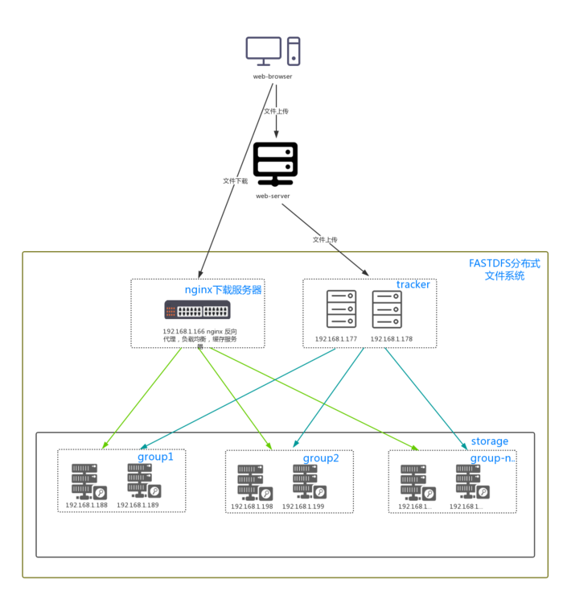
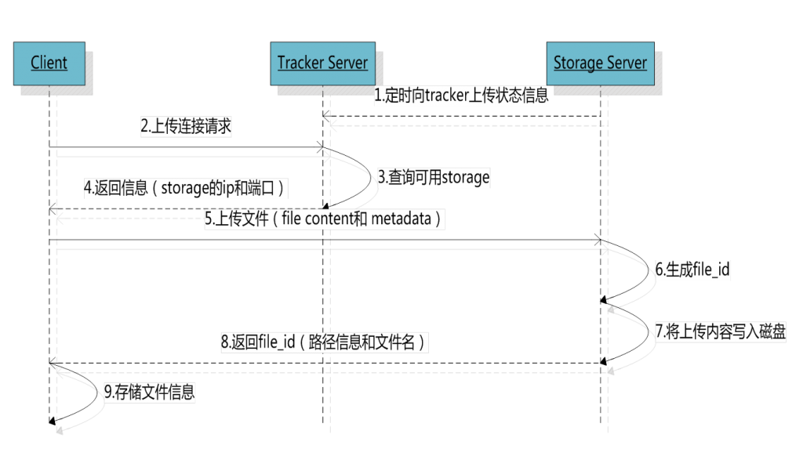
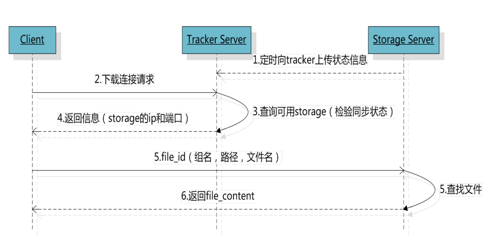

# FastDFS

## 介绍

技术论坛： http://bbs.chinaunix.net/forum-240-1.html

FAQ：http://bbs.chinaunix.net/thread-1920470-1-1.html

资源地址： https://sourceforge.net/projects/fastdfs/

源码资源： https://github.com/happyfish100

 FastDFS是一个开源的轻量级分布式文件系统，它对文件进行管理，功能包括：文件存储、文件同步、文件访问（文件上传、文件下载）等，解决了大容量存储和负载均衡的问题。特别适合以文件为载体的在线服务，如相册网站、视频网站等等。

FastDFS为互联网量身定制，充分考虑了冗余备份、负载均衡、线性扩容等机制，并注重高可用、高性能等指标，使用FastDFS很容易搭建一套高性能的文件服务器集群提供文件上传、下载等服务。

FastDFS服务端有两个角色：跟踪器（tracker）和存储节点（storage）。跟踪器主要做调度工作，在访问上起负载均衡的作用。

存储节点存储文件，完成文件管理的所有功能：就是这样的存储、同步和提供存取接口，FastDFS同时对文件的metadata进行管理。所谓文件的meta data就是文件的相关属性，以键值对（key value）方式表示，如：width=1024，其中的key为width，value为1024。文件metadata是文件属性列表，可以包含多个键值对。

跟踪器和存储节点都可以由一台或多台服务器构成。跟踪器和存储节点中的服务器均可以随时增加或下线而不会影响线上服务。其中跟踪器中的所有服务器都是对等的，可以根据服务器的压力情况随时增加或减少。

为了支持大容量，存储节点（服务器）采用了分卷（或分组）的组织方式。存储系统由一个或多个卷组成，卷与卷之间的文件是相互独立的，所有卷的文件容量累加就是整个存储系统中的文件容量。一个卷可以由一台或多台存储服务器组成，一个卷下的存储服务器中的文件都是相同的，卷中的多台存储服务器起到了冗余备份和负载均衡的作用。

在卷中增加服务器时，同步已有的文件由系统自动完成，同步完成后，系统自动将新增服务器切换到线上提供服务。

当存储空间不足或即将耗尽时，可以动态添加卷。只需要增加一台或多台服务器，并将它们配置为一个新的卷，这样就扩大了存储系统的容量。

FastDFS中的文件标识分为两个部分：卷名和文件名，二者缺一不可。

### web项目架构



### 谁在用？

有人在生产环境中使用FastDFS吗？
答案是肯定的。据我所知，截止2012年底至少有25家公司在使用FastDFS，其中有好几家是做网盘的公司。
其中存储量最大的一家，集群中存储group数有400个，存储服务器超过800台，存储容量达到6PB，文件数超过1亿，Group持续增长中。。。
以下是使用FastDFS的用户列表：
  某大型网盘（因对方要求对公司名保密，就不提供名字了。有400个group，存储容量达到了6PB，文件数超过1亿）  
  UC （http://www.uc.cn/，存储容量超过10TB）
  支付宝（http://www.alipay.com/）
  京东商城（http://www.360buy.com/）
  淘淘搜（http://www.taotaosou.com/）
  飞信（http://feixin.1008**/）
  赶集网（http://www.ganji.com/）
  淘米网（http://www.61.com/）
  迅雷（http://www.xunlei.com/）
  蚂蜂窝（http://www.mafengwo.cn/）
  丫丫网（http://www.iyaya.com/）
  虹网（[http://3g.ahong.com](http://3g.ahong.com/)）
  5173（http://www.5173.com/）
  华夏原创网（http://www.yuanchuang.com/）
  华师京城教育云平台（http://www.hsjdy.com.cn/）
  视友网（http://www.cuctv.com/）
  搜道网（http://www.sodao.com/）
  58同城（http://www.58.com/）
  商务联盟网（http://www.biz72.com/）
  中青网（http://www.youth.cn/）
  缤丽网 （http://www.binliy.com/）
  飞视云视频（http://www.freeovp.com/）
  梦芭莎（http://www.moonbasa.com/）
  活动帮（[www.eventsboom.com](http://www.eventsboom.com/)）
  51CTO（http://www.51cto.com/）
  搜房网（http://www.soufun.com/）


### 架构

- tracker Server：
  - 主节点，跟踪服务器，主要做调度工作，在访问上起负载均衡的作用。
  - 记录storage server的状态，是连接Client和Storage server的枢纽。
  - FastDFS集群中的Tracker server可以有多台，Trackerserver之间是相互平等关系同时提供服务
  - Trackerserver不存在单点故障。客户端请求Trackerserver采用轮询方式，如果请求的tracker无法提供服务则换另一个tracker。
- Storage Server：
  - 存储服务器，文件和meta data都保存到存储服务器上
  - storage集群由一个或多个组构成，集群存储总容量为集群中所有组的存储容量之和。
  - 一个组由一台或多台存储服务器组成，组内的Storage server之间是平等关系
  - 不同组的Storageserver之间不会相互通信，同组内的Storageserver之间会相互连接进行文件同步，从而保证同组内每个storage上的文件完全一致的。
  - 一个组的存储容量为该组内存储服务器容量最小的那个，由此可见组内存储服务器的软硬件配置最好是一致的。
  - Storage server会连接集群中所有的Tracker server，定时向他们报告自己的状态，包括磁盘剩余空间、文件同步状况、文件上传下载次数等统计信息。
- group：组，也称为卷。同组内服务器上的文件是完全相同的
- 文件标识：包括两部分：组名和文件名（包含路径）
-  meta data：文件相关属性，键值对（Key Value Pair）方式，如：width=1024,heigth=768


### 上传流程




- client询问tracker上传到的storage，不需要附加参数；
- tracker返回一台可用的storage；
- client直接和storage通讯完成文件上传


内部机制如下：

**1、选择tracker server**

当集群中不止一个tracker server时，由于tracker之间是完全对等的关系，客户端在upload文件时可以任意选择一个trakcer。
选择存储的group
当tracker接收到upload file的请求时，会为该文件分配一个可以存储该文件的group，支持如下选择group的规则：

- 1、Round robin，所有的group间轮询
- 2、Specified group，指定某一个确定的group
- 3、Load balance，剩余存储空间多多group优先

**2、选择storage server**

当选定group后，tracker会在group内选择一个storage server给客户端，支持如下选择storage的规则：

- 1、Round robin，在group内的所有storage间轮询
- 2、First server ordered by ip，按ip排序
- 3、First server ordered by priority，按优先级排序（优先级在storage上配置）

**3、选择storage path**

当分配好storage server后，客户端将向storage发送写文件请求，storage将会为文件分配一个数据存储目录，支持如下规则：

- 1、Round robin，多个存储目录间轮询
- 2、剩余存储空间最多的优先

**4、生成Fileid**

选定存储目录之后，storage会为文件生一个Fileid，由storage server ip、文件创建时间、文件大小、文件crc32和一个随机数拼接而成，然后将这个二进制串进行base64编码，转换为可打印的字符串。
选择两级目录
当选定存储目录之后，storage会为文件分配一个fileid，每个存储目录下有两级256*256的子目录，storage会按文件fileid进行两次hash（猜测），路由到其中一个子目录，然后将文件以fileid为文件名存储到该子目录下。

**5、生成文件名**

当文件存储到某个子目录后，即认为该文件存储成功，接下来会为该文件生成一个文件名，文件名由group、存储目录、两级子目录、fileid、文件后缀名（由客户端指定，主要用于区分文件类型）拼接而成。

### 下载流程



- client询问tracker下载文件的storage，参数为文件标识（组名和文件名）；
- tracker返回一台可用的storage；
- client直接和storage通讯完成文件下载。


### binlog

每个storage写文件后，同时会写一份binlog，binlog里不包含文件数据，只包含文件名等元信息，这份binlog用于后台同步，storage会记录向group内其他storage同步的进度，以便重启后能接上次的进度继续同步；进度以时间戳的方式进行记录，所以最好能保证集群内所有server的时钟保持同步。

###  FastDFS和其他文件存储的简单对比

| **指标**               | **FastDFS** | **NFS** | **集中存储设备**   **如NetApp****、NAS** |
| ---------------------- | ----------- | ------- | ---------------------------------------- |
| 线性扩容性             | 高          | 差      | 差                                       |
| 文件高并发访问性能     | 高          | 差      | 一般                                     |
| 文件访问方式           | 专有API     | POSIX   | 支持POSIX                                |
| 硬件成本               | 较低        | 中等    | 高                                       |
| 相同内容文件只保存一份 | 支持        | 不支持  | 不支持                                   |


| **指标**                  | **FastDFS**                                                  | **mogileFS**                                                 |
| ------------------------- | ------------------------------------------------------------ | ------------------------------------------------------------ |
| 系统简洁性                | 简洁   只有两个角色：tracker和storage                        | 一般   有三个角色：tracker、storage和存储文件信息的mysql db  |
| 系统性能                  | 很高（没有使用数据库，文件同步直接点对点，不经过tracker中转） | 高（使用mysql来存储文件索引等信息，文件同步通过tracker调度和中转） |
| 系统稳定性                | 高（C语言开发，可以支持高并发和高负载）                      | 一般（Perl语言开发，高并发和高负载支持一般）                 |
| 软RAID方式                | 分组（组内冗余），灵活性较大                                 | 动态冗余，灵活性一般                                         |
| 通信协议                  | 专有协议   下载文件支持HTTP                                  | HTTP                                                         |
| 技术文档                  | 较详细                                                       | 较少                                                         |
| 文件附加属性（meta data） | 支持                                                         | 不支持                                                       |
| 相同内容文件只保存一份    | 支持                                                         | 不支持                                                       |
| 下载文件时支持文件偏移量  | 支持                                                         | 不支持                                                       |

 

## 单机安装

准备linux服务器或虚拟机

Tracker 和 Storage 安装在一台机器上

### 版本

FastDFS 5.08版本

### 安装FastDFS依赖

FastDFS是C语言开发的应用。安装必须使用make、cmake和gcc编译器。

``` yum install -y make cmake gcc gcc-c++```

### 安装FastDFS核心库

libfastcommon是从FastDFS 和FastDHT 中提取出来的公共C函数库

#### 上传文件后解压缩

unzip libfastcommon-master.zip -d /usr/local/fastdfs

#### 编译安装

libfastmon没有提供make命令安装文件。使用的是shell脚本执行编译和安装。

shell脚本为make.sh

编译

```./make.sh```

安装

```./make.sh install```

有固定的默认安装位置。在/usr/lib64和/usr/include/fastcommon两个目录中。

#### 创建软连接

因为 FastDFS 主程序设置的 lib 目录是/usr/local/lib，所以需要创建软链接

```
ln -s /usr/lib64/libfastcommon.so /usr/local/lib/libfastcommon.so

ln -s /usr/lib64/libfastcommon.so /usr/lib/libfastcommon.so

ln -s /usr/lib64/libfdfsclient.so /usr/local/lib/libfdfsclient.so

ln -s /usr/lib64/libfdfsclient.so /usr/lib/libfdfsclient.so
```


### FastDFS主程序安装

#### 上传并解压缩

```
tar -zxf FastDFS_v5.08.tar.gz -C /usr/local/fastdfs
```

#### 编译安装

```
./make.sh
./make.sh install
```

安装后，FastDFS主程序所在位置：

```
/usr/bin - 可执行文件所在位置。
/etc/fdfs - 配置文件所在位置。
/usr/lib64 - 主程序代码所在位置
/usr/include/fastdfs - 包含的一些插件组所在位置

```

### 服务配置

#### 程序脚本

在/etc/init.d/目录中，脚本文件是 **fdfs-storaged**和**fdfs-trackerd**

#### 配置文件

配置文件在```/etc/fdfs/```目录中

- tracker.conf.sample - 跟踪器服务配置文件模板

- storage.conf.sample - 存储服务器配置文件模板

- client.conf.sample - FastDFS提供的命令行客户端配置文件模板。可以通过命令行测试FastDFS有效性。


### Tracker 服务

#### 修改配置文件

复制一份模板配置文件

```
cd /etc/fdfs

cp tracker.conf.sample tracker.conf
```

打开 tracker.conf

修改 base_path 路径，base_path FastDFSTracker启动后使用的根目录，用来存放Tracker data和logs。

```base_path=/home/yuqing/fastdfs -> base_path=/var/data/fastdfs-tracker（自定义目录）```

配置中的路径需要先创建好才能启动服务

```
mkdir -p /var/data/fastdfs-tracker
```

####  启动Tracker

```
/etc/init.d/fdfs_trackerd start
```

启动成功后，配置文件中base_path指向的目录中出现FastDFS服务相关数据目录（data目录、logs目录）

####  查看服务状态

```
ps -ef | grep fdfs
```

#### 停止服务

```
/etc/init.d/fdfs_trackerd stop
```

#### 重启服务

```
/etc/init.d/fdfs_trackerd restart
```


### 启动 Storage

#### 配置文件

```
cd /etc/fdfs
cp storage.conf.sample storage.conf
mkdir -p /var/data/fastdfs-storage/base
mkdir -p /var/data/fastdfs-storage/store
```

base_path=/home/yuqing/fastdfs -> base_path=/var/data/fastdfs-storage/base（自定义目录）

store_path0=/home/yuqing/fastdfs -> store_path0=/var/data/fastdfs-storage/store（自定义目录）

tracker_server=192.168.150.11:22122 -> tracker_server=tracker服务IP:22122

- base_path - 基础路径。用于保存storage server基础数据内容和日志内容的目录。
- store_path0 - 存储路径。是用于保存FastDFS中存储文件的目录，就是要创建256*256个子目录的位置。base_path和store_path0可以使用同一个目录。
- tracker_server - 跟踪服务器位置。就是跟踪服务器的ip和端口。

#### 启动服务

要求tracker服务必须已启动

```
/etc/init.d/fdfs_storaged start
```


启动成功后，配置文件中base_path指向的目录中出现FastDFS服务相关数据目录（data目录、logs目录）

配置文件中的store_path0指向的目录中同样出现FastDFS存储相关数据录（data目录）

其中$store_path0/data/目录中默认创建若干子孙目录（两级目录层级总计256*256个目录），是用于存储具体文件数据的。

Storage服务器启动比较慢，因为第一次启动的时候，需要创建256*256个目录。


#### 查看服务状态

```
/etc/init.d/fdfs_storaged status
```


#### 停止服务

```
/etc/init.d/fdfs_storaged stop
```


#### 重启服务

```
/etc/init.d/fdfs_storaged restart
```

###  Client

#### 修改配置文件

```
cd /etc/fdfs
cp client.conf.sample client.conf

```

client.conf配置文件中主要描述客户端的行为，需要进行下述修改：

```
vi /etc/fdfs/client.conf

base_path=/home/yuqing/fastdfs -> base_path=/fastdfs/client （自定义目录）

tracker_server=192.168.150.11:22122 -> tracker_server=tracker服务IP:22122

```

base_path - 就是客户端命令行执行过程时临时数据存储位置。


 创建自定义目录

```
mkdir -p /fastdfs/client
```

#### 上传文件

/usr/local/bin/fdfs_upload_file /etc/fdfs/client.conf  /要上传的文件

```
[root@node03 data]# /usr/bin/fdfs_upload_file /etc/fdfs/client.conf /root/install.log
group1/M00/00/00/wKiWDV0xfqWAFe1OAAAib-i5DLU637.log
```


上传结束后，返回group1/M00/00/00/xxxxxxxxxx.xxx，检查storage服务结点中的$store_path0/data/00/00/目录中是否有上传的文件（一般情况上传的文件按顺序保存在$store_path0/data/00/00/目录中，不能完全保证）。


上传文件结果：group1/M00/00/00/wKiWDV0xfqWAFe1OAAAib-i5DLU637.log


- 组名：**group1**文件上传后所在的storage组名称，在文件上传成功后有storage服务器返回，需要客户端自行保存。
-  虚拟磁盘路径：**M00**  storage配置的虚拟路径，与磁盘选项store_path*对应。如果配置了store_path0则是M00，如果配置了store_path1则是M01，以此类推。
- 数据两级目录：**/00/00** storage服务器在每个虚拟磁盘路径下创建的两级目录，用于存储数据文件。
- 文件名：**wKiWDV0xfqWAFe1OAAAib-i5DLU637.log**


#### 删除文件

```
/usr/bin/fdfs_delete_file /etc/fdfs/client.conf group1/M00/00/00/wKiWDV0xfqWAFe1OAAAi
b-i5DLU637.log
```


### Nginx组件

如果FastDFS中保存的是图片信息。希望在WEB应用中可以直接访问FastDFS中的图片进行显示。如果操作？

安装Nginx是为了WEB应用中可以使用HTTP协议直接访问Storage服务中存储的文件。在storage结点所在服务器安装Nginx组件。

需要安装两部分内容。

Nginx应用，在安装nginx应用的时候，同时要在nginx中增加一个FastDFS的组件。

#### fastdfs-nginx-module模块

上传并解压

```
tar -zxf fastdfs-nginx-module_v1.16.tar.gz
```

#### 修改配置

```
vi /usr/local/fastdfs/fastdfs-nginx-module/src/config
```

```
CORE_INCS="$CORE_INCS /usr/include/fastdfs /usr/include/fastcommon/"

```

#### 编译安装Nginx

```
./configure --prefix=/usr/local/tengine
--add-module=/root/fastdfs-nginx-module/src/
```

```
make && make install
```

#### 配置fastdfs-nginx-module

##### 拷贝配置文件

```
cp /root/fastdfs-nginx-module/src/mod_fastdfs.conf /etc/fdfs/
```

##### 修改配置文件 mod_fastdfs.conf

```
tracker_server=192.168.2.109:22122
url_have_group_name = true
store_path0=/var/data/fastdfs-storage/store

```

##### 拷贝http服务需要的配置

复制FastDFS安装包中的两个配置文件（http.conf和mime.types）到/etc/fdfs目录中

#### 创建网络访问存储服务的软连接

在上传文件到FastDFS后，FastDFS会返回group1/M00/00/00/xxxxxxxxxx.xxx。其中group1是卷名，在mod_fastdfs.conf配置文件中已配置了url_have_group_name，以保证URL解析正确。

而其中的M00是FastDFS保存数据时使用的虚拟目录，需要将这个虚拟目录定位到真实数据目录上。

```
ln -s /var/data/fastdfs-storage/store/data/  /var/data/fastdfs-storage/store/data/M00
```

####  修改nginx配置文件

```
    location ~ /group([0-9])/M00 {
        ngx_fastdfs_module;
    }
    
    http://192.168.150.11/group1/M00/00/00/wKiWC10xxc6AfHCKAAAib-i5DLU543_big.log
```


#### 文件名

```
add_header Content-Disposition "attachment;filename=$arg_attname";
```


## JavaApi


https://github.com/tobato/FastDFS_Client

RAID

配置

```
fdfs:
  so-timeout: 1500
  connect-timeout: 600
  tracker-list:
  - 192.168.150.13:22122
```


### 上传文件


```
  // 元数据
  Set<MetaData> metaDataSet = new HashSet<MetaData>();
        metaDataSet.add(new MetaData("Author", "yimingge"));
        metaDataSet.add(new MetaData("CreateDate", "2016-01-05"));
        
        
  	try {
			StorePath uploadFile = null;
			uploadFile = fc.uploadFile(filename.getInputStream(), filename.getSize(), getFileExtName(filename.getOriginalFilename()), metaDataSet);
	
			account.setPassword(password);
			account.setLocation(uploadFile.getPath());
		
		} catch (FileNotFoundException e) {
			// TODO Auto-generated catch block
			e.printStackTrace();
		}
```

获取文件后缀

```
	private String getFileExtName(String name) {
		// TODO Auto-generated method stub
		return (name.substring(name.lastIndexOf(".")+1));
	}
	
```

或

```
FilenameUtils.getExtension
```

**返回结果带group**

uploadFile.getFullPath() ： group1/M00/00/00/wKiWDV0u7ZKALKtNAAADP9sEx2w432.sql

**不带group**

uploadFile.getPath() ： M00/00/00/wKiWDV0u7ZKALKtNAAADP9sEx2w432.sql


### 缩略图

配置

```
  thumb-image:
    width: 150
    height: 150
```


```
uploadFile  = fc.uploadImageAndCrtThumbImage(filename.getInputStream(), filename.getSize(), FilenameUtils.getExtension(filename.getOriginalFilename()), metaDataSet);
		
```


### 下载文件

	@RequestMapping("/down")
		@ResponseBody
		public ResponseEntity<byte[]> down(HttpServletResponse resp) {
			
			DownloadByteArray cb = new DownloadByteArray();
			HttpHeaders headers = new HttpHeaders();
			headers.setContentType(MediaType.APPLICATION_OCTET_STREAM);
			headers.setContentDispositionFormData("attachment", "aaa.xx");
			byte[] bs = fc.downloadFile("group1", "M00/00/00/wKiWDV0vAb-AcOaYABf1Yhcsfws9181.xx", cb);
			
		return new ResponseEntity<>(bs,headers,HttpStatus.OK);
		}
