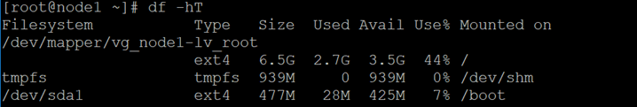
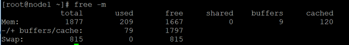
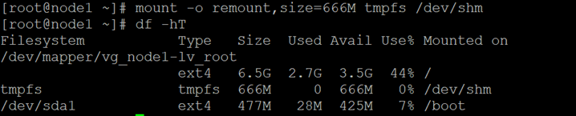
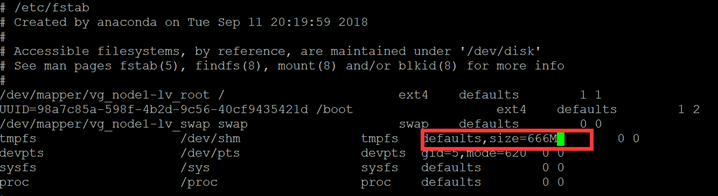
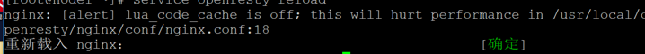

# 《亿级流量系统多级缓存架构2》

# Lua + 

## 课程主要内容

### Nginx缓存

#### Nginx全局共享内存缓存

```lua
lua_shared_dict shared_data 1m;


------


local shared_data = ngx.shared.shared_data  

local i = shared_data:get("i")  

if not i then  

    i = 1  

    shared_data:set("i", i)  

    ngx.say("lazy set i ", i, "<br/>")  
end  
 

i = shared_data:incr("i", 1)  

ngx.say("i=", i, "<br/>")
```


#### lua-resty-lrucache

Lua 实现的一个简单的 LRU 缓存，适合在 Lua 空间里直接缓存较为复杂的 Lua 数据结构：

它相比 ngx_lua 共享内存字典可以省去较昂贵的序列化操作，相比 memcached 这样的外部服务又能省去较昂贵的 socket 操作

lrucache 有两种实现

- resty.lrucache
  - 适合用来缓存命中率高或读操作远远大于写操作的缓存业务
- resty.lrucache.pureffi
  - 适合用来缓存命中率低或需要对key进行频繁增、删操作的缓存业务

```lua
local lrucache = require "resty.lrucache"

local c, err = lrucache.new(200)


	c:set("dog", 32)
    c:set("cat", 56)
    ngx.say("dog: ", c:get("dog"))
    ngx.say("cat: ", c:get("cat"))

    c:set("dog", { age = 10 }, 0.1)  -- expire in 0.1 sec
    c:delete("dog")

```

https://github.com/openresty/lua-resty-lrucache#name


##### 实例

```lua
local mycache = require("mycache")  
local count = mycache.get("count") or 0  
count = count + 1  
mycache.set("count", count, 10 * 60 * 60) --10分钟  
ngx.say(mycache.get("count"))     

```

**mycache.lua**

```lua
local lrucache = require("resty.lrucache")  
--创建缓存实例，并指定最多缓存多少条目  
local cache, err = lrucache.new(200)  
if not cache then  
   ngx.log(ngx.ERR, "create cache error : ", err)  
end  
  
local function set(key, value, ttlInSeconds)  
    cache:set(key, value, ttlInSeconds)  
end  
  
local function get(key)  
    return cache:get(key)  
end  
  
local _M = {  
  set = set,  
  get = get  
}  
return _M

```


##### tmpfs

在Linux系统内存中的虚拟磁盘映射，可以理解为使用物理内存当做磁盘，利用这种文件系统，可以有效提高在高并发场景下的磁盘读写，但是重启后数据会丢失。

###### 查看tmpfs命令：




###### 系统默认开启，大小约为物理内存一半


###### 查看物理内存利用情况




tmpfs没有占用内存空间，只有在写入数据的时候才会占用实际的物理内存

###### 调整大小

临时修改方式如下，立即生效但重启后会恢复




###### 永久修改 /etc/fstab文件




#### http_proxy 本地磁盘缓存

```nginx
proxy_cache_path /path/to/cache levels=1:2 keys_zone=my_cache:10m max_size=10g inactive=60m use_temp_path=off;

server {

     set $upstream http://ip:port

          location / {

                   proxy_cache my_cache;

                   proxy_pass $upstream;
             }

}
```

` /path/to/cache`  #本地路径，用来设置Nginx缓存资源的存放地址

`  levels `         #默认所有缓存文件都放在同一个`/path/to/cache`下，但是会影响缓存的性能，因此通常会在`/path/to/cache`下面建立子目录用来分别存放不同的文件。假设`levels=1:2`，Nginx为将要缓存的资源生成的`key`为`f4cd0fbc769e94925ec5540b6a4136d0`，那么`key`的最后一位0，以及倒数第2-3位6d作为两级的子目录，也就是该资源最终会被缓存到`/path/to/cache/0/6d`目录中

`key_zone`        #在共享内存中设置一块存储区域来存放缓存的`key`和`metadata`（类似使用次数），这样nginx可以快速判断一个request是否命中或者未命中缓存，1m可以存储8000个key，10m可以存储80000个key

`max_size`        #最大cache空间，如果不指定，会使用掉所有disk space，当达到配额后，会删除最少使用的cache文件

` inactive`        #未被访问文件在缓存中保留时间，本配置中如果60分钟未被访问则不论状态是否为expired，缓存控制程序会删掉文件。inactive默认是10分钟。需要注意的是，inactive和expired配置项的含义是不同的，expired只是缓存过期，但不会被删除，inactive是删除指定时间内未被访问的缓存文件

` use_temp_path`   #如果为off，则nginx会将缓存文件直接写入指定的cache文件中，而不是使用temp_path存储，official建议为off，避免文件在不同文件系统中不必要的拷贝

`proxy_cache`     #启用proxy cache，并指定key_zone。另外，如果proxy_cache off表示关闭掉缓存。

### lua-resty-redis访问redis

#### 常用方法

```lua
local res, err = red:get("key")

local res, err = red:lrange("nokey", 0, 1)

ngx.say("res:",cjson.encode(res))
```


#### 创建连接

```lua
red, err = redis:new()

ok, err = red:connect(host, port, options_table?)
```


#### timeout

```lua
red:set_timeout(time)
```

#### keepalive

```lua
red:set_keepalive(max_idle_timeout, pool_size)
```


#### close

```
ok, err = red:close()
```

 null 

nil

error 

exception

crash

#### pipeline

```nginx
red:init_pipeline()

results, err = red:commit_pipeline()
```

#### 认证

```nginx
    local res, err = red:auth("foobared")

    if not res then

        ngx.say("failed to authenticate: ", err)

        return
end
```


#### redis-cluster支持

https://github.com/steve0511/resty-redis-cluster

 

### redis2-nginx-module 

redis2-nginx-module是一个支持 Redis 2.0 协议的 Nginx upstream 模块，它可以让 Nginx 以非阻塞方式直接防问远方的 Redis 服务，同时支持 TCP 协议和 Unix Domain Socket 模式，并且可以启用强大的 Redis 连接池功能。

https://github.com/openresty/redis2-nginx-module

#### test

```nginx
location = /foo {

default_type text/html;

     redis2_query auth 123123;

     set $value 'first';

     redis2_query set one $value;

     redis2_pass 192.168.199.161:6379;

 }
```


#### get

```nginx
location = /get {

default_type text/html;

     redis2_pass 192.168.199.161:6379;

     redis2_query auth 123123;

     set_unescape_uri $key $arg_key;  # this requires ngx_set_misc

     redis2_query get $key;

}
```


#### set

```nginx
# GET /set?key=one&val=first%20value

location = /set {

default_type text/html;

redis2_pass 192.168.199.161:6379;

redis2_query auth 123123;
 

     set_unescape_uri $key $arg_key;  # this requires ngx_set_misc

     set_unescape_uri $val $arg_val;  # this requires ngx_set_misc

     redis2_query set $key $val;

 }
```


#### pipeline


```nginx
     set $value 'first';

     redis2_query set one $value;

     redis2_query get one;

     redis2_query set one two;

     redis2_query get one;

redis2_query del key1;
```

#### list

```lua
    redis2_query lpush key1 C;

    redis2_query lpush key1 B;

    redis2_query lpush key1 A;

redis2_query lrange key1 0 -1;
```


#### 集群

```nginx
upstream redis_cluster {

     server 192.168.199.161:6379;

     server 192.168.199.161:6379;

 }

location = /redis {

default_type text/html;

         redis2_next_upstream error timeout invalid_response;

         redis2_query get foo;

         redis2_pass redis_cluster;
   }
```


## URL一致性哈希负载均衡

有针对性的对url进行一致性hash 定向负载到后端Nginx 

提高Nginx缓存系统命中率

#### nginx url_hash

Nginx第三方模块，在转发请求时如果后端服务器宕机，会导致503错误

#### lua-resty-http

### GitHub主页

https://github.com/ledgetech/lua-resty-http

### 安装组件

wget https://raw.githubusercontent.com/pintsized/lua-resty-http/master/lib/resty/http_headers.lua  

wget https://raw.githubusercontent.com/pintsized/lua-resty-http/master/lib/resty/http.lua 


 

```lua
local http = require("resty.http")  

local httpc = http.new()  
  
local resp, err = httpc:request_uri("http://www.sogou.com", {  
    method = "GET",  
    path = "/sogou?query=resty.http",  
    headers = {  
        ["User-Agent"] = "Mozilla/5.0 (Windows NT 6.1; WOW64) AppleWebKit/537.36 (KHTML, like Gecko) Chrome/40.0.2214.111 Safari/537.36"  
    }  
})  
  
if not resp then  
    ngx.say("request error :", err)  
    return  
end  
  
 
ngx.status = resp.status  
  
  
for k, v in pairs(resp.headers) do  
    if k ~= "Transfer-Encoding" and k ~= "Connection" then  
        ngx.header[k] = v  
    end  
end  
  
ngx.say(resp.body)  
  
httpc:close()

```

http模块加入

```
resolver 8.8.8.8;
```


### lua-resty-http实现一致性hash负载均衡

```lua
local http = require("resty.http")  
local httpc = http.new()  

local hosts = {"192.168.150.111","192.168.150.112"}

local item_id= ngx.var.arg_id

local id_hash = ngx.crc32_long(item_id)
local index = (id_hash % 2) +1
  
local resp, err = httpc:request_uri("http://"..hosts[index], {  
    method = "GET",  
    path = "/sogou?query=resty.http",  
    headers = {  
        ["User-Agent"] = "Mozilla/5.0 (Windows NT 6.1; WOW64) AppleWebKit/537.36 (KHTML, like Gecko) Chrome/40.0.2214.111 Safari/537.36"  
    }  
})  
  
if not resp then  
    ngx.say("request error :", err)  
    return  
end  
  
 
ngx.say(resp.body)  
  
httpc:close()

```

## 模板实时渲染 lua-resty-template

https://github.com/bungle/lua-resty-template

如果学习过JavaEE中的servlet和JSP的话，应该知道JSP模板最终会被翻译成Servlet来执行；

而lua-resty-template模板引擎可以认为是JSP，其最终会被翻译成Lua代码，然后通过ngx.print输出。   

lua-resty-template大体内容有： 

l   模板位置：从哪里查找模板； 

l   变量输出/转义：变量值输出； 

l   代码片段：执行代码片段，完成如if/else、for等复杂逻辑，调用对象函数/方法； 

l   注释：解释代码片段含义； 

l   include：包含另一个模板片段； 

l   其他：lua-resty-template还提供了不需要解析片段、简单布局、可复用的代码块、宏指令等支持。

基础语法

l   {(include_file)}：包含另一个模板文件；

l   {* var *}：变量输出；

l   {{ var }}：变量转义输出；

l   ：代码片段；

l   {# comment #}：注释；

l   {-raw-}：中间的内容不会解析，作为纯文本输出；

### lua代码热加载

在http模块中加入

```
lua_code_cache off;
```

reload后Nginx会提示影响性能，记得在生产环境中关掉。



### 测试

### 一、初始化

```
-- Using template.new
local template = require "resty.template"
local view = template.new "view.html"
view.message = "Hello, World!"
view:render()

-- Using template.render
-- template.render("view.html", { message = "Hel11lo, Worl1d!" })


```

### 二、执行函数，得到渲染之后的内容

```
local func = template.compile("view.html")  

local content = func(context)  

ngx.say("xx:",content) 
```


### resty.template.html

```lua
local template = require("resty.template")
local html = require "resty.template.html"

template.render([[
<ul>

    {*html.li(person.name)*} --

</ul>
<table>

    <tr data-sort="{{(person.name or ""):lower()}}">
        {*html.td{ id = person.id }(person.name)*}
    </tr>

</table>]], {
    { id = 1, name = "Emma"},
    { id = 2, name = "James" },
    { id = 3, name = "Nicholas" },
    { id = 4 }
})

```

### 模板内容

```html
<!DOCTYPE html>
<html>
<body>
  <h1>{{message}}</h1>
</body>
</html>

```

### 多值传入

```lua
template.caching(false)
local template = require("resty.template")
local context = {
    name = "lucy",
    age = 50,
}
template.render("view.html", context)

```

### 模板内容

```lua
<!DOCTYPE html>
<html>
<body>
  <h1>name:{{name}}</h1>
  <h1>age:{{age}}</h1>
</body>
</html>

```


### 模板管理与缓存

模板缓存：默认开启，开发环境可以手动关闭

```template.caching(true)```

模板文件需要业务系统更新与维护，当模板文件更新后，可以通过模板版本号或消息通知Openresty清空缓存重载模板到内存中

`template.cache = {}`


### 完整页面


```lua
local template = require("resty.template")
template.caching(false)
local context = {
    title = "测试",
    name = "lucy",
    description = "<script>alert(1);</script>",
    age = 40,
    hobby = {"电影", "音乐", "阅读"},
    score = {语文 = 90, 数学 = 80, 英语 = 70},
    score2 = {
        {name = "语文", score = 90},
        {name = "数学", score = 80},
        {name = "英语", score = 70},
    }
}

template.render("view.html", context)

```

### 模板

```html
{(header.html)}  
   <body>  
      {# 不转义变量输出 #}  
      姓名：{* string.upper(name) *}<br/>  
      {# 转义变量输出 #}  
      简介：{{description}}
           简介：{* description *}<br/>  
      {# 可以做一些运算 #}  
      年龄: {* age + 10 *}<br/>  
      {# 循环输出 #}  
      爱好：  
        
          - xxoo
            
                - {* v *} 
  
         
      <br/>  
  
      成绩：  
        
        
         ，  
         {* k *} = {* v *}  
           
      <br/>  
      成绩2：  
        
         ，  
          {* t.name *} = {* t.score *}  
      <br/>  
      {# 中间内容不解析 #}  
      {-raw-}{(file)}{-raw-}  
{(footer.html)}  

```


### layout 布局统一风格

使用模板内容嵌套可以实现全站风格同一布局

#### lua

`local template = require "resty.template"`

一、

```
local layout   = template.new "layout.html"

layout.title   = "Testing lua-resty-template"

layout.view    = template.compile "view.html" { message = "Hello, World!" }

layout:render()
```


二、

```
template.render("layout.html", {

  title = "Testing lua-resty-template",

  msg = "type=2",

  view  = template.compile "view.html" { message = "Hello, World!" }

})
```


三、

此方式重名变量值会被覆盖

```
local view     = template.new("view.html", "layout.html")

view.title     = "Testing lua-resty-template"

view.msg = "type=3"

view.message   = "Hello, World!"

view:render()
```


四、

可以区分一下

```
local layout   = template.new "layout.html"

layout.title   = "Testing lua-resty-template"

layout.msg = "type=4"

local view     = template.new("view.html", layout)

view.message   = "Hello, World!"

view:render()
```


 

#### layout.html

```
<!DOCTYPE html>

<html>

<head>

​    <title>{{title}}</title>

</head>

<h1>layout</h1>

<body>

​    {*view*}

</body>

</html>
```


#### view.html·

`msg:{{message}}`

 

#### 多级嵌套

lua

```
local view     = template.new("view.html", "layout.html")

view.title     = "Testing lua-resty-template"

view.message   = "Hello, World!"

view:render()

view.html


```


<h1>msg:{{message}}</h1>
section.html

<div
id="section">

​    {*view*} - sss

</div>

layout.html

<!DOCTYPE html>

<html>

<head>

​    <title>{{title}}</title>

</head>

<h1>layout {{msg}}</h1>
<body>

​    {*view*}

</body>

</html>


## IDE Lua 脚本调试

### EmmyLua插件

https://github.com/EmmyLua/IntelliJ-EmmyLua

https://emmylua.github.io/zh_CN/

### LDT 基于eclipse

https://www.eclipse.org/ldt/

 

 

## 限流

### 限流算法

#### 漏桶算法

​                                                  

#### 令牌桶算法

   

#### 计数器

常见的连接池、线程池等简单粗暴的按照数量限流的方式

### Tomcat限流

server.xml配置文件中的Connector节点

<Connector port="8080" protocol="HTTP/1.1" connectionTimeout="20000" redirectPort="8443" 

maxConnections="800" acceptCount="500" maxThreads="400" />

l   maxThreads：tomcat能并发处理的最大线程数

l   acceptCount：当tomcat起动的线程数达到最大时，接受排队的请求个数，默认值为100 

l   maxConnections：瞬时最大连接数，超出会排队等待

 

## Lua 开源项目

### WAF

https://github.com/unixhot/waf

https://github.com/loveshell/ngx_lua_waf

 

l   防止 SQL 注入，本地包含，部分溢出，fuzzing 测试，XSS/SSRF 等 Web 攻击

l   防止 Apache Bench 之类压力测试工具的攻击

l   屏蔽常见的扫描黑客工具，扫描器

l   屏蔽图片附件类目录执行权限、防止 webshell 上传

l   支持 IP 白名单和黑名单功能，直接将黑名单的 IP 访问拒绝

l   支持 URL 白名单，将不需要过滤的 URL 进行定义

l   支持 User-Agent 的过滤、支持 CC 攻击防护、限制单个 URL 指定时间的访问次数

l   支持支持 Cookie 过滤，URL 与 URL 参数过滤

l   支持日志记录，将所有拒绝的操作，记录到日志中去

### Kong 基于Openresty的流量网关

https://konghq.com/

https://github.com/kong/kong

Kong 基于 OpenResty，是一个云原生、快速、可扩展、分布式的微服务抽象层（Microservice Abstraction Layer），也叫 API 网关（API Gateway），在 Service Mesh 里也叫 API 中间件（API Middleware）。

Kong 开源于 2015 年，核心价值在于高性能和扩展性。从全球 5000 强的组织统计数据来看，Kong 是现在依然在维护的，在生产环境使用最广泛的 API 网关。

Kong 宣称自己是世界上最流行的开源微服务 API 网关（The World’s Most Popular Open Source Microservice API Gateway）。

核心优势：

l   可扩展：可以方便的通过添加节点水平扩展，这意味着可以在很低的延迟下支持很大的系统负载。

l   模块化：可以通过添加新的插件来扩展 Kong 的能力，这些插件可以通过 RESTful Admin API 来安装和配置。

l   在任何基础架构上运行：Kong 可以在任何地方都能运行，比如在云或混合环境中部署 Kong，单个或全球的数据中心。

   

### ABTestingGateway

https://github.com/CNSRE/ABTestingGateway

ABTestingGateway 是一个可以动态设置分流策略的网关，关注与灰度发布相关领域，基于 Nginx 和 ngx-lua 开发，使用 Redis 作为分流策略数据库，可以实现动态调度功能。

ABTestingGateway 是新浪微博内部的动态路由系统 dygateway 的一部分，目前已经开源。在以往的基于 Nginx 实现的灰度系统中，分流逻辑往往通过 rewrite 阶段的 if 和 rewrite 指令等实现，优点是性能较高，缺点是功能受限、容易出错，以及转发规则固定，只能静态分流。ABTestingGateway 则采用 ngx-lua，通过启用 lua-shared-dict 和 lua-resty-lock 作为系统缓存和缓存锁，系统获得了较为接近原生 Nginx 转发的性能。

l   支持多种分流方式，目前包括 iprange、uidrange、uid 尾数和指定uid分流

l   支持多级分流，动态设置分流策略，即时生效，无需重启

l   可扩展性，提供了开发框架，开发者可以灵活添加新的分流方式，实现二次开发

l   高性能，压测数据接近原生 Nginx 转发

l   灰度系统配置写在 Nginx 配置文件中，方便管理员配置

l   适用于多种场景：灰度发布、AB 测试和负载均衡等