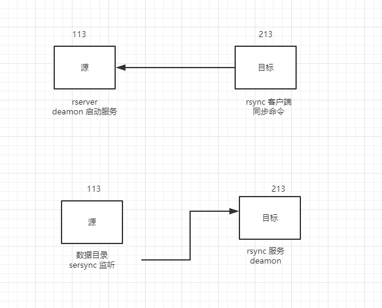

# 亿级流量系统多级缓存架构15 静态文件生成方案

## 模板文件外部路径 √

## 项目部署  √

## 多Nginx同步数据 √



### 镜像服务器启动服务

在213上 启动rsync服务

检查密码文件

```
hello:123
```


`rsync --daemon`


### 在数据源创建密码文件

vi /etc/rsync.password

chmod 600  /etc/rsync.password

```
123
```

sersync  的方式监控目录中变化的数据，通过rsync客户端推送给rsync daemon

### 数据源的服务配置

```
yum install rsync -y
vi /etc/rsync.password
`123`
chmod 600 /etc/rsync.password

下载sersync

wget https://storage.googleapis.com/google-code-archive-downloads/v2/code.google.com/sersync/sersync2.5.4_64bit_binary_stable_final.tar.gz

tar xf sersync2.5.4_64bit_binary_stable_final.tar.gz 

cd GNU-Linux-x86/

mkdir -p  /opt/sersync/{logs,conf,bin}
cp sersync2 /opt/sersync/bin
cp confxml.xml /opt/sersync/conf/
cd /opt/sersync/conf/
vi confxml.xml 
../bin/sersync2 -d -r -o ./confxml.xml 

cd /data
touch {1,2,3,4,5,6}
```

## 批量生成文件 √

## 首页生成 √

## 健康检查 √

## 静态文件缓存架构

## 搜索

## 分页