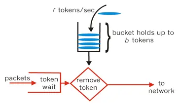

## 亿级流量系统多级缓存架构6

## 服务限流

### 什么叫限流？

Ab测试

```
yum install httpd-tools
```


即限制流量进入

**缓存**，是用来增加系统吞吐量，提升访问速度提供高并发。

**降级**，是在系统某些服务组件不可用的时候、流量暴增、资源耗尽等情况下，暂时屏蔽掉出问题的服务，继续提供降级服务，给用户尽可能的友好提示，返回兜底数据，不会影响整体业务流程，待问题解决再重新上线服务 

**限流**，是指在使用缓存和降级无效的场景。比如当达到阈值后限制接口调用频率，访问次数，库存个数等，在出现服务不可用之前，提前把服务降级。只服务好一部分用户。


在我们使用微信、支付宝、短信等等这些api的时候，每个接口都会有调用上的限流。

限流是对某一时间窗口内的请求数进行限制，保持系统的可用性、稳定性和安全性，防止因流量暴增而导致的系统运行缓慢或宕机，

app 统计

友盟 cnzz .....

### 限流算法

#### 计数器算法

简单粗暴

比如线程池大小，数据库连接池大小、nginx连接数等都属于计数器算法。

全局或某段时间范围达到阈值则限流。

#### 漏桶算法


```
削峰
缓冲
消费速度固定 因为计算性能固定
保证桶不能忙
```


#### 令牌桶算法



平滑的流入速率限制，消费/秒。

可以用于对外服务接口，内部集群调用


**区别**

- 令牌桶是按照固定速率从桶里拿令牌消费，如果令牌为0，则拒绝新请求
- 漏桶是按照固定速率流出请求，流入速率不控制，当桶内请求达到阈值，新请求则被拒绝。
- 令牌桶支持每次拿多个令牌，平均流入速率，并支持突发流入，还可以支持缓慢提升流入速度

#### 并发限流

设置系统阈值总的qps个数

Tomcat中配置的

- acceptCount 响应连接数
- maxConnections 瞬时最大连接数
- maxThreads 最大线程数

#### 接口限流

##### 接口总数

可以使用atomic类或者semaphore进行限流

这种方式简单粗暴。没有平滑处理。使用限制某个接口的总并发数，或限制某账号服务调用总次数。

比如某些开放平台限制试用账号。

```java
if (atomic.incrementAndGet() > 100){
    // 拒绝
}finally{
	atomic.decrementAndGet();

}
```

##### 接口时间窗口

此时可以使用`Guava Cache`，类似于一个`ConcurrentMap`,但并不完全一样。

最基础的不同是`ConcurrentMap`保存所有的元素知道它们被明确删除,`Guava Cache`可以配置自动过期

```java
//计数器
counter;
// 限制数量
limit;
// 限制单位 1000=秒
unit;
// 获得当前时间
current = system.currentTimeMillis() / unit
//判断时间窗内是否限制访问

if (counter.get(current).incrementAndGet() > limit){
    // 拒绝
}

```

### 使用guava实现

**引入包**

```xml
<!-- https://mvnrepository.com/artifact/com.google.guava/guava -->
<dependency>
    <groupId>com.google.guava</groupId>
    <artifactId>guava</artifactId>
    <version>28.1-jre</version>
</dependency>
```


**核心代码**

```java
		LoadingCache<Long, AtomicLong> counter = CacheBuilder.newBuilder().
				expireAfterWrite(2, TimeUnit.SECONDS)
				.build(new CacheLoader<Long, AtomicLong>() {

					@Override
					public AtomicLong load(Long secend) throws Exception {
						// TODO Auto-generated method stub
						return new AtomicLong(0);
					}
				});
		counter.get(1l).incrementAndGet();
```

#### 令牌桶实现

**稳定模式(SmoothBursty:令牌生成速度恒定)**

```java
	public static void main(String[] args) {
		// RateLimiter.create(2)每秒产生的令牌数
		RateLimiter limiter = RateLimiter.create(2);
        // limiter.acquire() 阻塞的方式获取令牌
		System.out.println(limiter.acquire());;
		try {
			Thread.sleep(2000);
		} catch (InterruptedException e) {
			// TODO Auto-generated catch block
			e.printStackTrace();
		}
		System.out.println(limiter.acquire());;
		System.out.println(limiter.acquire());;
		System.out.println(limiter.acquire());;
		System.out.println(limiter.acquire());;
		
		System.out.println(limiter.acquire());;
		System.out.println(limiter.acquire());;
	}
```

```RateLimiter.create(2)`` 容量和突发量，令牌桶算法允许将一段时间内没有消费的令牌暂存到令牌桶中，用来突发消费。

**渐进模式(SmoothWarmingUp:令牌生成速度缓慢提升直到维持在一个稳定值)** 

```java
	// 平滑限流，从冷启动速率（满的）到平均消费速率的时间间隔
		RateLimiter limiter = RateLimiter.create(2,1000l,TimeUnit.MILLISECONDS);
		System.out.println(limiter.acquire());;
		try {
			Thread.sleep(2000);
		} catch (InterruptedException e) {
			// TODO Auto-generated catch block
			e.printStackTrace();
		}
		System.out.println(limiter.acquire());;
		System.out.println(limiter.acquire());;
		System.out.println(limiter.acquire());;
		System.out.println(limiter.acquire());;
		
		System.out.println(limiter.acquire());;
		System.out.println(limiter.acquire());;
```


**超时**

```
boolean tryAcquire = limiter.tryAcquire(Duration.ofMillis(11));
```

在timeout时间内是否能够获得令牌，异步执行


### 分布式系统限流

#### Nginx + Lua

可以使用resty.lock保持原子特性，请求之间不会产生锁的重入

https://github.com/openresty/lua-resty-lock

使用lua_shared_dict存储数据

```lua
local locks = require "resty.lock"

local function acquire()
    local lock =locks:new("locks")
    local elapsed, err =lock:lock("limit_key") --互斥锁 保证原子特性
    local limit_counter =ngx.shared.limit_counter --计数器

    local key = "ip:" ..os.time()
    local limit = 5 --限流大小
    local current =limit_counter:get(key)

    if current ~= nil and current + 1> limit then --如果超出限流大小
       lock:unlock()
       return 0
    end
    if current == nil then
       limit_counter:set(key, 1, 1) --第一次需要设置过期时间，设置key的值为1，
过期时间为1秒
    else
        limit_counter:incr(key, 1) --第二次开始加1即可
    end
    lock:unlock()
    return 1
end
ngx.print(acquire())

```


**nginx配置**