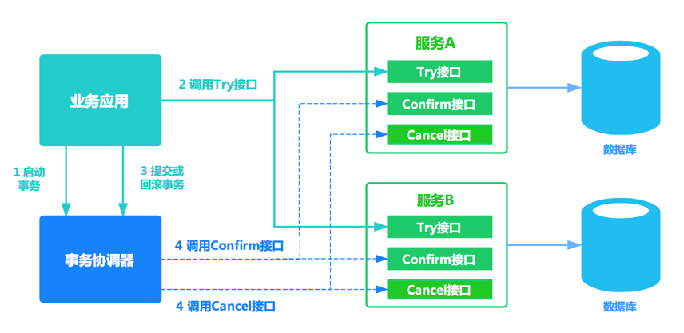

# 亿级流量系统多级缓存架构 -分布式事务 2

## 刚性事物和柔性事物

1. 刚性事务：遵循ACID原则，强一致性。
2. 柔性事务：遵循BASE理论，最终一致性

## 分布式事务解决方案

### XA两阶段提交方案

数据库实现xa协议，保证事务，mysql oracle等。

#### 一阶段提交

由单数据源数据库实现，以mysql为例，

- 记录redolog
- 数据库通过redolog完成事务

单节点提交简单直观，没有和其他节点的通讯，性能好

#### 二阶段提交

主要由商业数据库实现，但并不常用，强一致性，性能低

- 增加中间角色，事务管理器，来收集各数据库事务状态
- 阻塞
- 事务管理器 是由数据库提供的中间件

### 接口查询

### TCC

在互联网项目，电商系统，app领域占据主力地位

接口需要自己实现或使用第三方开源框架

二阶段提交改进

对代码有侵入

- Try
- confirm
- cancel

有侵入性、需要做幂等操作

### 商业产品

**GTS**

全局事务服务（Global Transaction Service ，简称GTS）用于实现分布式环境下特别是微服务架构下的高性能事务一致性。可以与RDS、MySQL、PostgreSQL、DRDS等数据源，Spring Cloud、Dubbo、EDAS及其他RPC框架，MQ消息队列等中间件产品配合使用，轻松实现分布式数据库事务、多库事务、消息事务、服务链路级事务及各种组合。

阿里云服务中间件

https://www.aliyun.com/aliware/txc

https://yq.aliyun.com/articles/334238

作者

https://weibo.com/jiangyu666

### LCN

http://www.txlcn.org/zh-cn/

**Lock**、**confirm**、**notify**

兼容dubbo、springcloud框架，支持RPC框架拓展，支持各种ORM框架、NoSQL、负载均衡、事务补偿

#### 原理

https://txlcn.org/zh-cn/docs/principle/control.html

### tcc-transaction

### TXC

无侵入式