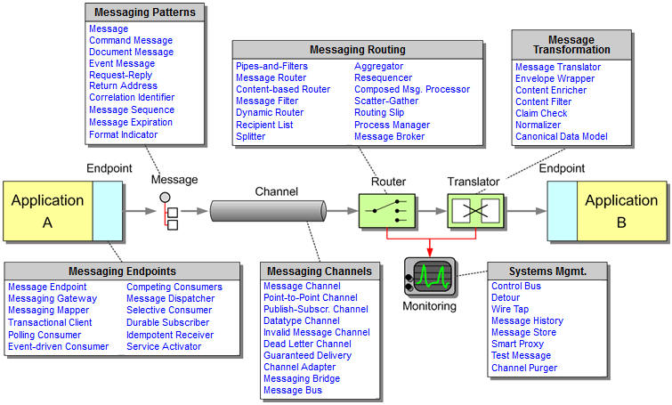

# Active MQ 05

## 高级使用

### queue browser

可以查看队列中的消息而不消费，没有订阅的功能

### JMSCorrelationID

用于消息之间的关联，给人一种会话的感觉

http://activemq.apache.org/how-should-i-implement-request-response-with-jms.html

---

### **JMSReplyTo**

发送方可以接受到消息消费确认的地址

### QueueRequestor同步消息

可以发送同步消息

本质违背了mq的异步通讯原则

但是mq还是能够提供应用解耦、异构系统的特性

因为使用QueueRequestor发送消息后，会等待接收端的回复，如果收不到回复就会造成死等现象!而且该方法没有设置超时等待的功能 

### 生产环境中影响性能的几个因素

#### Out of memory

activemq启动脚本中配置内存

```
%ACTIVEMQ_OPTS%" == "" set ACTIVEMQ_OPTS=-Xms1G -Xmx1G
```


以及配置文件中的百分比

```
<memoryUsage percentOfJvmHeap="70" />
```


SystemUsage配置设置了一些系统内存和硬盘容量，当系统消耗超过这些容量设置时，amq会“slow down producer”，还是很重要的。

#### 持久化和非持久化

#### 消息异步发送

建议使用默认，强制开启有可能丢失消息

异步发送丢失消息的场景是：生产者设置UseAsyncSend=true，使用producer.send(msg)持续发送消息。由于消息不阻塞，生产者会认为所有send的消息均被成功发送至MQ。如果服务端突然宕机，此时生产者端内存中尚未被发送至MQ的消息都会丢失。

```
new ActiveMQConnectionFactory("tcp://locahost:61616?jms.useAsyncSend=true");
```

```
((ActiveMQConnectionFactory)connectionFactory).setUseAsyncSend(true);
```

```
((ActiveMQConnection)connection).setUseAsyncSend(true)
```


#### 批量确认

ActiveMQ缺省支持批量确认消息，批量确认可以提高系统性能

**关闭方法**

```
new ActiveMQConnectionFactory("tcp://locahost:61616?jms.optimizeAcknowledge=false");
```

```
((ActiveMQConnectionFactory)connectionFactory).setOptimizeAcknowledge(fase);
```

```
((ActiveMQConnection)connection).setOptimizeAcknowledge(true);
```


### 消费缓冲与消息积压prefetchSize

消费者端，一般来说消费的越快越好，broker的积压越小越好。

但是考虑到事务性和客户端确认的情况，如果一个消费者一次获取到了很多消息却都不确认，这会造成事务上下文变大，broker端这种“半消费状态”的数据变多，所以ActiveMQ有一个prefetchSize参数来控制未确认情况下，最多可以预获取多少条记录。

**Pre-fetch默认值**

| consumer type | default value |
| ------------- | ------------- |
| queue         | 1000          |
| queue browser | 500           |
| topic         | 32766         |
| durable topic | 1000          |


#### 可以通过3中方式设置prefetchSize

**创建连接时整体设置**

```
	ActiveMQConnectionFactory connectio nFactory = new ActiveMQConnectionFactory(
				"admin",
				"admin",
				"tcp://localhost:5671?jms.prefetchPolicy.all=50"
				);
```

**创建连接时对topic和queue单独设置**

```
		ActiveMQConnectionFactory connectionFactory = new ActiveMQConnectionFactory(
				"admin",
				"admin",
				"tcp://localhost:5671?jms.prefetchPolicy.queuePrefetch=1&jms.prefetchPolicy.topicPrefetch=1"
				);
```

**针对destination单独设置**

```
Destination topic = session.createTopic("user?consumer.prefetchSize=10");
```


注意：对destination设置prefetchsize后会覆盖连接时的设置值


### 消息到底是推还是拉?

发送消息时是推向broker

获取消息时：

- 默认是一条一条的推
- 当customer的prefetchSize满的时候停止推消息
- 当customer的prefetchSize ==0时 拉取消息

### EIP Enterprise Integration Patterns.

EIP系统是以数据为基础，应用为核心，以实现业务及业务流程的自动化为目的多功能企业信息平台。为企业的信息化建设提供一种循序渐进，逐步优化的路径




一个围绕消息集成的企业应用集成场景基本在上面的图中描述的比较清楚的，简单说明如下

1)消息发送方和接收方：可以是异构的业务系统，但是都需要提供Endpoint实现集成。
2)消息本身：两个应用系统通过channel连接，实现了消息本身的发送和接收操作
3)消息Channel：即消息传输的通道，消息本身必须要通过channel来实现传输，从源到达目标。
4)消息路由：当有多个目标接收方的时候，如果根据消息的特征来确定究竟发送到哪个接收方？
5)消息转换：消息在传输过程中是否需要进行转换和数据映射，包括报文格式转换和内容转换映射。
6)Pipe and Filter：在执行复杂的消息流处理时，如何维护消息本身的独立性和灵活性。


常用实现Camel

支持ActiveMQ、RabbitMQ、kafka、WebService

**camel实现了客户端与服务端的解耦， 生产者和消费者的解耦。**


