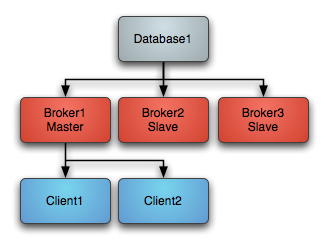
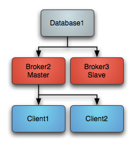
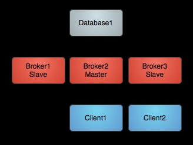
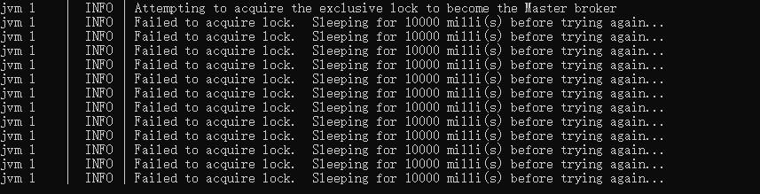
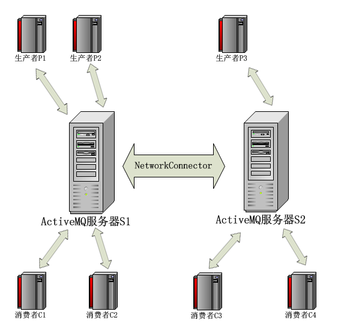
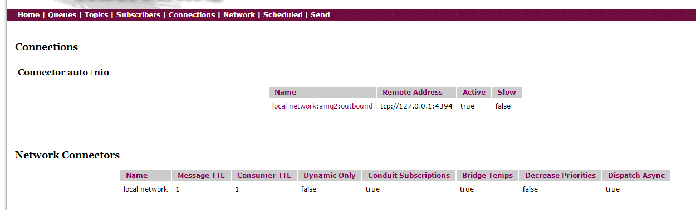
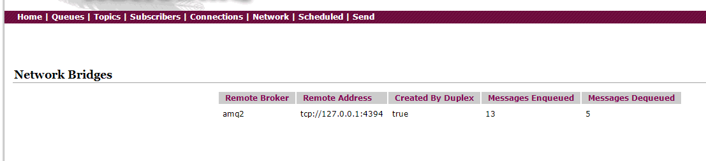

# Active MQ 07

## 集群配置

**官方文档**

http://activemq.apache.org/clustering

### 主备集群

http://activemq.apache.org/masterslave.html

| Master Slave Type                                            | Requirements                       | Pros                                                         | Cons                                                         |
| ------------------------------------------------------------ | ---------------------------------- | ------------------------------------------------------------ | ------------------------------------------------------------ |
| [Shared File System Master Slave](http://activemq.apache.org/shared-file-system-master-slave) | A shared file system such as a SAN | Run as many slaves as required. Automatic recovery of old masters | Requires shared file system                                  |
| [JDBC Master Slave](http://activemq.apache.org/jdbc-master-slave) | A Shared database                  | Run as many slaves as required. Automatic recovery of old masters | Requires a shared database. Also relatively slow as it cannot use the high performance journal |
| [Replicated LevelDB Store](http://activemq.apache.org/replicated-Features/PersistenceFeatures/Persistence/Features/Persistence/leveldb-store) | ZooKeeper Server                   | Run as many slaves as required. Automatic recovery of old masters. Very fast. | Requires a ZooKeeper server.                                 |

#### Shared File System Master Slave

基于共享存储的Master-Slave；多个broker共用同一数据源，谁拿到锁谁就是master,其他处于待启动状态，如果master挂掉了，某个抢到文件锁的slave变成master

**启动后**




**Master宕机**




**Master重启**




**JDBC Master Slave**

基于JDBC的Master-Slave:使用同一个数据库，拿到LOCK表的写锁的broker成为master.

性能较低，不能使用高性能日志

**Replicated LeveDB Store**

基于zookeeper复制LeveDB存储的Master-Slave机制

**配置步骤**

1. 修改broker名称
2. 修改数据源
   1. 如果使用kahadb，配置相同路径
   2. 如果使用mysql 使用同一数据源（同一数据库和表）

**尝试**



http://activemq.apache.org/failover-transport-reference.html


#### failover 故障转移协议

断线重连机制是ActiveMQ的高可用性具体体现之一。ActiveMQ提供failover机制去实现断线重连的高可用性，可以使得连接断开之后，不断的重试连接到一个或多个brokerURL。

默认情况下，如果client与broker直接的connection断开，则client会新起一个线程，不断的从url参数中获取一个url来重试连接。

配置语法

```java
		ActiveMQConnectionFactory connectionFactory = new ActiveMQConnectionFactory(
				"admin",
				"admin",
				"failover:(nio://localhost:5671,nio://localhost:5672)"
				);
```

**可配置选项**

#### Transport Options

| Option Name                   | Default Value | Description                                                  |
| ----------------------------- | ------------- | ------------------------------------------------------------ |
| `backup`                      | `false`       | Initialize and hold a second transport connection - to enable fast failover. |
| `initialReconnectDelay`       | `10`          | The delay (in ms) before the *first* reconnect attempt.      |
| `maxCacheSize`                | `131072`      | Size in bytes for the cache of tracked messages. Applicable only if `trackMessages` is `true`. |
| `maxReconnectAttempts`        | `-1 | 0`      | **From ActiveMQ 5.6**: default is `-1`, retry forever. `0` means disables re-connection, e.g: just try to connect once. **Before ActiveMQ 5.6**: default is `0`, retry forever. **All ActiveMQ versions**: a value `>0` denotes the maximum number of reconnect attempts before an error is sent back to the client. |
| `maxReconnectDelay`           | `30000`       | The maximum delay (in ms) between the *second and subsequent* reconnect attempts. |
| `nested.*`                    | `null`        | **From ActiveMQ 5.9:** common URI options that will be applied to each URI in the list**.** |
| `randomize`                   | `true`        | If `true`, choose a URI at random from the list to use for reconnect. |
| `reconnectDelayExponent`      | `2.0`         | The exponent used during exponential back-off attempts.      |
| `reconnectSupported`          | `true`        | Determines whether the client should respond to broker `ConnectionControl` events with a reconnect (see: `rebalanceClusterClients`). |
| `startupMaxReconnectAttempts` | `-1`          | A value of `-1` denotes that the number of connection attempts at startup should be unlimited. A value of `>=0` denotes the number of reconnect attempts at startup that will be made after which an error is sent back to the client when the client makes a subsequent reconnect attempt. **Note**: once successfully connected the `maxReconnectAttempts` option prevails. |
| `timeout`                     | `-1`          | **From ActiveMQ 5.3**: set the timeout on send operations (in ms) without interruption of re-connection process. |
| `trackMessages`               | `false`       | Keep a cache of in-flight messages that will flushed to a broker on reconnect. |
| `updateURIsSupported`         | `true`        | **From** **ActiveMQ 5.4:** determines whether the client should accept updates from the broker to its list of known URIs. |
| `updateURIsURL`               | `null`        | **From ActiveMQ 5.4:** a URL (or path to a local file) to a text file containing a comma separated list of URIs to use for reconnect in the case of failure. |
| `useExponentialBackOff`       | `true`        | If `true` an exponential back-off is used between reconnect attempts. |
| `warnAfterReconnectAttempts`  | `10`          | **From ActiveMQ 5.10:** a value `>0` specifies the number of reconnect attempts before a warning is logged. A logged warning indicates that there is no current connection but re-connection is being attempted. A value of `<=0` disables the logging of warnings about reconnect attempts. |

**backup**

初始化的时候创建第二个连接，快速故障转移

**initialReconnectDelay**

第一次重试延迟

**trackMessages**

设置是否缓存（故障发生时）尚未传送完成的消息，当broker一旦重新连接成功，便将这些缓存中的消息刷新到新连接的代理中，使得消息可以在broker切换前后顺利传送。默认false

**maxCacheSize**

当trackMessage启动时，缓存的最大子字节数

**maxReconnectAttempts**

默认1|0，自5.6版本开始，-1为默认值，代表不限重试次数，0标识从不重试（只尝试连接一次，并不重连），5.6以前的版本，0为默认值，代表不重试，如果设置大于0的数，则代表最大重试次数。

**maxReconnectDelay**

最长重试间隔

**randomize**

使用随机连接，以达到负载均衡的目的，默认true

只配主备的情况下最好关闭

**startupMaxReconnectAttempts**

初始化时的最大重试次

“-1”表示在启动时连接尝试的次数是无限的。

' >=0 '的值表示在启动时重新连接尝试的次数

一旦成功连接后续将使用“maxReconnectAttempts”选项

**timeout**

连接超时

**updateURIsSupported**

是否可以动态修改broker uri

**updateURIsURL**

指定动态修改地址的路径

**useExponentialBackOff**

重连时间间隔是否以指数形式增长

**reconnectDelayExponent**

指数增长时的指数

**warnAfterReconnectAttempts**

重连日志记录

### 负载均衡

**官方文档**

http://activemq.apache.org/networks-of-brokers.html

#### 静态网络配置



在broker节点下配置networkConnectors

- networkConnectors（网络连接器）主要用来配置ActiveMQ服务端与服务端之间的通信
- TransportConnector（传输连接器）主要用于配置ActiveMQ服务端和客户端之间的通信方式

```
<networkConnectors>
  <networkConnector duplex="true" name="amq-cluster" uri="static:failover://(nio://localhost:5671,nio://localhost:5672)"  />
</networkConnectors>
```

参与的节点都需要修改

注意如果单机启动多个节点，记得修改端口避免冲突

启动成功后`Connections`中会有其他节点



`Network`中也会显示桥接连接



负载均衡的环境下，broker上的消息优先给在本地连接的consumer

当networkerConnector与remote Broker建立链接之后，那么remote Broker将会向local Broker交付订阅信息，包括remote broker持有的destinations、Consumers、持久订阅者列表等；那么此后local Broker将把remote Broker做一个消息“订阅者”


**Advisory**

ActiveMQ提供了“Advisory”机制，通常ActiveMQ内部将某些事件作为“advisory”在全局广播，比如destination的创建、consumer的加入、DLQ的产生等，这将额外的消耗极小的性能；我们可以在ActiveMQ的监控页面上看到影响的消息，开发者也可以View这些消息(通道名称以“ActiveMQ.Advisory.”开头)。对于分布式网络中的broker，将严重依赖“Advisory”，特别是“dynamic network”，默认已开启

在一个broker上发生事件，都会以“通知”的方式发送给配置文件中指定的所有networkConnector

**Dynamic networks**

“动态网络”表明当remote Broker持有通道的消费者时，local Broker才会转发相应的消息；此时我们需要开启advisorySupport。当remote broker上有Consumer创建时，Advisory中将会广播消息，消息为ConsumerInfo类型，它将包括consumer所在的broker path，如果local broker与此path建立了networkConnector，那么此后local Broker将会启动响应的消息转发。

**Static networks**

  相对于“动态网络”而言，“静态网络”将不依赖Advisory，在任何时候，即使remote Broker中没有相应的consumer，消息也将转发给remote Broker

将brokers作为简单代理并转发消息到远端而不管是否有消费者

#### 可配置属性

##### URI的几个属性

| property              | default | description                                                  |
| --------------------- | ------- | ------------------------------------------------------------ |
| initialReconnectDelay | 1000    | time(ms) to wait before attempting a reconnect (if useExponentialBackOff is false) |
| maxReconnectDelay     | 30000   | time(ms) to wait before attempting to re-connect             |
| useExponentialBackOff | true    | increases time between reconnect for every failure in a reconnect sequence |
| backOffMultiplier     | 2       | multipler used to increase the wait time if using exponential back off |

##### NetworkConnector Properties

| property                            | default | description                                                  |
| ----------------------------------- | ------- | ------------------------------------------------------------ |
| name                                | bridge  | name of the network - for more than one network connector between the same two brokers - use different names |
| dynamicOnly                         | false   | if true, only activate a networked durable subscription when a corresponding durable subscription reactivates, by default they are activated on startup. |
| decreaseNetworkConsumerPriority     | false   | if true, starting at priority -5, decrease the priority for dispatching to a network Queue consumer the further away it is (in network hops) from the producer. When false all network consumers use same default priority(0) as local consumers |
| networkTTL                          | 1       | the number of brokers in the network that messages and subscriptions can pass through (sets both message&consumer -TTL) |
| messageTTL                          | 1       | (version 5.9) the number of brokers in the network that messages can pass through |
| consumerTTL                         | 1       | (version 5.9) the number of brokers in the network that subscriptions can pass through (keep to 1 in a mesh) |
| conduitSubscriptions                | true    | multiple consumers subscribing to the same destination are treated as one consumer by the network |
| excludedDestinations                | empty   | destinations matching this list won’t be forwarded across the network (this only applies to dynamicallyIncludedDestinations) |
| dynamicallyIncludedDestinations     | empty   | destinations that match this list **will** be forwarded across the network **n.b.** an empty list means all destinations not in the exluded list will be forwarded |
| useVirtualDestSubs                  | false   | if true, the network connection will listen to advisory messages for virtual destination consumers |
| staticallyIncludedDestinations      | empty   | destinations that match will always be passed across the network - even if no consumers have ever registered an interest |
| duplex                              | false   | if true, a network connection will be used to both produce ***AND\*** Consume messages. This is useful for hub and spoke scenarios when the hub is behind a firewall etc. |
| prefetchSize                        | 1000    | Sets the [prefetch size](http://activemq.apache.org/what-is-the-prefetch-limit-for) on the network connector’s consumer. It must be > 0 because network consumers do not poll for messages |
| suppressDuplicateQueueSubscriptions | false   | (from 5.3) if true, duplicate subscriptions in the network that arise from network intermediaries will be suppressed. For example, given brokers A,B and C, networked via multicast discovery. A consumer on A will give rise to a networked consumer on B and C. In addition, C will network to B (based on the network consumer from A) and B will network to C. When true, the network bridges between C and B (being duplicates of their existing network subscriptions to A) will be suppressed. Reducing the routing choices in this way provides determinism when producers or consumers migrate across the network as the potential for dead routes (stuck messages) are eliminated. networkTTL needs to match or exceed the broker count to require this intervention. |
| bridgeTempDestinations              | true    | Whether to broadcast advisory messages for created temp destinations in the network of brokers or not. Temp destinations are typically created for request-reply messages. Broadcasting the information about temp destinations is turned on by default so that consumers of a request-reply message can be connected to another broker in the network and still send back the reply on the temporary destination specified in the JMSReplyTo header. In an application scenario where most/all messages use request-reply pattern, this will generate additional traffic on the broker network as every message typically sets a unique JMSReplyTo address (which causes a new temp destination to be created and broadcasted via an advisory message in the network of brokers). When disabling this feature such network traffic can be reduced but then producer and consumers of a request-reply message need to be connected to the same broker. Remote consumers (i.e. connected via another broker in your network) won’t be able to send the reply message but instead raise a “temp destination does not exist” exception. |
| alwaysSyncSend                      | false   | (version 5.6) When true, non persistent messages are sent to the remote broker using request/reply in place of a oneway. This setting treats both persistent and non-persistent messages the same. |
| staticBridge                        | false   | (version 5.6) If set to true, broker will not dynamically respond to new consumers. It will only use `staticallyIncludedDestinations` to create demand subscriptions |
| userName                            | null    | The username to authenticate against the remote broker       |
| password                            | null    | The password for the username to authenticate against the remote broker |

**name**

相同的名称会被添加到同一集群中

**dynamicOnly**

是否直接转发，设置成true的话 broker会在没有消费者的时候不去转发消息

**decreaseNetworkConsumerPriority**

如果为true，网络的消费者优先级降低为-5。如果为false，则默认跟本地消费者一样为0.

**networkTTL** **messageTTL** **consumerTTL**

消息和订阅在网络中被broker转发（穿过）的最大次数，消息在网络中每转发一次，都会将TTL-1


**conduitSubscriptions**

多个消费者消费消息被当作一个消费者

**excludedDestinations**

在这个名单中的Destination不会在网络中被转发

```
<excludedDestinaitons>
        <queue physicalName="include.test.foo"/>
        <topic physicalName="include.test.bar"/>
　</excludedDestinaitons>
```


**dynamicallyIncludedDestinations**

通过网络转发的destinations，注意空列表代表所有的都转发。

```
　<dynamicallyIncludeDestinaitons>
        <queue physicalName="include.test.foo"/>
        <topic physicalName="include.test.bar"/>
　</dynamicallyIncludeDestinaitons>
```


**useVirtualDestSubs**

开启此选项会在转发消息时

**staticallyIncludedDestinations**

匹配的目的地将始终通过网络传递——即使没有消费者对此感兴趣 对应静态networks

```
 <staticallyIncludeDestinaitons>
        <queue physicalName="aways.include.queue"/>
　</staticallyIncludeDestinaitons>
```


**duplex**

是否允许双向连接**如果该属性为true，当这个节点使用Network Bridge连接到其它目标节点后，将强制目标也建立Network Bridge进行反向连接**

**prefetchSize**

缓冲消息大小，必须大于0，不会主动拉取消息

**suppressDuplicateQueueSubscriptions**

如果为true, 重复的订阅关系一产生即被阻止。

**bridgeTempDestinations**

是否转发临时destination，禁用后再使用request/reply模型的时候客户端需要连接到同一broker，不然会找不到destination

**alwaysSyncSend**

开启后转发非持久化消息会使用request/reply模型

**staticBridge**

如果设置为true，则代理将不会动态响应新的consumer，只能使用staticallyIncludedDestinations中的destination

**userName** **password**

连接broker时的用户名和密码


#### 动态网络配置

**官方文档**

http://activemq.apache.org/multicast-transport-reference

使用multicast协议，可以指定组播地址或使用`multicast://default`（239.255.2.3）

配置`networkConnectors`

```
<networkConnectors>
 <networkConnector uri="multicast://239.0.0.5" duplex="false"/>
</networkConnectors>
```

broker启动后会使用udp协议向组播地址发送数据报文以便让其他在这个组播地址的节点感知到自己的存在

每个UDP数据报中，包含的主要信息包括本节点ActiveMQ的版本信息，以及连接到自己所需要使用的host名字、协议名和端口信息。

配置`transportConnector`指明将哪一个连接通过UDP数据报向其他ActiveMQ节点进行公布，就需要在transportConnector标签上使用discoveryUri属性进行标识

```
	<transportConnector name="auto+nio" uri="auto+nio://localhost:5672" discoveryUri="multicast://239.0.0.5"/>
```


### 消息回流

在消息转发的时候，remote broker转发Local broker的消息会消费掉LocalBroker的消息

那么在转发的过程中，消息在被拉取后和发送给consumer的过程中重启的话会造成消息丢失

`replayWhenNoConsumers` 选项可以使remote broke上有需要转发的消息但是没有被消费时，把消息回流到它原始的broker.同时把enableAudit设置为false,为了防止消息回流后被当作重复消息而不被分发

```
　　　　 <destinationPolicy>
            <policyMap>
              <policyEntries>
                <policyEntry queue=">" enableAudit="false">
                    <networkBridgeFilterFactory>
                        <conditionalNetworkBridgeFilterFactory replayWhenNoConsumers="true"/>
                    </networkBridgeFilterFactory>
                </policyEntry>
              </policyEntries>
            </policyMap>
        </destinationPolicy>
```


### 消息副本

http://activemq.apache.org/replicated-message-store