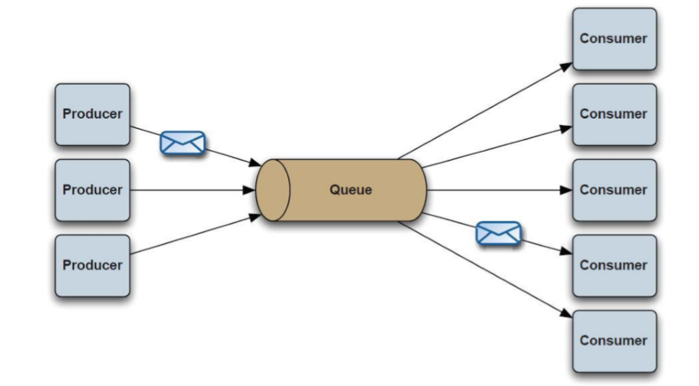
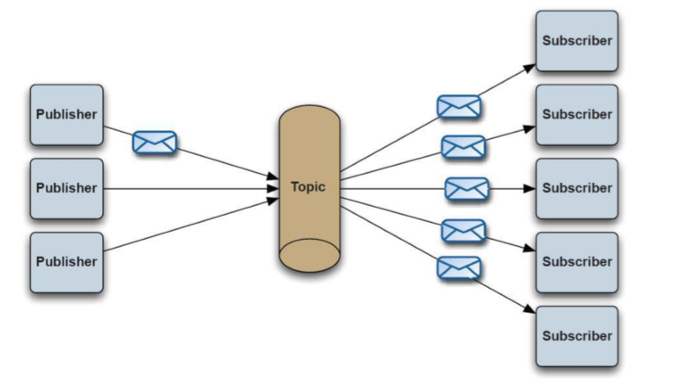

# 消息中间件之ActiveMQ 01

# 什么是JMS MQ

全称：Java MessageService 中文：Java 消息服务。 

JMS 是 Java 的一套 API 标准，最初的目的是为了使应用程序能够访问现有的 MOM 系 统（MOM 是 MessageOriented Middleware 的英文缩写，指的是利用高效可靠的消息传递机 制进行平台无关的数据交流，并基于数据通信来进行分布式系统的集成。） ；

后来被许多现有 的 MOM 供应商采用，并实现为 MOM 系统。【常见 MOM 系统包括 Apache 的 ActiveMQ、 阿里巴巴的 RocketMQ、IBM 的 MQSeries、Microsoft 的 MSMQ、BEA 的 RabbitMQ 等。 （并 非全部的 MOM 系统都遵循 JMS 规范）】 

基于 JMS 实现的 MOM，又被称为 JMSProvider。

“消息”是在两台计算机间传送的数据单位。消息可以非常简单，例如只包含文本字符串； 也可以更复杂，可能包含嵌入对象。 消息被发送到队列中。

“消息队列”是在消息的传输过程中保存消息的容器。消息队列管 理器在将消息从它的源中继到它的目标时充当中间人。

队列的主要目的是提供路由并保证消 息的传递；如果发送消息时接收者不可用，消息队列会保留消息，直到可以成功地传递它。

消息队列的主要特点是异步处理，主要目的是减少请求响应时间和解耦。所以主要的使 用场景就是将比较耗时而且不需要即时（同步）返回结果的操作作为消息放入消息队列。同 时由于使用了消息队列，只要保证消息格式不变，消息的发送方和接收方并不需要彼此联系， 也不需要受对方的影响，即解耦和。如: 跨系统的异步通信，所有需要异步交互的地方都可以使用消息队列。就像我们除了打电 话（同步）以外，还需要发短信，发电子邮件（异步）的通讯方式。 多个应用之间的耦合，由于消息是平台无关和语言无关的，而且语义上也不再是函数调 用，因此更适合作为多个应用之间的松耦合的接口。基于消息队列的耦合，不需要发送方和 接收方同时在线。 在企业应用集成（EAI）中，文件传输，共享数据库，消息队列，远程过程调用都可以 作为集成的方法。 应用内的同步变异步，比如订单处理，就可以由前端应用将订单信息放到队列，后端应 用从队列里依次获得消息处理，高峰时的大量订单可以积压在队列里慢慢处理掉。由于同步 通常意味着阻塞，而大量线程的阻塞会降低计算机的性能。 消息驱动的架构（EDA），系统分解为消息队列，和消息制造者和消息消费者，一个处 理流程可以根据需要拆成多个阶段（Stage） ，阶段之间用队列连接起来，前一个阶段处理的 结果放入队列，后一个阶段从队列中获取消息继续处理。 应用需要更灵活的耦合方式，如发布订阅，比如可以指定路由规则。 跨局域网，甚至跨城市的通讯，比如北京机房与广州机房的应用程序的通信。


## 消息中间件应用场景

### **异步通信**

有些业务不想也不需要立即处理消息。消息队列提供了异步处理机制，允许用户把一个消息放入队列，但并不立即处理它。想向队列中放入多少消息就放多少，然后在需要的时候再去处理它们。

### **缓冲**

在任何重要的系统中，都会有需要不同的处理时间的元素。消息队列通过一个缓冲层来帮助任务最高效率的执行，该缓冲有助于控制和优化数据流经过系统的速度。以调节系统响应时间。

### **解耦**

降低工程间的强依赖程度，针对异构系统进行适配。在项目启动之初来预测将来项目会碰到什么需求，是极其困难的。通过消息系统在处理过程中间插入了一个隐含的、基于数据的接口层，两边的处理过程都要实现这一接口，当应用发生变化时，可以独立的扩展或修改两边的处理过程，只要确保它们遵守同样的接口约束。

### **冗余**

有些情况下，处理数据的过程会失败。除非数据被持久化，否则将造成丢失。消息队列把数据进行持久化直到它们已经被完全处理，通过这一方式规避了数据丢失风险。许多消息队列所采用的”插入-获取-删除”范式中，在把一个消息从队列中删除之前，需要你的处理系统明确的指出该消息已经被处理完毕，从而确保你的数据被安全的保存直到你使用完毕。

### **扩展性**

因为消息队列解耦了你的处理过程，所以增大消息入队和处理的频率是很容易的，只要另外增加处理过程即可。不需要改变代码、不需要调节参数。便于分布式扩容。

### **可恢复性**

系统的一部分组件失效时，不会影响到整个系统。消息队列降低了进程间的耦合度，所以即使一个处理消息的进程挂掉，加入队列中的消息仍然可以在系统恢复后被处理。

### **顺序保证**

在大多使用场景下，数据处理的顺序都很重要。大部分消息队列本来就是排序的，并且能保证数据会按照特定的顺序来处理。

### **过载保护**

在访问量剧增的情况下，应用仍然需要继续发挥作用，但是这样的突发流量无法提取预知；如果以为了能处理这类瞬间峰值访问为标准来投入资源随时待命无疑是巨大的浪费。使用消息队列能够使关键组件顶住突发的访问压力，而不会因为突发的超负荷的请求而完全崩溃。

### **数据流处理**

分布式系统产生的海量数据流，如：业务日志、监控数据、用户行为等，针对这些数据流进行实时或批量采集汇总，然后进行大数据分析是当前互联网的必备技术，通过消息队列完成此类数据收集是最好的选择。


## 常用消息队列（ActiveMQ、RabbitMQ、RocketMQ、Kafka）比较

| 特性MQ           | ActiveMQ   | RabbitMQ   | RocketMQ         | Kafka            |
| ---------------- | ---------- | ---------- | ---------------- | ---------------- |
| 生产者消费者模式 | 支持       | 支持       | 支持             | 支持             |
| 发布订阅模式     | 支持       | 支持       | 支持             | 支持             |
| 请求回应模式     | 支持       | 支持       | 不支持           | 不支持           |
| Api完备性        | 高         | 高         | 高               | 高               |
| 多语言支持       | 支持       | 支持       | java             | 支持             |
| 单机吞吐量       | 万级       | 万级       | 万级             | 十万级           |
| 消息延迟         | 无         | 微秒级     | 毫秒级           | 毫秒级           |
| 可用性           | 高（主从） | 高（主从） | 非常高（分布式） | 非常高（分布式） |
| 消息丢失         | 低         | 低         | 理论上不会丢失   | 理论上不会丢失   |
| 文档的完备性     | 高         | 高         | 高               | 高               |
| 提供快速入门     | 有         | 有         | 有               | 有               |
| 社区活跃度       | 高         | 高         | 有               | 高               |
| 商业支持         | 无         | 无         | 商业云           | 商业云           |

 

## JMS中的一些角色

### **Broker**

消息服务器，作为server提供消息核心服务

### provider

生产者

消息生产者是由会话创建的一个对象，用于把消息发送到一个目的地。

### Consumer

消费者

消息消费者是由会话创建的一个对象，它用于接收发送到目的地的消息。消息的消费可以采用以下两种方法之一：

- 同步消费。通过调用消费者的receive方法从目的地中显式提取消息。receive方法可以一直阻塞到消息到达。
- 异步消费。客户可以为消费者注册一个消息监听器，以定义在消息到达时所采取的动作。

### p2p

基于点对点的消息模型

消息生产者生产消息发送到 queue 中，然后消息消费者从 queue 中取出并且消费消息。 消息被消费以后，queue 中不再有存储，所以消息消费者不可能消费到已经被消费的消
息。
Queue 支持存在多个消费者，但是对一个消息而言，只会有一个消费者可以消费、其它 的则不能消费此消息了。 当消费者不存在时，消息会一直保存，直到有消费消费



### pub/sub



基于订阅/发布的消息模型

消息生产者（发布）将消息发布到 topic 中，同时有多个消息消费者（订阅）消费该消
息。
和点对点方式不同，发布到 topic 的消息会被所有订阅者消费。 当生产者发布消息，不管是否有消费者。都不会保存消息 一定要先有消息的消费者，后有消息的生产者。


### PTP 和 PUB/SUB 简单对


| 1                 | Topic                                                        | Queue                                                        |
| ----------------- | ------------------------------------------------------------ | ------------------------------------------------------------ |
|                   | Publish Subscribe messaging 发布 订阅消息                    | Point-to-Point 点对点                                        |
| 有无状态          | topic 数据默认不落地，是无状态的。                           | Queue 数据默认会在 mq 服 务器上以文件形式保存，比如 Active MQ 一 般 保 存 在 $AMQ_HOME\data\kahadb 下 面。也可以配置成 DB 存储。 |
| 完整性保障        | 并不保证 publisher 发布的每条数 据，Subscriber 都能接受到。  | Queue 保证每条数据都能 被 receiver 接收。消息不超时。        |
| 消息是否会丢失    | 一般来说 publisher 发布消息到某 一个 topic 时，只有正在监听该 topic 地址的 sub 能够接收到消息；如果没 有 sub 在监听，该 topic 就丢失了。 | Sender 发 送 消 息 到 目 标 Queue， receiver 可以异步接收这 个 Queue 上的消息。Queue 上的 消息如果暂时没有 receiver 来 取，也不会丢失。前提是消息不 超时。 |
| 消息发布接 收策略 | 一对多的消息发布接收策略，监 听同一个topic地址的多个sub都能收 到 publisher 发送的消息。Sub 接收完 通知 mq 服务器 | 一对一的消息发布接收策 略，一个 sender 发送的消息，只 能有一个 receiver 接收。 receiver 接收完后，通知 mq 服务器已接 收，mq 服务器对 queue 里的消 息采取删除或其他操作。 |
|                   |                                                              |                                                              |
|                   |                                                              |                                                              |


### Queue

队列存储，常用与点对点消息模型 

默认只能由唯一的一个消费者处理。一旦处理消息删除。 

### Topic

主题存储，用于订阅/发布消息模型

主题中的消息，会发送给所有的消费者同时处理。只有在消息可以重复处 理的业务场景中可使用。

Queue/Topic都是 Destination 的子接口

### ConnectionFactory

连接工厂，jms中用它创建连接

连接工厂是客户用来创建连接的对象，例如ActiveMQ提供的ActiveMQConnectionFactory。

### Connection

JMS Connection封装了客户与JMS提供者之间的一个虚拟的连接。  

### Destination

消息的目的地

目的地是客户用来指定它生产的消息的目标和它消费的消息的来源的对象。JMS1.0.2规范中定义了两种消息传递域：点对点（PTP）消息传递域和发布/订阅消息传递域。 点对点消息传递域的特点如下：

- 每个消息只能有一个消费者。
- 消息的生产者和消费者之间没有时间上的相关性。无论消费者在生产者发送消息的时候是否处于运行状态，它都可以提取消息。

发布/订阅消息传递域的特点如下：

-  每个消息可以有多个消费者。
-  生产者和消费者之间有时间上的相关性。
- 订阅一个主题的消费者只能消费自它订阅之后发布的消息。JMS规范允许客户创建持久订阅，这在一定程度上放松了时间上的相关性要求 。持久订阅允许消费者消费它在未处于激活状态时发送的消息。
 在点对点消息传递域中，目的地被成为队列（queue）；在发布/订阅消息传递域中，目的地被成为主题（topic）。

### Session

JMS Session是生产和消费消息的一个单线程上下文。会话用于创建消息生产者（producer）、消息消费者（consumer）和消息（message）等。会话提供了一个事务性的上下文，在这个上下文中，一组发送和接收被组合到了一个原子操作中。

## JMS的消息格式

### JMS消息由以下三部分组成的：

- 消息头。

  每个消息头字段都有相应的getter和setter方法。

- 消息属性。

  如果需要除消息头字段以外的值，那么可以使用消息属性。

- 消息体。

  JMS定义的消息类型有TextMessage、MapMessage、BytesMessage、StreamMessage和ObjectMessage。

### TextMessage

文本消息

### MapMessage

k/v

### BytesMessage

字节流

### StreamMessage

java原始的数据流

### ObjectMessage

序列化的java对象

## 消息可靠性机制

### 确认 JMS消息

只有在被确认之后，才认为已经被成功地消费了。

消息的成功消费通常包含三个阶段：客户接收消息、客户处理消息和消息被确认。 

在事务性会话中，当一个事务被提交的时候，确认自动发生。

在非事务性会话中，消息何时被确认取决于创建会话时的应答模式（acknowledgement mode）。该参数有以下三个可选值：

- Session.AUTO_ACKNOWLEDGE。当客户成功的从receive方法返回的时候，或者从MessageListener.onMessage方法成功返回的时候，会话自动确认客户收到的消息。
- Session.CLIENT_ACKNOWLEDGE。客户通过消息的acknowledge方法确认消息。需要注意的是，在这种模式中，确认是在会话层上进行：确认一个被消费的消息将自动确认所有已被会话消费的消息。例如，如果一个消息消费者消费了10个消息，然后确认第5个消息，那么所有10个消息都被确认。
- Session.DUPS_ACKNOWLEDGE。该选择只是会话迟钝的确认消息的提交。如果JMS Provider失败，那么可能会导致一些重复的消息。如果是重复的消息，那么JMS Provider必须把消息头的JMSRedelivered字段设置为true。

### 持久性

JMS 支持以下两种消息提交模式：

- PERSISTENT。指示JMS Provider持久保存消息，以保证消息不会因为JMS Provider的失败而丢失。
- NON_PERSISTENT。不要求JMS Provider持久保存消息。

### 优先级

可以使用消息优先级来指示JMS Provider首先提交紧急的消息。优先级分10个级别，从0（最低）到9（最高）。如果不指定优先级，默认级别是4。需要注意的是，JMS Provider并不一定保证按照优先级的顺序提交消息。

### 消息过期

可以设置消息在一定时间后过期，默认是永不过期。

### 临时目的地

可以通过会话上的createTemporaryQueue方法和createTemporaryTopic方法来创建临时目的地。它们的存在时间只限于创建它们的连接所保持的时间。只有创建该临时目的地的连接上的消息消费者才能够从临时目的地中提取消息。

### 持久订阅

首先消息生产者必须使用PERSISTENT提交消息。客户可以通过会话上的createDurableSubscriber方法来创建一个持久订阅，该方法的第一个参数必须是一个topic，第二个参数是订阅的名称。 JMS Provider会存储发布到持久订阅对应的topic上的消息。如果最初创建持久订阅的客户或者任何其它客户使用相同的连接工厂和连接的客户ID、相同的主题和相同的订阅名再次调用会话上的createDurableSubscriber方法，那么该持久订阅就会被激活。JMS Provider会象客户发送客户处于非激活状态时所发布的消息。 持久订阅在某个时刻只能有一个激活的订阅者。持久订阅在创建之后会一直保留，直到应用程序调用会话上的unsubscribe方法。

### 本地事务

在一个JMS客户端，可以使用本地事务来组合消息的发送和接收。JMS Session接口提供了commit和rollback方法。事务提交意味着生产的所有消息被发送，消费的所有消息被确认；事务回滚意味着生产的所有消息被销毁，消费的所有消息被恢复并重新提交，除非它们已经过期。 事务性的会话总是牵涉到事务处理中，commit或rollback方法一旦被调用，一个事务就结束了，而另一个事务被开始。关闭事务性会话将回滚其中的事务。 需要注意的是，如果使用请求/回复机制，即发送一个消息，同时希望在同一个事务中等待接收该消息的回复，那么程序将被挂起，因为知道事务提交，发送操作才会真正执行。 需要注意的还有一个，消息的生产和消费不能包含在同一个事务中。

# ActiveMQ


官方网站

http://activemq.apache.org/


## Broker

ActiveMQ 5.0 的二进制发布包中bin目录中包含一个名为activemq的脚本，直接运行这个脚本就可以启动一个broker。 此外也可以通过Broker Configuration URI或Broker XBean URI对broker进行配置，以下是一些命令行参数的例子：

| Example                                                      | Description                                                  |
| ------------------------------------------------------------ | ------------------------------------------------------------ |
| activemq                                                     | Runs a broker using the default  'xbean:activemq.xml' as the broker configuration file. |
| activemq xbean:myconfig.xml                                  | Runs a broker using the file myconfig.xml as the  broker configuration file that is located in the classpath. |
| activemq xbean:file:./conf/broker1.xml                       | Runs a broker using the file broker1.xml as the  broker configuration file that is located in the relative file path  ./conf/broker1.xml |
| activemq xbean:file:C:/ActiveMQ/conf/broker2.xml             | Runs a broker using the file broker2.xml as the  broker configuration file that is located in the absolute file path  C:/ActiveMQ/conf/broker2.xml |
| activemq broker:(tcp://localhost:61616,  tcp://localhost:5000)?useJmx=true | Runs a broker with two transport connectors and  JMX enabled. |
| activemq broker:(tcp://localhost:61616,  network:tcp://localhost:5000)?persistent=false | Runs a broker with 1 transport connector and 1  network connector with persistence disabled. |

## 存储

### KahaDB存储

KahaDB是默认的持久化策略，所有消息顺序添加到一个日志文件中，同时另外有一个索引文件记录指向这些日志的存储地址，还有一个事务日志用于消息回复操作。是一个专门针对消息持久化的解决方案,它对典型的消息使用模式进行了优化。

在data/kahadb这个目录下，会生成四个文件，来完成消息持久化 
1.db.data 它是消息的索引文件，本质上是B-Tree（B树），使用B-Tree作为索引指向db-*.log里面存储的消息 
2.db.redo 用来进行消息恢复 *

3.db-.log 存储消息内容。新的数据以APPEND的方式追加到日志文件末尾。属于顺序写入，因此消息存储是比较 快的。默认是32M，达到阀值会自动递增 
4.lock文件 锁，写入当前获得kahadb读写权限的broker ，用于在集群环境下的竞争处理

```
<persistenceAdapter> <!--directory:保存数据的目录;journalMaxFileLength:保存消息的文件大小 --> <kahaDBdirectory="${activemq.data}/kahadb"journalMaxFileLength="16mb"/> </persistenceAdapter>

```

特性：

1、日志形式存储消息；

2、消息索引以 B-Tree 结构存储，可以快速更新；

3、 完全支持 JMS 事务；

4、支持多种恢复机制kahadb 可以限制每个数据文件的大小。不代表总计数据容量。 


### AMQ 方式

只适用于 5.3 版本之前。 AMQ 也是一个文件型数据库，消息信息最终是存储在文件中。内存中也会有缓存数据。 

```
<persistenceAdapter> <!--directory:保存数据的目录 ;maxFileLength:保存消息的文件大小 --> <amqPersistenceAdapterdirectory="${activemq.data}/amq"maxFileLength="32mb"/> </persistenceAdapter>
```


 性能高于 JDBC，写入消息时，会将消息写入日志文件，由于是顺序追加写，性能很高。

 为了提升性能，创建消息主键索引，并且提供缓存机制，进一步提升性能。

每个日志文件的 大小都是有限制的（默认 32m，可自行配置） 。 

当超过这个大小，系统会重新建立一个文件。

当所有的消息都消费完成，系统会删除这 个文件或者归档。 

主要的缺点是 AMQ Message 会为每一个 Destination 创建一个索引，如果使用了大量的 Queue，索引文件的大小会占用很多磁盘空间。 

而且由于索引巨大，一旦 Broker（ActiveMQ 应用实例）崩溃，重建索引的速度会非常 慢。 

虽然 AMQ 性能略高于 Kaha DB 方式，但是由于其重建索引时间过长，而且索引文件 占用磁盘空间过大，所以已经不推荐使用。

### JDBC存储 

使用JDBC持久化方式，数据库默认会创建3个表，每个表的作用如下： 
activemq_msgs：queue和topic的消息都存在这个表中 
activemq_acks：存储持久订阅的信息和最后一个持久订阅接收的消息ID 
activemq_lock：跟kahadb的lock文件类似，确保数据库在某一时刻只有一个broker在访问


ActiveMQ 将数据持久化到数据库中。 

不指定具体的数据库。 可以使用任意的数据库 中。 

本环节中使用 MySQL 数据库。 下述文件为 activemq.xml 配置文件部分内容。 

 首先定义一个 mysql-ds 的 MySQL 数据源，然后在 persistenceAdapter 节点中配置 jdbcPersistenceAdapter 并且引用刚才定义的数据源。

dataSource 指定持久化数据库的 bean，createTablesOnStartup 是否在启动的时候创建数 据表，默认值是 true，这样每次启动都会去创建数据表了，一般是第一次启动的时候设置为 true，之后改成 false。 


**Beans中添加**

```
<bean id="mysql-ds" class="org.apache.commons.dbcp.BasicDataSource" destroy-method="close"> 

<property name="driverClassName" value="com.mysql.jdbc.Driver"/> 
<property name="url" value="jdbc:mysql://localhost/activemq?relaxAutoCommit=true"/> 
<property name="username" value="activemq"/>
<property name="password" value="activemq"/>
<property name="maxActive" value="200"/>
<property name="poolPreparedStatements" value="true"/> 

</bean>
```

**修改persistenceAdapter**

```
        <persistenceAdapter>
           <!-- <kahaDB directory="${activemq.data}/kahadb"/> -->

		<jdbcPersistenceAdapter dataSource="#mysql-ds" createTablesOnStartup="true" /> 


        </persistenceAdapter>
```

依赖jar包

commons-dbcp commons-pool mysql-connector-java


#### 表字段解释

**activemq_acks**：用于存储订阅关系。如果是持久化Topic，订阅者和服务器的订阅关系在这个表保存。
主要的数据库字段如下：

```
container：消息的destination 
sub_dest：如果是使用static集群，这个字段会有集群其他系统的信息 
client_id：每个订阅者都必须有一个唯一的客户端id用以区分 
sub_name：订阅者名称 
selector：选择器，可以选择只消费满足条件的消息。条件可以用自定义属性实现，可支持多属性and和or操作 
last_acked_id：记录消费过的消息的id。
```

2：**activemq_lock**：在集群环境中才有用，只有一个Broker可以获得消息，称为Master Broker，其他的只能作为备份等待Master Broker不可用，才可能成为下一个Master Broker。这个表用于记录哪个Broker是当前的Master Broker。

3：**activemq_msgs**：用于存储消息，Queue和Topic都存储在这个表中。
主要的数据库字段如下：

[](javascript:void(0);)

```
id：自增的数据库主键 
container：消息的destination 
msgid_prod：消息发送者客户端的主键 
msg_seq：是发送消息的顺序，msgid_prod+msg_seq可以组成jms的messageid 
expiration：消息的过期时间，存储的是从1970-01-01到现在的毫秒数 
msg：消息本体的java序列化对象的二进制数据 
priority：优先级，从0-9，数值越大优先级越高 
xid:用于存储订阅关系。如果是持久化topic，订阅者和服务器的订阅关系在这个表保存。
```


### LevelDB存储 

LevelDB持久化性能高于KahaDB，虽然目前默认的持久化方式仍然是KahaDB。并且，在ActiveMQ 5.9版本提供 了基于LevelDB和Zookeeper的数据复制方式，用于Master-slave方式的首选数据复制方案。 但是在ActiveMQ官网对LevelDB的表述：LevelDB官方建议使用以及不再支持，推荐使用的是KahaDB 


### Memory 消息存储

顾名思义，基于内存的消息存储，就是消息存储在内存中。persistent=”false”,表示不设置持 久化存储，直接存储到内存中 
在broker标签处设置。

### JDBC Message store with ActiveMQ Journal 

这种方式克服了JDBC Store的不足，JDBC存储每次消息过来，都需要去写库和读库。 ActiveMQ Journal，使用延迟存储数据到数据库，当消息来到时先缓存到文件中，延迟后才写到数据库中。

当消费者的消费速度能够及时跟上生产者消息的生产速度时，journal文件能够大大减少需要写入到DB中的消息。 举个例子，生产者生产了1000条消息，这1000条消息会保存到journal文件，如果消费者的消费速度很快的情况 下，在journal文件还没有同步到DB之前，消费者已经消费了90%的以上的消息，那么这个时候只需要同步剩余的 10%的消息到DB。 如果消费者的消费速度很慢，这个时候journal文件可以使消息以批量方式写到DB。 


## 协议

完整支持的协议

http://activemq.apache.org/configuring-version-5-transports.html


ActiveMQ支持的client-broker通讯协议有：TCP、NIO、UDP、SSL、Http(s)、VM。

### Transmission Control Protocol (TCP) 

1：这是默认的Broker配置，TCP的Client监听端口是61616。
2：在网络传输数据前，必须要序列化数据，消息是通过一个叫wire protocol的来序列化成字节流。默认情况下，ActiveMQ把wire protocol叫做OpenWire，它的目的是促使网络上的效率和数据快速交互。
3：TCP连接的URI形式：tcp://hostname:port?key=value&key=value，加粗部分是必须的
4：TCP传输的优点：
(1)TCP协议传输可靠性高，稳定性强
(2)高效性：字节流方式传递，效率很高
(3)有效性、可用性：应用广泛，支持任何平台

```
<transportConnector name="openwire" uri="tcp://0.0.0.0:61616?maximumConnections=1000&amp;wireFormat.maxFrameSize=104857600"/>
```


### New I/O API Protocol（NIO） 

1：NIO协议和TCP协议类似，但NIO更侧重于底层的访问操作。它允许开发人员对同一资源可有更多的client调用和服务端有更多的负载。 
2：适合使用NIO协议的场景：
(1)可能有大量的Client去链接到Broker上一般情况下，大量的Client去链接Broker是被操作系统的线程数所限制的。因此，NIO的实现比TCP需要更少的线程去运行，所以建议使用NIO协议
(2)可能对于Broker有一个很迟钝的网络传输NIO比TCP提供更好的性能
3：NIO连接的URI形式：nio://hostname:port?key=value
4：Transport Connector配置示例： 

```
<transportConnectors>
　　<transportConnector
　　　　name="tcp"
　　　　uri="tcp://localhost:61616?trace=true" />
　　<transportConnector
　　　　name="nio"
　　　　uri="nio://localhost:61618?trace=true" />
</transportConnectors>
```


上面的配置，示范了一个TCP协议监听61616端口，一个NIO协议监听61618端口 

### User Datagram Protocol（UDP)

1：UDP和TCP的区别
(1)TCP是一个原始流的传递协议，意味着数据包是有保证的，换句话说，数据包是不会被复制和丢失的。UDP，另一方面，它是不会保证数据包的传递的
(2)TCP也是一个稳定可靠的数据包传递协议，意味着数据在传递的过程中不会被丢失。这样确保了在发送和接收之间能够可靠的传递。相反，UDP仅仅是一个链接协议，所以它没有可靠性之说
2：从上面可以得出：TCP是被用在稳定可靠的场景中使用的；UDP通常用在快速数据传递和不怕数据丢失的场景中，还有ActiveMQ通过防火墙时，只能用UDP
3：UDP连接的URI形式：udp://hostname:port?key=value
4：Transport Connector配置示例： 

```
<transportConnectors>
    <transportConnector
        name="udp"
        uri="udp://localhost:61618?trace=true" />
</transportConnectors>
```


### Secure Sockets Layer Protocol (SSL) 

1：连接的URI形式：ssl://hostname:port?key=value
2：Transport Connector配置示例： 

```
<transportConnectors>
    <transportConnector name="ssl" uri="ssl://localhost:61617?trace=true"/>
</transportConnectors>
```


### Hypertext Transfer Protocol (HTTP/HTTPS) 

1：像web和email等服务需要通过防火墙来访问的，Http可以使用这种场合
2：连接的URI形式：http://hostname:port?key=value或者https://hostname:port?key=value
3：Transport Connector配置示例：

```
<transportConnectors>
    <transportConnector name="http" uri="http://localhost:8080?trace=true" />
</transportConnectors>
```


### VM Protocol（VM） 

1、VM transport允许在VM内部通信，从而避免了网络传输的开销。这时候采用的连 接不是socket连接，而是直接的方法调用。 

2、第一个创建VM连接的客户会启动一个embed VM broker，接下来所有使用相同的 broker name的VM连接都会使用这个broker。当这个broker上所有的连接都关闭 的时候，这个broker也会自动关闭。 

3、连接的URI形式：vm://brokerName?key=value 

4、Java中嵌入的方式： vm:broker:(tcp://localhost:6000)?brokerName=embeddedbroker&persistent=fal se ， 定义了一个嵌入的broker名称为embededbroker以及配置了一个 tcptransprotconnector在监听端口6000上 

5、使用一个加载一个配置文件来启动broker vm://localhost?brokerConfig=xbean:activemq.xml


## HelloWorld

### 下载

http://activemq.apache.org/

### 安装启动

解压后直接执行

`bin/win64/activemq.bat`


### web控制台

http://localhost:8161/

通过8161端口访问

### 修改访问端口

修改 ActiveMQ 配置文件:/usr/local/activemq/conf/jetty.xml

**jettyport节点**

配置文件修改完毕，保存并重新启动 ActiveMQ 服务。

### 开发

maven坐标

```
<!-- https://mvnrepository.com/artifact/org.apache.activemq/activemq-all -->
<dependency>
    <groupId>org.apache.activemq</groupId>
    <artifactId>activemq-all</artifactId>
    <version>5.15.11</version>
</dependency>
```


#### Sender

```java
package com.mashibing.activemq01;

import javax.jms.Connection;
import javax.jms.Destination;
import javax.jms.JMSException;
import javax.jms.MessageProducer;
import javax.jms.Queue;
import javax.jms.Session;
import javax.jms.TextMessage;

import org.apache.activemq.ActiveMQConnectionFactory;

public class Sender {

	public static void main(String[] args) throws Exception {
		// 1. 建立工厂对象，
		ActiveMQConnectionFactory activeMQConnectionFactory = new ActiveMQConnectionFactory(
				ActiveMQConnectionFactory.DEFAULT_USER,
				ActiveMQConnectionFactory.DEFAULT_PASSWORD,
				"tcp://localhost:61616"
				);
		//2 从工厂里拿一个连接
		Connection connection = activeMQConnectionFactory.createConnection();
		connection.start();
		//3 从连接中获取Session(会话)
		Session session = connection.createSession(false, Session.AUTO_ACKNOWLEDGE);
		// 从会话中获取目的地(Destination)消费者会从这个目的地取消息
		Queue queue = session.createQueue("f");
		
		
		//从会话中创建消息提供者
		
		MessageProducer producer = session.createProducer(queue);
		//从会话中创建文本消息(也可以创建其它类型的消息体)
		
		for (int i = 0; i < 100; i++) {
			TextMessage message = session.createTextMessage("msg: " + i);
			// 通过消息提供者发送消息到ActiveMQ
			Thread.sleep(1000);
			producer.send(message);
		}
		
		// 关闭连接
		connection.close();
		System.out.println("exit");
	}
}

```

#### Receiver

```java
package com.mashibing.activemq01;

import javax.jms.Connection;
import javax.jms.Destination;
import javax.jms.JMSException;
import javax.jms.Message;
import javax.jms.MessageConsumer;
import javax.jms.MessageProducer;
import javax.jms.Queue;
import javax.jms.Session;
import javax.jms.TextMessage;

import org.apache.activemq.ActiveMQConnectionFactory;

public class Receiver {

	public static void main(String[] args) throws Exception {
		// 1. 建立工厂对象，
		ActiveMQConnectionFactory activeMQConnectionFactory = new ActiveMQConnectionFactory(
				ActiveMQConnectionFactory.DEFAULT_USER,
				ActiveMQConnectionFactory.DEFAULT_PASSWORD,
				"tcp://localhost:61616"
				);
		//2 从工厂里拿一个连接
		Connection connection = activeMQConnectionFactory.createConnection();
		connection.start();
		//3 从连接中获取Session(会话)
		Session session = connection.createSession(false, Session.AUTO_ACKNOWLEDGE);
		// 从会话中获取目的地(Destination)消费者会从这个目的地取消息
		Queue queue = session.createQueue("f");
		
		
		//从会话中创建消息提供者
		
		MessageConsumer consumer = session.createConsumer(queue);
		//从会话中创建文本消息(也可以创建其它类型的消息体)
		


		while (true) {
			TextMessage receive = (TextMessage)consumer.receive();
			System.out.println("TextMessage:" + receive.getText());
			
		}
	}
}

```

# Active MQ的安全机制

### web控制台安全

```
# username: password [,rolename ...]
admin: admin, admin
user: user, user
yiming: 123, user
```

用户名：密码，角色

注意: 配置需重启ActiveMQ才会生效。

### 消息安全机制

修改 activemq.xml

在123行     </broker> 节点中添加

```xml
	<plugins>
      <simpleAuthenticationPlugin>
          <users>
              <authenticationUser username="admin" password="admin" groups="admins,publishers,consumers"/>
              <authenticationUser username="publisher" password="publisher"  groups="publishers,consumers"/>
              <authenticationUser username="consumer" password="consumer" groups="consumers"/>
              <authenticationUser username="guest" password="guest"  groups="guests"/>
          </users>
      </simpleAuthenticationPlugin>
 </plugins>

```

## 