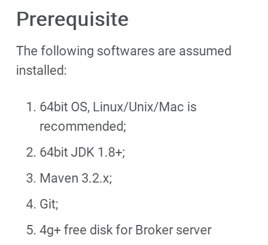
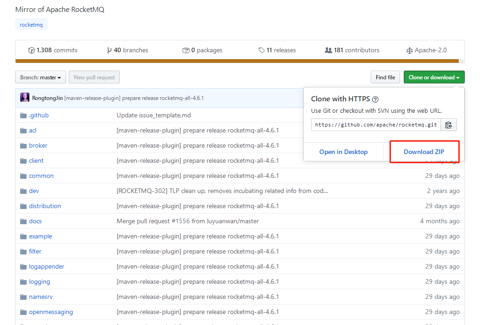
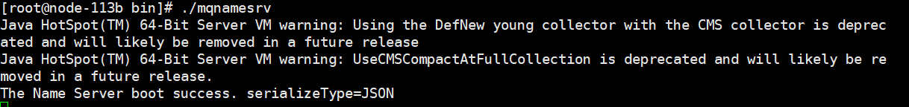
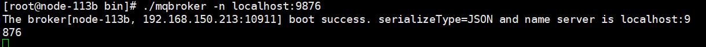
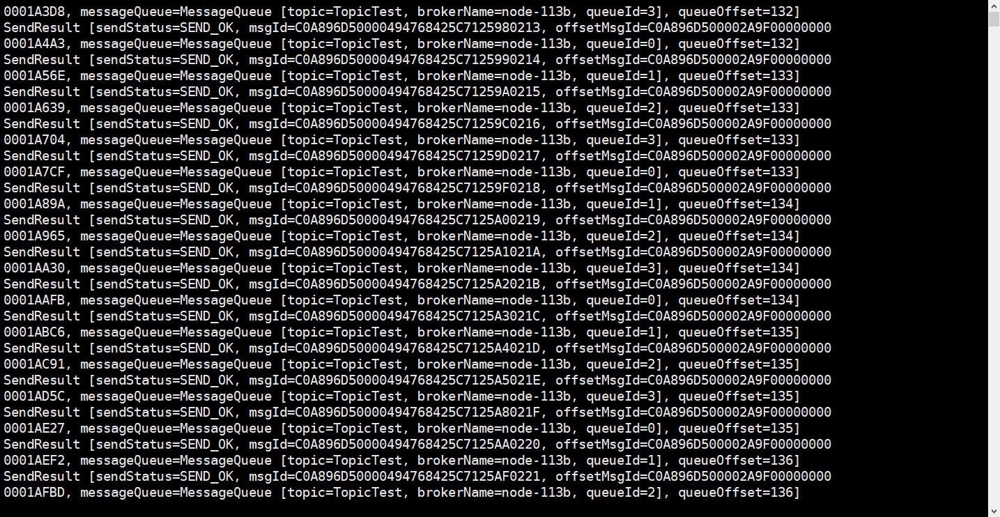
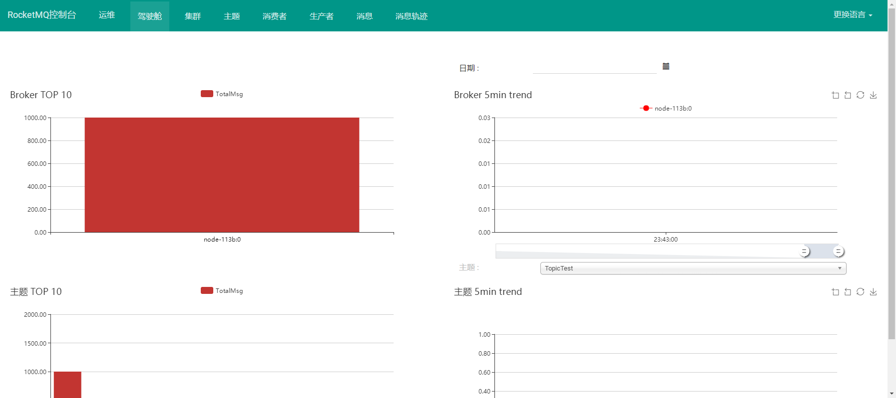

# RocketMQ 01 

## 主要内容：

- 编译安装 
- HelloWorld


**官方网站**

http://rocketmq.apache.org

**GitHub**

https://github.com/apache/rocketmq


## Quick Start

### Linux下使用Maven编译源码安装

Rocketmq4.6+需要jdk1.8环境编译和运行



**各版本要求**

| Version          | Client | Broker | NameServer |
| :--------------- | :----- | :----- | :--------- |
| 4.0.0-incubating | >=1.7  | >=1.8  | >=1.8      |
| 4.1.0-incubating | >=1.6  | >=1.8  | >=1.8      |
| 4.2.0            | >=1.6  | >=1.8  | >=1.8      |
| 4.3.x            | >=1.6  | >=1.8  | >=1.8      |
| 4.4.x            | >=1.6  | >=1.8  | >=1.8      |
| 4.5.x            | >=1.6  | >=1.8  | >=1.8      |
| 4.6.x            | >=1.6  | >=1.8  | >=1.8      |


#### 1.从GitHub上下载源码并上传到服务器



#### 2.在Linux上安装Maven

**下载Maven**

```
wget https://mirrors.tuna.tsinghua.edu.cn/apache/maven/maven-3/3.6.3/binaries/apache-maven-3.6.3-bin.tar.gz
```


**添加阿里云镜像**

修改`maven/conf`目录下的`settings.xml`

在`mirrors`节点下添加

```
<mirror> 
    <id>aliyun-maven</id> 
    <mirrorOf>*</mirrorOf> 
    <name>aliyun maven</name> 
    <url>http://maven.aliyun.com/nexus/content/groups/public</url> 
</mirror>
```


**配置maven环境变量**

修改`/etc/profile`

```
export M2_HOME=/usr/local/maven
export PATH=$PATH:$M2_HOME/bin
```

**配置java环境变量**

```
export JAVA_HOME="/usr/java/jdk1.8.0_181-amd64"
export CLASS_PATH="$JAVA_HOME/lib"
export PATH=".$PATH:$JAVA_HOME/bin"
```

环境变量修完执行`source /etc/profile`立即生效

**进入rocketmq主目录编译项目**

```
mvn -Prelease-all -DskipTests clean install -U
```

#### 3.启动nameserver

`bin`目录下执行

```
./mqnamesrv
```

正常提示



#### 4.启动Broker

```
./mqbroker -n localhost:9876
```

正常提示




#### 5.测试消息发送

使用`tool.sh`脚本执行测试程序

在`bin`目录下执行

```
./tools.sh org.apache.rocketmq.example.quickstart.Producer
```

提示如下表示成功



**6.接受消息**

```
./tools.sh org.apache.rocketmq.example.quickstart.Consumer
```


### 控制台rocketmq-console编译安装

#### 下载

https://github.com/apache/rocketmq-externals

**中文指南**

https://github.com/apache/rocketmq-externals/blob/master/rocketmq-console/doc/1_0_0/UserGuide_CN.md

#### 上传到服务器并解压缩

#### 编译

进入`rocketmq-console`目录

执行编译

```
mvn clean package -Dmaven.test.skip=true
```

#### 启动


编译成功后在`rocketmq-console/target`目录下执行`rocketmq-console-ng-1.0.1.jar`

启动时，直接动态添加`nameserver`地址或编辑`application.properties`添加属性

```
java -jar rocketmq-console-ng-1.0.1.jar --rocketmq.config.namesrvAddr=127.0.0.1:9876

```

启动成功后访问服务器8080端口即可




#### pom.xml依赖

```xml
 <dependency>
        <groupId>org.apache.rocketmq</groupId>
        <artifactId>rocketmq-client</artifactId>
        <version>4.6.1</version>
 </dependency>
```


### 安装启动常见错误


#### 编译时包无法在mirror上找到 提示502错误

**原因：**网络不好或maven仓库服务器出错

重试即可，或者欢迎镜像仓库


#### **发送失败提示connect to null failed**

```
 ./tools.sh org.apache.rocketmq.example.quickstart.Producer
22:49:02.470 [main] DEBUG i.n.u.i.l.InternalLoggerFactory - Using SLF4J as the default logging framework
RocketMQLog:WARN No appenders could be found for logger (io.netty.util.internal.PlatformDependent0).
RocketMQLog:WARN Please initialize the logger system properly.
java.lang.IllegalStateException: org.apache.rocketmq.remoting.exception.RemotingConnectException: connect to
 null failed
```

**原因：**不知道`nameserver`在哪儿

在`tools`脚本中添加

```
export NAMESRV_ADDR=localhost:9876
```


#### 启动broker失败 Cannot allocate memory

**原因：**jvm启动初始化内存分配大于物理内存

```
[root@node-113b bin]# ./mqbroker -n localhost:9876
Java HotSpot(TM) 64-Bit Server VM warning: INFO: os::commit_memory(0x00000005c0000000, 8589934592, 0) failed
; error='Cannot allocate memory' (errno=12)#
# There is insufficient memory for the Java Runtime Environment to continue.
# Native memory allocation (mmap) failed to map 8589934592 bytes for committing reserved memory.
# An error report file with more information is saved as:
# /usr/local/rocketmq/bin/hs_err_pid1997.log

```

修改启动脚本中的jvm参数

`runbroker.sh` broker

`runserver.sh` nameserver

默认数值给的都很大，改小即可

```
JAVA_OPT="${JAVA_OPT} -server -Xms256m -Xmx256m -Xmn128m -XX:MetaspaceSize=64m -XX:MaxMetaspaceSize=100m"
```


#### 启动broker成功但提示：Failed to obtain the host name

```
[root@node-113b bin]# ./mqbroker -n localhost:9876
22:30:42.307 [main] ERROR RocketmqCommon - Failed to obtain the host name
java.net.UnknownHostException: node-113b: node-113b: No address associated with hostname
	at java.net.InetAddress.getLocalHost(InetAddress.java:1505) ~[na:1.8.0_181]
	at org.apache.rocketmq.common.BrokerConfig.localHostName(BrokerConfig.java:189) [rocketmq-common-4.6
.1.jar:4.6.1]	at org.apache.rocketmq.common.BrokerConfig.<init>(BrokerConfig.java:38) [rocketmq-common-4.6.1.jar:4
.6.1]	at org.apache.rocketmq.broker.BrokerStartup.createBrokerController(BrokerStartup.java:110) [rocketmq
-broker-4.6.1.jar:4.6.1]	at org.apache.rocketmq.broker.BrokerStartup.main(BrokerStartup.java:58) [rocketmq-broker-4.6.1.jar:4
.6.1]Caused by: java.net.UnknownHostException: node-113b: No address associated with hostname
	at java.net.Inet6AddressImpl.lookupAllHostAddr(Native Method) ~[na:1.8.0_181]
	at java.net.InetAddress$2.lookupAllHostAddr(InetAddress.java:928) ~[na:1.8.0_181]
	at java.net.InetAddress.getAddressesFromNameService(InetAddress.java:1323) ~[na:1.8.0_181]
	at java.net.InetAddress.getLocalHost(InetAddress.java:1500) ~[na:1.8.0_181]
	... 4 common frames omitted
The broker[DEFAULT_BROKER, 192.168.150.213:10911] boot success. serializeType=JSON and name server is localh
ost:9876
```

**原因：**无法解析当前的主机名

hosts里添加映射即可

```
192.168.150.213 node-113b
```

#### linux日期校准

**安装ntpdate**

```
yum install ntpdate

ntpdate ntp1.aliyun.com
```


### 

