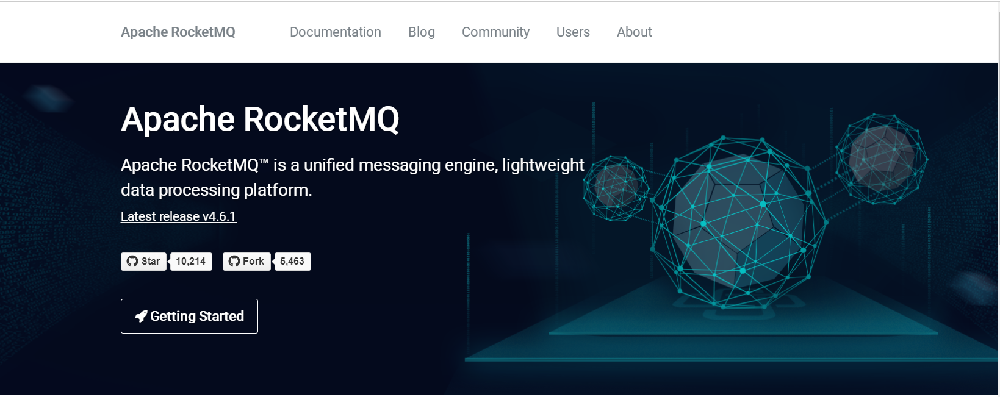
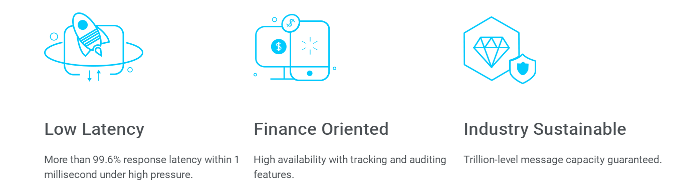
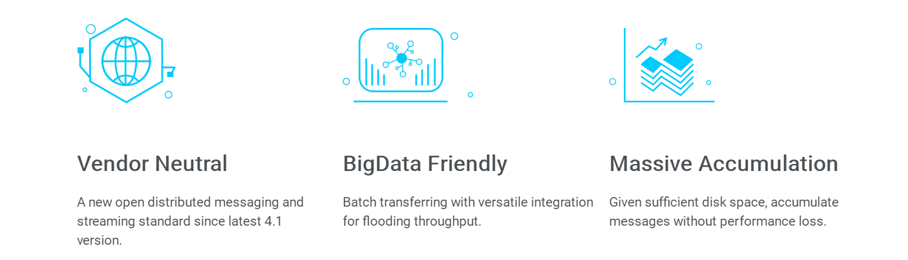

# RocketMQ 01

## 官网首页

### Apache RocketMQ™ is a unified messaging engine, lightweight data processing platform.

**Apache RocketMQ™  是一个标准化的消息引擎，轻量级的处理平台**

**unified messaging engine** ：标准化消息引擎

**lightweight data processing platform**：轻量级处理平台

### 生词：

**Community**：社区

**unified** ：统一的；一致标准的

**messaging** ：消息传递，收发

**engine**：引擎

**platform**：平台

**processing** ：处理、计算

---

### Low Latency

低延迟

#### More than 99.6% response latency within 1 millisecond under high pressure.

在高压力下，1毫秒的延迟内可以响应超过99.6%的请求

### Finance Oriented

**金融方向，面向金融**

#### High availability with tracking and auditing features.

系统具有高可用性支撑了追踪和审计的特性

### Industry Sustainable

行业可发展性

#### Trillion-level message capacity guaranteed.

保证了万亿级别的消息容量。

### 生词：

**Low Latency** ：低延迟

**high pressure**：高压

**Oriented** ：面向

**Finance** ： 金融

**tracking** ：追踪

**auditing** ：审计

**Industry** ：产业、行业

**Sustainable**：可持续发展

**Trillion-level** ： 万亿级别

**capacity** ： 容量

**guaranteed**：有保证的

### Vendor Neutral

中立厂商

**Neutral**：中立的

**Vendor** ：厂商

#### A new open distributed messaging and streaming standard since latest 4.1 version.

在最新的4.1版本开放了一个新的分布式消息和流标准

### BigData Friendly

对大数据友好

#### Batch transferring with versatile integration for flooding throughput.

批量传输与多功能集成支撑了海量吞吐。

### Massive Accumulation

大量的积累

#### Given sufficient disk space, accumulate messages without performance loss.

只要给与足够的磁盘空间，就可以累积消息而不会造成性能损失。

### 生词：

**standard** ： 标准

**since** ： 自……以来

**latest** ：最新的

**version**：版本

**BigData** ：大数据

**Batch** ：批量

**transferring** ：转移、传输

**versatile**：多功能的

**integration** ：集成

**flooding**：淹没、泛洪、泛滥

**throughput**：吞吐量

**flooding throughput**： 海量吞吐

**Massive** ：大量的

**Accumulation** ： 积累

**sufficient**：足够的

**disk space**：磁盘空间

**accumulate** ：积累

**performance loss**：性能损失