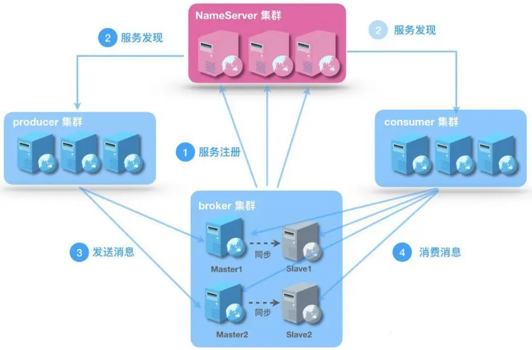
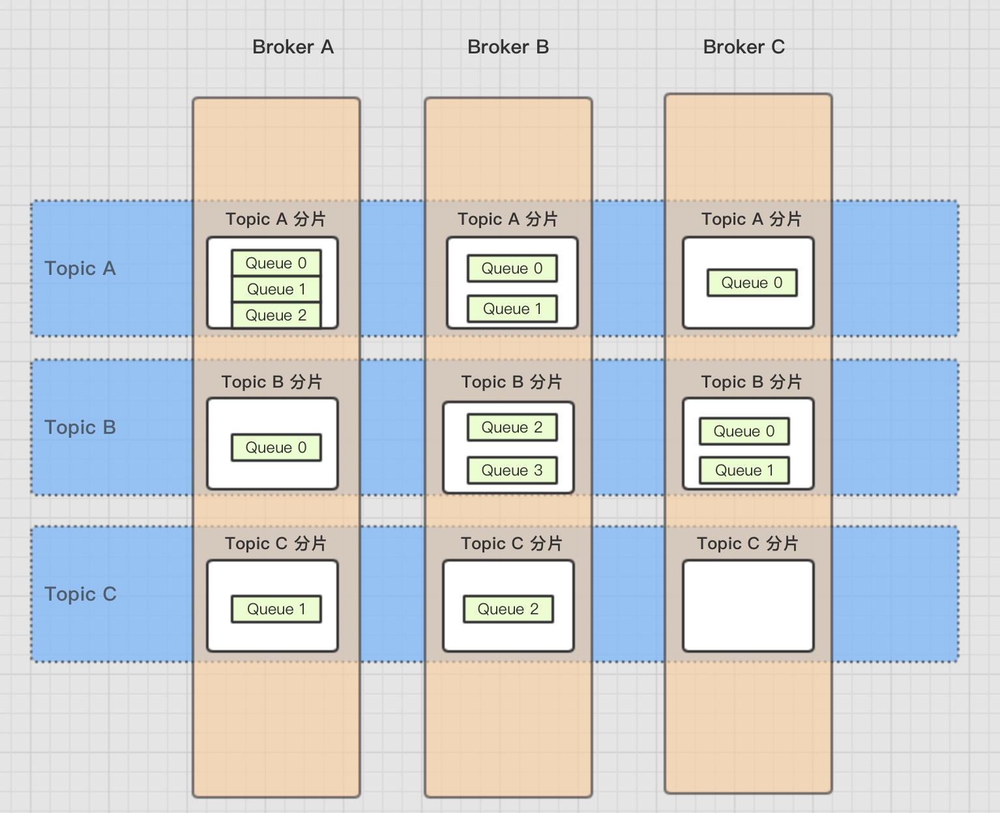

# RocketMQ 02

主流的MQ有很多，比如ActiveMQ、RabbitMQ、RocketMQ、Kafka、ZeroMQ等。

之前阿里巴巴也是使用ActiveMQ，随着业务发展，ActiveMQ IO 模块出现瓶颈，后来阿里巴巴 通过一系列优化但是还是不能很好的解决，之后阿里巴巴把注意力放到了主流消息中间件kafka上面，但是kafka并不能满足他们的要求，尤其是低延迟和高可靠性。

所以RocketMQ是站在巨人的肩膀上（kafka）MetaQ的内核，又对其进行了优化让其更满足互联网公司的特点。它是纯Java开发，具有高吞吐量、高可用性、适合大规模分布式系统应用的特点。 RocketMQ目前在阿里集团被广泛应用于交易、充值、流计算、消息推送、日志流式处理、binglog分发等场景。

## RocketMQ 功能 大纲

### RocketMQ介绍

- 消息队列应用场景
- rocketmq中的角色
  - nameserver
- 官网解读

### 消息发送

- 同步发送

- 异步发送

- 单向发送

- 消息批量发送

- 消息结构

- 消息发送流程


### 消息存储

- 存储方式
- 发送消息时存储流程
- 存储文件与内存映射
- 刷盘机制
- 文件恢复与过期删除机制
- 索引

### 消息消费

- 消息订阅
- 消息拉取和推送
- 消息处理队列
- 顺序消费
- 定时消息机制
- 消息过滤TAG与sql92
- FilterServer过滤机制
- 并发消息消费
- 消费负载与算法
- 消费者动态添加
- 消息消费过程
- ACK
- 消费进度与offset

### Rocketmq集群 HA

- 集群搭建
- 主从同步复制原理
- 读写分离机制


### 整合

- 使用spring
- SpringCloud整合

### 监控与运维

- rocketmq-console监控平台
- 命令行运维 MQAdmin
- 自定义日志


## 消息队列介绍

消息队列是《数据结构》中先进先出的一种数据结构，在当前的架构中，作为中间件提供服务。

### 消息中间件功能

#### 应用解耦

AB应用不在互相依赖

#### 流量削峰

流量达到高峰的时候，通常使用限流算法来控制流量涌入系统，避免系统被击瘫，但是这种方式损失了一部分请求

此时可以使用消息中间件来缓冲大量的请求，匀速消费，当消息队列中堆积消息过多时，我们可以动态上线增加消费端，来保证不丢失重要请求。

#### 大数据处理

消息中间件可以把各个模块中产生的管理员操作日志、用户行为、系统状态等数据文件作为消息收集到主题中

数据使用方可以订阅自己感兴趣的数据内容互不影响，进行消费

#### 异构系统

跨语言


### RocketMQ 角色

CAP



#### broker

- Broker面向producer和consumer接受和发送消息
- 向nameserver提交自己的信息
- 是消息中间件的消息存储、转发服务器。
- 每个Broker节点，在启动时，都会遍历NameServer列表，与每个NameServer建立长连接，注册自己的信息，之后定时上报。


##### broker集群

- Broker高可用，可以配成Master/Slave结构，Master可写可读，Slave只可以读，Master将写入的数据同步给Slave。
  - 一个Master可以对应多个Slave，但是一个Slave只能对应一个Master
  - Master与Slave的对应关系通过指定相同的BrokerName，不同的BrokerId来定义BrokerId为0表示Master，非0表示Slave
- Master多机负载，可以部署多个broker
  - 每个Broker与nameserver集群中的所有节点建立长连接，定时注册Topic信息到所有nameserver。


#### producer

- 消息的生产者
- 通过nameserver集群中的其中一个节点（随机选择）建立长连接，获得Topic的路由信息，包括Topic下面有哪些Queue，这些Queue分布在哪些Broker上等
- 接下来向提供Topic服务的Master建立长连接，且定时向Master发送心跳

#### consumer

消息的消费者，通过NameServer集群获得Topic的路由信息，连接到对应的Broker上消费消息。

注意，由于Master和Slave都可以读取消息，因此Consumer会与Master和Slave都建立连接。

#### nameserver

底层由netty实现，提供了路由管理、服务注册、服务发现的功能，是一个无状态节点

**nameserver是服务发现者**，集群中各个角色（producer、broker、consumer等）都需要定时想nameserver上报自己的状态，以便互相发现彼此，超时不上报的话，nameserver会把它从列表中剔除

**nameserver可以部署多个**，当多个nameserver存在的时候，其他角色同时向他们上报信息，以保证高可用，

**NameServer集群间互不通信**，没有主备的概念

**nameserver内存式存储**，nameserver中的broker、topic等信息默认不会持久化

**为什么不用zookeeper？**：rocketmq希望为了提高性能，CAP定理，客户端负载均衡

### 对比JSM中的Topic和Queue

Topic是一个逻辑上的概念，实际上Message是在每个Broker上以Queue的形式记录。



对应到JMS中的topic实现是由客户端来完成的

```
        consumer.setMessageModel(MessageModel.BROADCASTING);
```

