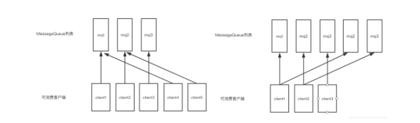
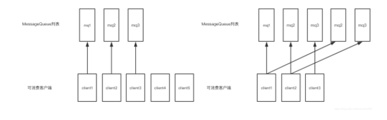

# RocketMQ 面试FAQ

## 说说你们公司线上生产环境用的是什么消息中间件?


## 为什么要使用MQ？

因为项目比较大，做了分布式系统，所有远程服务调用请求都是**同步执行**经常出问题，所以引入了mq


**解耦**

系统耦合度降低，没有强依赖关系

**异步**

不需要同步执行的远程调用可以有效提高响应时间

**削峰**

请求达到峰值后，后端service还可以保持固定消费速率消费，不会被压垮

### 多个mq如何选型？

**RabbitMQ**

erlang开发，延迟比较低

**RocketMQ**

java开发，面向互联网集群化功能丰富

**kafka**

Scala开发，面向日志功能丰富

**ActiveMQ**

java开发，简单，稳定


小项目：ActiveMQ

大项目：RocketMQ或kafka、RabbitMq


## RocketMQ由哪些角色组成，每个角色作用和特点是什么？

nameserver 无状态 动态列表

producer

broker

consumer

## RocketMQ中的Topic和ActiveMQ有什么区别？

### ActiveMQ 

有destination的概念，即消息目的地

destination分为两类：

- topic
  - 广播消息
- queue
  - 队列消息

### RocketMQ

RocketMQ的Topic是一组Message Queue的集合 ConsumeQueue

一条消息是广播消息还是队列消息由客户端消费决定


## RocketMQ Broker中的消息被消费后会立即删除吗？

不会，每条消息都会持久化到CommitLog中，每个consumer连接到broker后会维持消费进度信息，当有消息消费后只是当前consumer的消费进度（CommitLog的offset）更新了。

### 那么消息会堆积吗？什么时候清理过期消息？

4.6版本默认48小时后会删除不再使用的CommitLog文件

- 检查这个文件最后访问时间
- 判断是否大于过期时间
- 指定时间删除，默认凌晨4点

## RocketMQ消费模式有几种？

消费模型由consumer决定，消费维度为Topic

### 集群消费

一组consumer同时消费一个topic，可以分配消费负载均衡策略分配consumer对应消费topic下的哪些queue


多个group同时消费一个topic时，每个group都会消费到数据


一条消息只会被一个group中的consumer消费，

### 广播消费

消息将对一 个Consumer Group 下的各个 Consumer 实例都消费一遍。即即使这些 Consumer 属于同一个Consumer Group ，消息也会被 Consumer Group 中的每个 Consumer 都消费一次。


## 消费消息时使用的是push还是pull？

在刚开始的时候就要决定使用哪种方式消费

两种：

`DefaultLitePullConsumerImpl`  拉

`DefaultMQPushConsumerImpl`推

两个实现 `DefaultLitePullConsumerImpl` `DefaultMQPushConsumerImpl`都实现了MQConsumerInner接口接口

名称上看起来是一个推，一个拉，但实际底层实现都是采用的**长轮询机制**，即拉取方式

broker端属性 longPollingEnable 标记是否开启长轮询。默认开启

### 为什么要主动拉取消息而不使用事件监听方式？

事件驱动方式是建立好长连接，由事件（发送数据）的方式来实时推送。

如果broker主动推送消息的话有可能push速度快，消费速度慢的情况，那么就会造成消息在consumer端堆积过多，同时又不能被其他consumer消费的情况

#### 说一说几种常见的消息同步机制？

push：

如果broker主动推送消息的话有可能push速度快，消费速度慢的情况，那么就会造成消息在consumer端堆积过多，同时又不能被其他consumer消费的情况

pull：

轮训时间间隔，固定值的话会造成资源浪费

长轮询：


上连接 短连接（每秒） 长轮询

### broker如何处理拉取请求的？

consumer首次请求broker

- broker中是否有符合条件的消息
- 有 -> 
  - 响应consumer
  - 等待下次consumer的请求
- 没有
  - 挂起consumer的请求，即不断开连接，也不返回数据
  - 挂起时间长短，写死在代码里的吗？长轮询写死，短轮询可以配
  - 使用consumer的offset，
    - DefaultMessageStore#ReputMessageService#run方法
      - 每隔1ms检查commitLog中是否有新消息，有的话写入到pullRequestTable
      - 当有新消息的时候返回请求
    - PullRequestHoldService 来Hold连接，每个5s执行一次检查pullRequestTable有没有消息，有的话立即推送


## RocketMQ如何做负载均衡？

通过Topic在多broker种分布式存储实现

### producer端

发送端指定Target message queue发送消息到相应的broker，来达到写入时的负载均衡

- 提升写入吞吐量，当多个producer同时向一个broker写入数据的时候，性能会下降
- 消息分布在多broker种，为负载消费做准备

每 30 秒从 nameserver获取 Topic 跟 Broker 的映射关系，近实时获取最新数据存储单元，queue落地在哪个broker中

在使用api中send方法的时候，可以指定Target message queue写入或者使用MessageQueueSelector

#### **默认策略是随机选择：**

- producer维护一个index
- 每次取节点会自增
- index向所有broker个数取余
- 自带容错策略

#### 其他实现

- SelectMessageQueueByHash
  - hash的是传入的args
- SelectMessageQueueByRandom
- SelectMessageQueueByMachineRoom 没有实现

也可以自定义实现**MessageQueueSelector**接口中的select方法

```
MessageQueue select(final List<MessageQueue> mqs, final Message msg, final Object arg);
```

可以自定义规则来选择mqs

#### 如何知道mqs的，mqs的数据从哪儿来？

producer.start()方法

参考源码

- 启动producer的时候会向nameserver发送心跳包
- 获取nameserver中的topic列表
- 使用topic向nameserver获取topicRouteData

**TopicRouteData**对象表示与某一个topic有关系的broker节点信息，内部包含多个QueueData对象（可以有多个broker集群支持该topic）和多个BrokerData信息（多个集群的多个节点信息都在该列表中）


**producer加工TopicRouteData，对应的多节点信息后返回mqs。**


### consumer端

客户端完成负载均衡

- 获取集群其他节点
- 当前节点消费哪些queue
- **负载粒度直到Message Queue**
- **consumer的数量最好和Message Queue的数量对等或者是倍数，不然可能会有消费倾斜**
- 每个consumer通过**balanced**维护processQueueTable
  - processQueueTable为当前consumer的消费queue
  - processQueueTable中有 
    - ProcessQueue ：维护消费进度，从broker中拉取回来的消息缓冲
    - MessageQueue ： 用来定位查找queue

DefaultMQPushConsumer默认 使用AllocateMessageQueueAveragely（平均分配）

### 当消费负载均衡consumer和queue不对等的时候会发生什么？

#### 平均分配



#### 环形分配



#### 负载均衡算法

平均分配策略(默认)(AllocateMessageQueueAveragely)
环形分配策略(AllocateMessageQueueAveragelyByCircle)
手动配置分配策略(AllocateMessageQueueByConfig)
机房分配策略(AllocateMessageQueueByMachineRoom)
一致性哈希分配策略(AllocateMessageQueueConsistentHash)
靠近机房策略(AllocateMachineRoomNearby)

consumer启动流程参考源码


## 消息丢失

#### SendResult

producer在发送同步/异步可靠消息后，会接收到SendResult，表示消息发送成功

SendResult其中属性sendStatus表示了broker是否真正完成了消息存储

当sendStatus!="ok"的时候，应该重新发送消息，避免丢失

当producer.setRetryAnotherBrokerWhenNotStoreOK

## 消息重复消费

影响消息正常发送和消费的重要原因是网络的不确定性。

**可能是因为consumer首次启动引起重复消费**

需要设置`consumer.setConsumeFromWhere`

只对一个新的consumeGroup第一次启动时有效,设置从头消费还是从维护开始消费

**你们怎么保证投递出去的消息只有一条且仅仅一条，不会出现重复的数据?**

绑定业务key

**如果消费了重复的消息怎么保证数据的准确性?**

### 引起重复消费的原因

#### **ACK**

正常情况下在consumer真正消费完消息后应该发送ack，通知broker该消息已正常消费，从queue中剔除

当ack因为网络原因无法发送到broker，broker会认为词条消息没有被消费，此后会开启消息重投机制把消息再次投递到consumer

#### **group**

在CLUSTERING模式下，消息在broker中会保证相同group的consumer消费一次，但是针对不同group的consumer会推送多次

### 解决方案

#### 数据库表

处理消息前，使用消息主键在表中带有约束的字段中insert

#### Map

单机时可以使用map *ConcurrentHashMap* -> putIfAbsent   guava cache

#### Redis

使用主键或set操作

## 如何让RocketMQ保证消息的顺序消费

**你们线上业务用消息中间件的时候，是否需要保证消息的顺序性?**

**如果不需要保证消息顺序，为什么不需要?假如我有一个场景要保证消息的顺序，你们应该如何保证?**

- 同一topic

- 同一个QUEUE

- 发消息的时候一个线程去发送消息

- 消费的时候 一个线程 消费一个queue里的消息或者使用MessageListenerOrderly

- 多个queue 只能保证单个queue里的顺序

  

### 应用场景是啥？

应用系统和现实的生产业务绑定，避免在分布式系统中多端消费业务消息造成顺序混乱

比如需要严格按照顺序处理的数据或业务


**数据包装**/清洗

数据：

```
import java.nio.ByteBuffer;
import java.nio.charset.Charset;
import java.util.HashMap;
import java.util.Iterator;
import java.util.Map;
```


1. 去掉import
2. 统计某个字符出现次数

**业务流程处理**

返修过程

1. 收件录入信息
2. 信息核对
3. 送入检修系统处理

电商订单

1. 创建订单
2. 检查库存预扣库存
3. 支付
4. 真扣库存

binlog同步


## RocketMQ如何保证消息不丢失

1. 生产端如何保证投递出去的消息不丢失：消息在半路丢失，或者在MQ内存中宕机导致丢失，此时你如何基于MQ的功能保证消息不要丢失？
2. MQ自身如何保证消息不丢失？
3. 消费端如何保证消费到的消息不丢失：如果你处理到一半消费端宕机，导致消息丢失，此时怎么办？


### 解耦的思路

#### 发送方

发送消息时做消息备份（记日志或同步到数据库），判断sendResult是否正常返回

#### broker

**节点保证**

- master接受到消息后同步刷盘，保证了数据持久化到了本机磁盘中
- 同步写入slave
- 写入完成后返回SendResult


#### consumer

- 记日志
- 同步执行业务逻辑，最后返回ack
- 异常控制 

**磁盘保证**

使用Raid磁盘阵列保证数据磁盘安全

**网络数据篡改**

内置TLS可以开启，默认使用crc32校验数据


### 消息刷盘机制底层实现

每间隔10ms，执行一次数据持久化操作

两种， 同步刷、异步刷

```
   public void run() {
            CommitLog.log.info(this.getServiceName() + " service started");

            while (!this.isStopped()) {
                try {
                    this.waitForRunning(10);
                    this.doCommit();
                } catch (Exception e) {
                    CommitLog.log.warn(this.getServiceName() + " service has exception. ", e);
                }
            }

```

## rocketMq的消息堆积如何处理

**下游消费系统如果宕机了，导致几百万条消息在消息中间件里积压，此时怎么处理?**

**你们线上是否遇到过消息积压的生产故障?如果没遇到过，你考虑一下如何应对?**

具体表现为 ui中转圈圈

对于大规模消息发送接收可以使用pull模式，手动处理消息拉取速度,消费的时候统计消费时间以供参考

保证消息消费速度固定，即可通过上线更多consumer临时解决消息堆积问题

### 如果consumer和queue不对等，上线了多台也在短时间内无法消费完堆积的消息怎么办？

- 准备一个临时的topic

- queue的数量是堆积的几倍
- queue分不到多broker种
- 上线一台consumer做消息的搬运工，把原来topic中的消息挪到新的topic里，不做业务逻辑处理，只是挪过去
- 上线N台consumer同时消费临时topic中的数据
- 改bug
- 恢复原来的consumer，继续消费之前的topic

### 堆积时间过长消息超时了？

RocketMQ中的消息只会在commitLog被删除的时候才会消失，不会超时

### 堆积的消息会不会进死信队列？

不会，消息在消费失败后会进入重试队列（%RETRY%+consumergroup），多次（默认16）才会进入死信队列（%DLQ%+consumergroup）

## 你们用的是RocketMQ?那你说说RocketMQ的底层架构原理，磁盘上数据如何存储的，整体分布式架构是如何实现的?

## 零拷贝等技术是如何运用的?

使用nio的MappedByteBuffer调起数据输出

## 你们用的是RocketMQ?RocketMQ很大的一个特点是对分布式事务的支持，你说说他在分布式事务支持这块机制的底层原理?

分布式系统中的事务可以使用TCC（Try、Confirm、Cancel）、2pc来解决分布式系统中的消息原子性

RocketMQ 4.3+提供分布事务功能，通过 RocketMQ 事务消息能达到分布式事务的最终一致

#### RocketMQ实现方式

**Half Message：**预处理消息，当broker收到此类消息后，会存储到RMQ_SYS_TRANS_HALF_TOPIC的消息消费队列中

**检查事务状态：**Broker会开启一个定时任务，消费RMQ_SYS_TRANS_HALF_TOPIC队列中的消息，每次执行任务会向消息发送者确认事务执行状态（提交、回滚、未知），如果是未知，等待下一次回调。

**超时：**如果超过回查次数，默认回滚消息

#### TransactionListener的两个方法

##### executeLocalTransaction

半消息发送成功触发此方法来执行本地事务

##### checkLocalTransaction

broker将发送检查消息来检查事务状态，并将调用此方法来获取本地事务状态

##### 本地事务执行状态

**LocalTransactionState.COMMIT_MESSAGE**

执行事务成功，确认提交

**LocalTransactionState.ROLLBACK_MESSAGE**

回滚消息，broker端会删除半消息

**LocalTransactionState.UNKNOW**

暂时为未知状态，等待broker回查

## 如果让你来动手实现一个分布式消息中间件，整体架构你会如何设计实现?

## 看过RocketMQ 的源码没有。如果看过，说说你对RocketMQ 源码的理解?

## 高吞吐量下如何优化生产者和消费者的性能?

### 消费

- 同一group下，多机部署，并行消费

- 单个consumer提高消费线程个数
- 批量消费
  - 消息批量拉取
  - 业务逻辑批量处理

### 运维

- 网卡调优
- jvm调优
- 多线程与cpu调优
- Page Cache

## 再说说RocketMQ 是如何保证数据的高容错性的?

- 在不开启容错的情况下，轮询队列进行发送，如果失败了，重试的时候过滤失败的Broker
- 如果开启了容错策略，会通过RocketMQ的预测机制来预测一个Broker是否可用
- 如果上次失败的Broker可用那么还是会选择该Broker的队列
- 如果上述情况失败，则随机选择一个进行发送
- 在发送消息的时候会记录一下调用的时间与是否报错，根据该时间去预测broker的可用时间