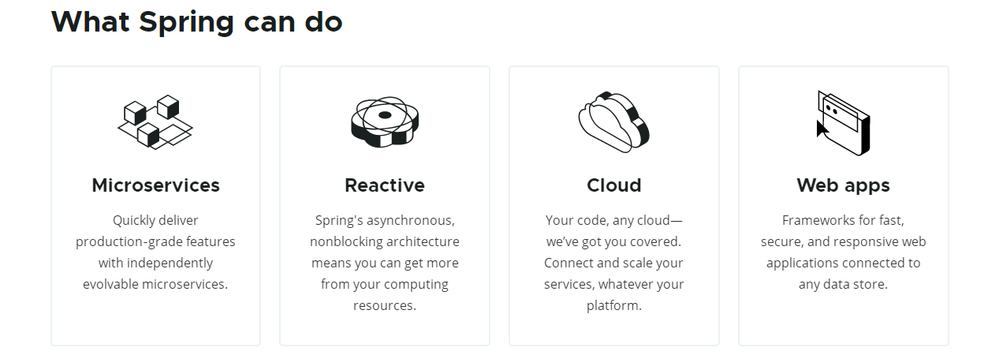
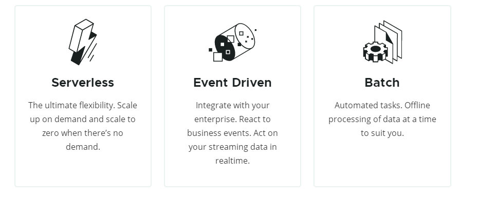
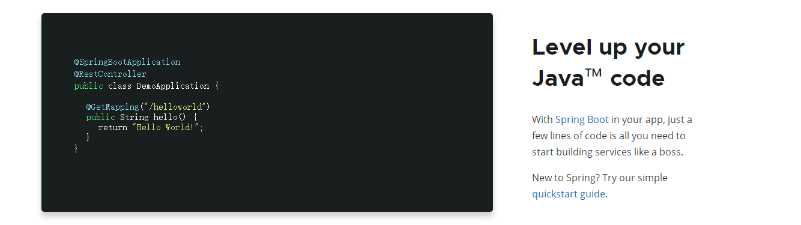

# Spring官网解读

# 首页

## What Spring can do

### Microservices

微服务

#### Quickly deliver production‑grade features with independently evolvable microservices.

具有快速交付、独立、可扩展的微服务的生产级项目的特性。

**Quickly deliver** ： 快速交付

**production‑grade ：**生产级

**features** ：特性

**independently** : 独立的

**evolvable：**可扩展的

### Reactive

响应式

#### Spring's asynchronous, nonblocking architecture means you can get more from your computing resources.

Spring使用异步、非阻塞架构意味着您可以获得更多的计算资源

**asynchronous**： 异步的

**nonblocking ：**费阻塞的

**architecture** ：架构

### Cloud

云

#### Your code, any cloud—we’ve got you covered. Connect and scale your services, whatever your platform.

你的代码，任何云，我们都能搞定。连接和扩展您的服务，无论您的平台是什么。

**covered** 覆盖，涵盖

**Connect and scale your services** 连接和扩展你的服务

### Web apps

web应用程序

#### Frameworks for fast, secure, and responsive web applications connected to any data store.

框架可以用于快速、安全、响应式的web应用程序并且可以接到任何数据存储

**Frameworks **：框架

**secure**安全的

**responsive** 响应式

**data store：**数据存储仓库

### Serverless

是一种构建和管理基于微服务架构的完整流程，允许你在服务部署级别而不是服务器部署级别来管理你的应用部署

#### The ultimate flexibility. Scale up on demand and scale to zero when there’s no demand.

最终扩容，可以按需扩容，在没有需求时将扩容归零。

**ultimate** 最终

**flexibility**弹性

**Scale up on demand** 按需扩容

### Event Driven

事件驱动

#### Integrate with your enterprise. React to business events. Act on your streaming data in realtime.

与您的企业集成。响应业务事件。实时处理您的流数据。

**Integrate** 集成

**enterprise**企业

**React to business events**响应业务事件

### **Batch**

批量

#### Automated tasks. Offline processing of data at a time to suit you.

自动执行的任务。离线处理数据的时间适合您。

**Automated tasks**自动执行任务

## Level up your Java™ code

升级你的java代码

### With [Spring Boot](https://spring.io/projects/spring-boot) in your app, just a few lines of code is all you need to start building services like a boss.

在您的应用程序中有了[Spring Boot](https://spring.io/projects/springing-boot)，只需几行代码就可以像boss一样开始构建服务。

### New to Spring? Try our simple [quickstart guide](https://spring.io/quickstart).

全新的Spring？试试简单的快速入门指南