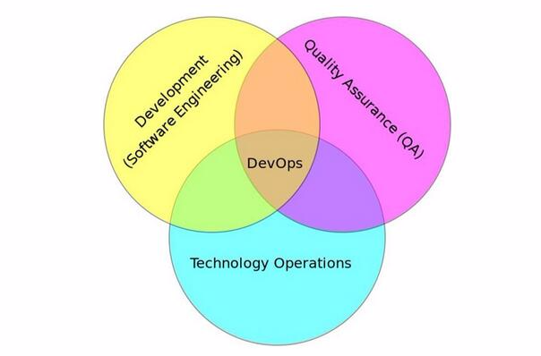
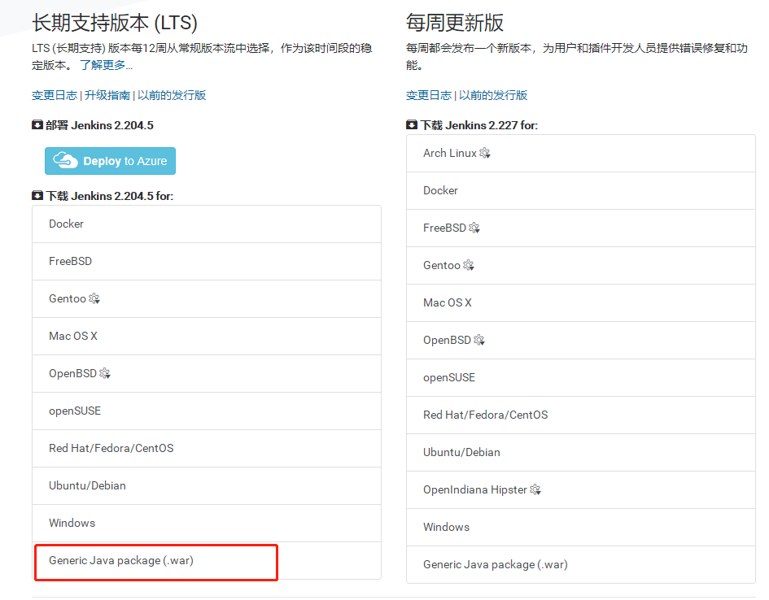
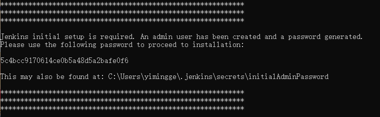
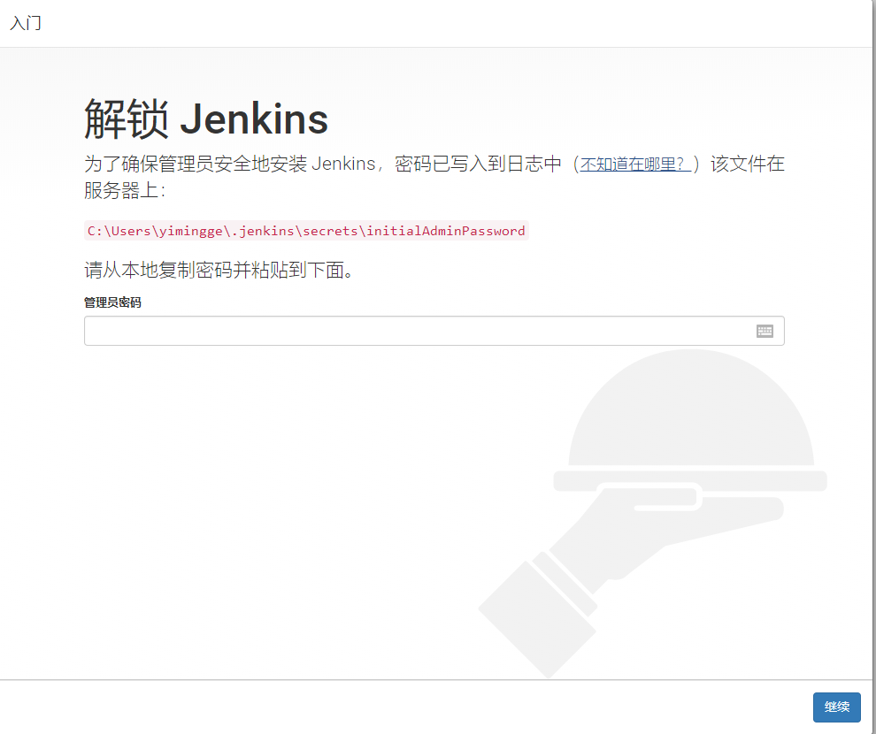

# 持续集成

续集成服务（Continuous Integration，简称 CI）

它绑定 Github 上面的项目，只要有新的代码，就会自动抓取。然后，提供一个运行环境，执行测试，完成构建，还能部署到服务器。

持续集成指的是只要代码有变更，就自动运行构建和测试，反馈运行结果。确保符合预期以后，再将新代码"集成"到主干。

持续集成的好处在于，每次代码的小幅变更，就能看到运行结果，从而不断累积小的变更，而不是在开发周期结束时，一下子合并一大块代码。

## 云服务

### travis-ci

Travis CI 是在软件开发领域中的一个在线的，分布式的持续集成服务，用来构建及测试在GitHub托管的代码。与 Jenkis 不同，Travis 不需要自己在服务器部署服务，并且是高度集成 GitHub 的，所以对于开源项目还是非常友好的。

适用于开源软件

官网：https://travis-ci.org/

### CircleCI 

CircleCI 和travis-ci类似也是一个持续集成/持续部署的服务，不需要自己搭建服务器。

适用于开源软件

### 阿里云

### 华为云

### IBM

### daocloud

## Jenkins

### 平台安装

Jenkins 项目产生两个发行线, 长期支持版本 (LTS) 和每周更新版本

两个版本都以 `.war` 文件, 原生包, 安装程序, 和 Docker 容器的形式分发

### 下载

https://jenkins.io/zh/download/

选择war包

### 启动

下载完成之后复制到一个没有中文的路径下

执行` java -jar Jenkins.war`启动服务

服务启动成功后会显示一段密文

### 使用

访问本地服务的8080端口即可开始使用服务

#### 根据提示输入启动服务时的秘钥

#### 点击安装推荐的插件

此过程需要几分钟，等待插件安装完成

### 如果网络不行

#### 替换国内源

http://mirrors.jenkins-ci.org/status.html

完成基本配置

https://mirrors.tuna.tsinghua.edu.cn/jenkins/updates/update-center.json

##### 手动安装插件

Localization: Chinese (Simplified)

Git 

Maven Integration

#### 完全离线安装

https://plugins.jenkins.io/

下载好hpi文件上传安装即可

### 准备Git仓库

git@github.com:bjmashibing/InternetArchitect.git