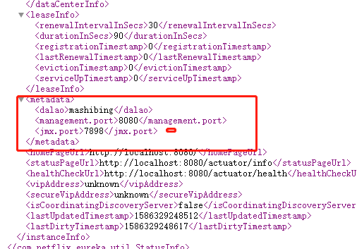
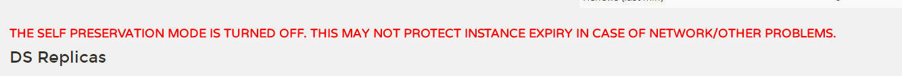
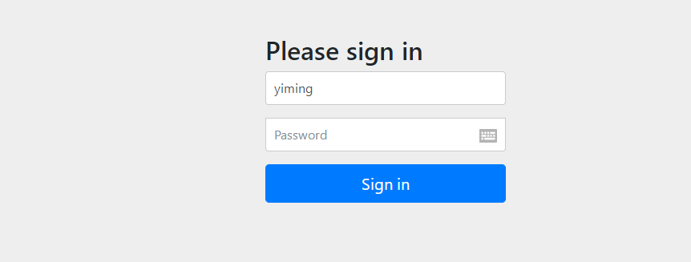

# SpringCloud 03

## Eureka原理

eureka来源于古希腊词汇，意为“发现了”

eureka分为两部分，Server端和Client端

### Register

**服务注册**

想要参与服务注册发现的实例首先需要向Eureka服务器注册信息

注册在第一次心跳发生时提交

## Renew

**续租，心跳**

Eureka客户需要每30秒发送一次心跳来续租

10:00 00 第一次

10:00 30

10:01

10:01 30 最后

更新通知Eureka服务器实例仍然是活动的。如果服务器在90秒内没有看到更新，它将从其注册表中删除实例

## Fetch Registry

Eureka客户端从服务器获取注册表信息并将其缓存在本地。

之后，客户端使用这些信息来查找其他服务。

通过获取上一个获取周期和当前获取周期之间的增量更新，可以定期(每30秒)更新此信息。

节点信息在服务器中保存的时间更长(大约3分钟)，因此获取节点信息时可能会再次返回相同的实例。Eureka客户端自动处理重复的信息。

在获得增量之后，Eureka客户机通过比较服务器返回的实例计数来与服务器协调信息，如果由于某种原因信息不匹配，则再次获取整个注册表信息。

## Cancel

Eureka客户端在关闭时向Eureka服务器发送取消请求。这将从服务器的实例注册表中删除实例，从而有效地将实例从通信量中取出。

## Time Lag

同步时间延迟

来自Eureka客户端的所有操作可能需要一段时间才能反映到Eureka服务器上，然后反映到其他Eureka客户端上。这是因为eureka服务器上的有效负载缓存，它会定期刷新以反映新信息。Eureka客户端还定期地获取增量。因此，更改传播到所有Eureka客户机可能需要2分钟。

## Communication mechanism

通讯机制

Http协议下的Rest请求

默认情况下Eureka使用Jersey和Jackson以及JSON完成节点间的通讯

## 服务注册

新建一个web项目，引入starter`spring-cloud-starter-netflix-eureka-client`

### 客户端配置选项

```
#续约发送间隔默认30秒，心跳间隔
eureka.instance.lease-renewal-interval-in-seconds=5
#表示eureka client间隔多久去拉取服务注册信息，默认为30秒，对于api-gateway，如果要迅速获取服务注册状态，可以缩小该值，比如5秒
eureka.client.registry-fetch-interval-seconds=5
# 续约到期时间（默认90秒）
eureka.instance.lease-expiration-duration-in-seconds=60
```

### 服务器端配置选项

```
#关闭自我保护模式
eureka.server.enable-self-preservation=false
#失效服务间隔
eureka.server.eviction-interval-timer-in-ms=3000
```


## Eureka单独使用

### Rest服务调用

官方文档

https://github.com/Netflix/eureka/wiki/Eureka-REST-operations

| **Operation**                                                | **HTTP action**                                              | **Description**                                              |
| ------------------------------------------------------------ | ------------------------------------------------------------ | ------------------------------------------------------------ |
| Register new application instance                            | POST /eureka/v2/apps/**appID**                               | Input: JSON/XMLpayload HTTPCode: 204 on success              |
| De-register application instance                             | DELETE /eureka/v2/apps/**appID**/**instanceID**              | HTTP Code: 200 on success                                    |
| Send application instance heartbeat                          | PUT /eureka/v2/apps/**appID**/**instanceID**                 | HTTP Code: * 200 on success * 404 if **instanceID**doesn’t exist |
| Query for all instances                                      | GET /eureka/v2/apps                                          | HTTP Code: 200 on success Output: JSON/XML                   |
| Query for all **appID** instances                            | GET /eureka/v2/apps/**appID**                                | HTTP Code: 200 on success Output: JSON/XML                   |
| Query for a specific **appID**/**instanceID**                | GET /eureka/v2/apps/**appID**/**instanceID**                 | HTTP Code: 200 on success Output: JSON/XML                   |
| Query for a specific **instanceID**                          | GET /eureka/v2/instances/**instanceID**                      | HTTP Code: 200 on success Output: JSON/XML                   |
| Take instance out of service                                 | PUT /eureka/v2/apps/**appID**/**instanceID**/status?value=OUT_OF_SERVICE | HTTP Code: * 200 on success * 500 on failure                 |
| Move instance back into service (remove override)            | DELETE /eureka/v2/apps/**appID**/**instanceID**/status?value=UP (The value=UP is optional, it is used as a suggestion for the fallback status due to removal of the override) | HTTP Code: * 200 on success * 500 on failure                 |
| Update metadata                                              | PUT /eureka/v2/apps/**appID**/**instanceID**/metadata?key=value | HTTP Code: * 200 on success * 500 on failure                 |
| Query for all instances under a particular **vip address**   | GET /eureka/v2/vips/**vipAddress**                           | * HTTP Code: 200 on success Output: JSON/XML  * 404 if the **vipAddress**does not exist. |
| Query for all instances under a particular **secure vip address** | GET /eureka/v2/svips/**svipAddress**                         | * HTTP Code: 200 on success Output: JSON/XML  * 404 if the **svipAddress**does not exist. |

#### /eureka/status 服务状态

使用浏览器请求url会返回服务器状态信息

```xml

<com.netflix.eureka.util.StatusInfo>
  <generalStats>
    <environment>test</environment>
    <num-of-cpus>16</num-of-cpus>
    <total-avail-memory>526mb</total-avail-memory>
    <current-memory-usage>183mb (34%)</current-memory-usage>
    <server-uptime>00:00</server-uptime>
  </generalStats>
  <applicationStats>
    <registered-replicas></registered-replicas>
    <available-replicas></available-replicas>
    <unavailable-replicas></unavailable-replicas>
  </applicationStats>
  <instanceInfo>
    <instanceId>localhost</instanceId>
    <hostName>localhost</hostName>
    <app>UNKNOWN</app>
    <ipAddr>192.168.29.1</ipAddr>
    <status>UP</status>
    <overriddenstatus>UNKNOWN</overriddenstatus>
    <port enabled="true">8080</port>
    <securePort enabled="false">443</securePort>
    <countryId>1</countryId>
    <dataCenterInfo class="com.netflix.appinfo.InstanceInfo$DefaultDataCenterInfo">
      <name>MyOwn</name>
    </dataCenterInfo>
    <leaseInfo>
      <renewalIntervalInSecs>30</renewalIntervalInSecs>
      <durationInSecs>90</durationInSecs>
      <registrationTimestamp>0</registrationTimestamp>
      <lastRenewalTimestamp>0</lastRenewalTimestamp>
      <evictionTimestamp>0</evictionTimestamp>
      <serviceUpTimestamp>0</serviceUpTimestamp>
    </leaseInfo>
    <metadata>
      <management.port>8080</management.port>
      <jmx.port>7649</jmx.port>
    </metadata>
    <homePageUrl>http://localhost:8080/</homePageUrl>
    <statusPageUrl>http://localhost:8080/actuator/info</statusPageUrl>
    <healthCheckUrl>http://localhost:8080/actuator/health</healthCheckUrl>
    <vipAddress>unknown</vipAddress>
    <secureVipAddress>unknown</secureVipAddress>
    <isCoordinatingDiscoveryServer>false</isCoordinatingDiscoveryServer>
    <lastUpdatedTimestamp>1586328420409</lastUpdatedTimestamp>
    <lastDirtyTimestamp>1586328420519</lastDirtyTimestamp>
  </instanceInfo>
</com.netflix.eureka.util.StatusInfo>
```

如果需要json格式 可以加个请求头`Accept:application/json`

```json
{
    "generalStats": {
        "environment": "test",
        "num-of-cpus": "16",
        "total-avail-memory": "517mb",
        "current-memory-usage": "45mb (8%)",
        "server-uptime": "00:03"
    },
    "applicationStats": {
        "registered-replicas": "",
        "available-replicas": "",
        "unavailable-replicas": ""
    },
    "instanceInfo": {
        "instanceId": "localhost",
        "hostName": "localhost",
        "app": "UNKNOWN",
        "ipAddr": "192.168.29.1",
        "status": "UP",
        "overriddenStatus": "UNKNOWN",
        "port": {
            "$": 8080,
            "@enabled": "true"
        },
        "securePort": {
            "$": 443,
            "@enabled": "false"
        },
        "countryId": 1,
        "dataCenterInfo": {
            "@class": "com.netflix.appinfo.InstanceInfo$DefaultDataCenterInfo",
            "name": "MyOwn"
        },
        "leaseInfo": {
            "renewalIntervalInSecs": 30,
            "durationInSecs": 90,
            "registrationTimestamp": 0,
            "lastRenewalTimestamp": 0,
            "evictionTimestamp": 0,
            "serviceUpTimestamp": 0
        },
        "metadata": {
            "management.port": "8080",
            "jmx.port": "7649"
        },
        "homePageUrl": "http://localhost:8080/",
        "statusPageUrl": "http://localhost:8080/actuator/info",
        "healthCheckUrl": "http://localhost:8080/actuator/health",
        "vipAddress": "unknown",
        "secureVipAddress": "unknown",
        "isCoordinatingDiscoveryServer": "false",
        "lastUpdatedTimestamp": "1586328420409",
        "lastDirtyTimestamp": "1586328420519"
    }
```

#### 注册到eureka的服务信息查看

 get: {ip:port}/eureka/apps

#### 注册到eureka的具体的服务查看

 get: {ip:port}/eureka/apps/{appname}/{id}

#### 服务续约

 put：{ip:port}/eureka/apps/{appname}/{id}?lastDirtyTimestamp={}&status=up

#### 更改服务状态

 put：{ip:port}/eureka/apps/{appname}/{id}/status?lastDirtyTimestamp={}&value={UP/DOWN}
 对应eureka源码的：InstanceResource.statusUpdate

#### 删除状态更新

 delete：{ip:port}/eureka/apps/{appname}/{id}/status?lastDirtyTimestamp={}&value={UP/DOWN}

#### 删除服务

 delete: {ip:port}/eureka/apps/{appname}/{id}


### 元数据

Eureka的元数据有两种：标准元数据和自定义元数据。
标准元数据：主机名、IP地址、端口号、状态页和健康检查等信息，这些信息都会被发布在服务注册表中，用于服务之间的调用。
自定义元数据：可以使用eureka.instance.metadata-map配置，这些元数据可以在远程客户端中访问，但是一般不改变客户端行为，除非客户端知道该元数据的含义。

可以在配置文件中对当前服务设置自定义元数据，可后期用户个性化使用

元数据可以配置在eureka服务器和eureka的客户端上

```
eureka.instance.metadata-map.dalao=mashibing

```

#### 服务端：



#### 客户端：

```json
{
    "applications": {
        "versions__delta": "1",
        "apps__hashcode": "UP_2_",
        "application": [
            {
                "name": "EUREKA-CONSUMER",
                "instance": [
                    {
                        "instanceId": "localhost:Eureka-Consumer:9001",
                        "hostName": "localhost",
                        "app": "EUREKA-CONSUMER",
                        "ipAddr": "192.168.29.1",
                        "status": "UP",
                        "overriddenStatus": "UNKNOWN",
                        "port": {
                            "$": 9001,
                            "@enabled": "true"
                        },
                        "securePort": {
                            "$": 443,
                            "@enabled": "false"
                        },
                        "countryId": 1,
                        "dataCenterInfo": {
                            "@class": "com.netflix.appinfo.InstanceInfo$DefaultDataCenterInfo",
                            "name": "MyOwn"
                        },
                        "leaseInfo": {
                            "renewalIntervalInSecs": 30,
                            "durationInSecs": 90,
                            "registrationTimestamp": 1586331982283,
                            "lastRenewalTimestamp": 1586331982283,
                            "evictionTimestamp": 0,
                            "serviceUpTimestamp": 1586331982283
                        },
                        "metadata": {
                            "dalao": "mashibing666",
                            "management.port": "9001",
                            "jmx.port": "10158"
                        },
                        "homePageUrl": "http://localhost:9001/",
                        "statusPageUrl": "http://localhost:9001/actuator/info",
                        "healthCheckUrl": "http://localhost:9001/actuator/health",
                        "vipAddress": "Eureka-Consumer",
                        "secureVipAddress": "Eureka-Consumer",
                        "isCoordinatingDiscoveryServer": "false",
                        "lastUpdatedTimestamp": "1586331982283",
                        "lastDirtyTimestamp": "1586331982260",
                        "actionType": "ADDED"
                    },
                    {
                        "instanceId": "localhost:Eureka-Consumer:9000",
                        "hostName": "localhost",
                        "app": "EUREKA-CONSUMER",
                        "ipAddr": "192.168.29.1",
                        "status": "UP",
                        "overriddenStatus": "UNKNOWN",
                        "port": {
                            "$": 9000,
                            "@enabled": "true"
                        },
                        "securePort": {
                            "$": 443,
                            "@enabled": "false"
                        },
                        "countryId": 1,
                        "dataCenterInfo": {
                            "@class": "com.netflix.appinfo.InstanceInfo$DefaultDataCenterInfo",
                            "name": "MyOwn"
                        },
                        "leaseInfo": {
                            "renewalIntervalInSecs": 30,
                            "durationInSecs": 90,
                            "registrationTimestamp": 1586331637223,
                            "lastRenewalTimestamp": 1586332057220,
                            "evictionTimestamp": 0,
                            "serviceUpTimestamp": 1586331637223
                        },
                        "metadata": {
                            "dalao": "mashibing",
                            "management.port": "9000",
                            "jmx.port": "10000"
                        },
                        "homePageUrl": "http://localhost:9000/",
                        "statusPageUrl": "http://localhost:9000/actuator/info",
                        "healthCheckUrl": "http://localhost:9000/actuator/health",
                        "vipAddress": "Eureka-Consumer",
                        "secureVipAddress": "Eureka-Consumer",
                        "isCoordinatingDiscoveryServer": "false",
                        "lastUpdatedTimestamp": "1586331637223",
                        "lastDirtyTimestamp": "1586331637182",
                        "actionType": "ADDED"
                    }
                ]
            }
        ]
    }
}
```


## EurekaClient 

EurekaClient 可以在客户端获取eureka服务器上的注册者信息

**org.springframework.cloud.client.discovery与com.netflix.discovery.DiscoveryClient**


org.springframework.cloud.client.discovery是SpringCloud对注册中心client的抽象封装，提供公用功能

org.springframework.cloud.client.discovery定义用来服务发现的客户端接口，是客户端进行服务发现的核心接口，是spring cloud用来进行服务发现的顶级接口，在common中可以看到其地位。在Netflix Eureka和Consul中都有具体的实现类。

代表通用于服务发现的读操作，例如在 eureka或consul中。

```
有
	String description();//获取实现类的描述。
	List<String> getServices();//获取所有服务实例id。
	List<ServiceInstance> getInstances(String serviceId);//通过服务id查询服务实例信息列表。
```


com.netflix.discovery.DiscoveryClient为Eureka注册中心客户端的接口，功能更丰富

## 自我保护机制

### 机制

Eureka在CAP理论当中是属于AP ， 也就说当产生网络分区时，Eureka保证系统的可用性，但不保证系统里面数据的一致性

默认开启，服务器端容错的一种方式，即短时间心跳不到达仍不剔除服务列表里的节点

```
EMERGENCY! EUREKA MAY BE INCORRECTLY CLAIMING INSTANCES ARE UP WHEN THEY'RE NOT. RENEWALS ARE LESSER THAN THRESHOLD AND HENCE THE INSTANCES ARE NOT BEING EXPIRED JUST TO BE SAFE.
```

默认情况下，Eureka Server在一定时间内，没有接收到某个微服务心跳，会将某个微服务注销（90S）。但是当网络故障时，微服务与Server之间无法正常通信，上述行为就非常危险，因为微服务正常，不应该注销。

Eureka Server通过自我保护模式来解决整个问题，当Server在短时间内丢失过多客户端时，那么Server会进入自我保护模式，会保护注册表中的微服务不被注销掉。当网络故障恢复后，退出自我保护模式。

**思想：宁可保留健康的和不健康的，也不盲目注销任何健康的服务。**

#### 自我保护触发

**客户端每分钟续约数量小于客户端总数的85%时会触发保护机制**


自我保护机制的触发条件：
（当每分钟心跳次数( renewsLastMin ) 小于 numberOfRenewsPerMinThreshold 时，并且开启自动保护模式开关( eureka.server.enable-self-preservation = true ) 时，触发自我保护机制，不再自动过期租约。）
numberOfRenewsPerMinThreshold = expectedNumberOfRenewsPerMin * 续租百分比( eureka.server.renewalPercentThreshold, 默认0.85 )
expectedNumberOfRenewsPerMin = 当前注册的应用实例数 x 2
为什么乘以 2：
默认情况下，注册的应用实例每半分钟续租一次，那么一分钟心跳两次，因此 x 2 。

服务实例数：10个，期望每分钟续约数：10 * 2=20，期望阈值：20*0.85=17，自我保护少于17时 触发。

剔除：

```sh
    AbstractInstanceRegistry
    
    public void evict(long additionalLeaseMs) {
        logger.debug("Running the evict task");

        if (!isLeaseExpirationEnabled()) {
            logger.debug("DS: lease expiration is currently disabled.");
            return;
    }
    此代码意思：if中判断为true，不走此逻辑，走下面的剔除。如果if为false。走此逻辑，不剔除。
```


```sh
PeerAwareInstanceRegistryImpl

    @Override
    public boolean isLeaseExpirationEnabled() {
        if (!isSelfPreservationModeEnabled()) {
        //如果打开自我保护，不进入此逻辑。
            // The self preservation mode is disabled, hence allowing the instances to expire.
            return true;
        }
        return numberOfRenewsPerMinThreshold > 0 && getNumOfRenewsInLastMin() > numberOfRenewsPerMinThreshold;
    }
```


### 关闭

```properties
eureka.server.enable-self-preservation=false
```


关闭后会提示



### 清理时间

默认60秒

```
eureka.server.eviction-interval-timer-in-ms=3000
```


## 多网卡选择

1. ip注册

```sh
eureka:
  instance:
    prefer-ip-address: true
表示将自己的ip注册到EurekaServer上。不配置或false，表示将操作系统的hostname注册到server
```

2. 服务器有多个网卡，eh0，eh1，eh2，只有eh0可以让外部其他服务访问进来，而Eureka client将eh1和eh2注册到Eureka server上，这样其他服务就无法访问该微服务了。

3. 指定Ip

   ```sh
   eureka:
     instance:
       prefer-ip-address: true
       ip-address: 实际能访问到的Ip
   ```

   如果设置了此时的ip-address，在元数据查看到就是此ip，其他服务也通过此ip来调用。

   ```sh
   {
   	"host": "127.0.0.1",
   	"port": 8084,
   	"metadata": {
   		"yueyi": "2019",
   		"user.password": "root",
   		"management.port": "8084",
   		"jmx.port": "61378",
   		"user.name": "root"
   	},
   	"secure": false,
   	"uri": "http://127.0.0.1:8084",
   	"instanceId": "api-listen-order:30.136.133.11:port",
   	"serviceId": "API-LISTEN-ORDER",
   	"instanceInfo": {
   		"instanceId": "api-listen-order:30.136.133.11:port",
   		"app": "API-LISTEN-ORDER",
   		"appGroupName": null,
   		"ipAddr": "127.0.0.1",
   		"sid": "na",
   		"homePageUrl": "http://127.0.0.1:8084/",
   		"statusPageUrl": "http://127.0.0.1:8084/actuator/info",
   		"healthCheckUrl": "http://127.0.0.1:8084/actuator/health",
   		"secureHealthCheckUrl": null,
   		"vipAddress": "api-listen-order",
   		"secureVipAddress": "api-listen-order",
   		"countryId": 1,
   		"dataCenterInfo": {
   			"@class": "com.netflix.appinfo.InstanceInfo$DefaultDataCenterInfo",
   			"name": "MyOwn"
   		},
   		"hostName": "127.0.0.1",
   		"status": "UP",
   		"overriddenStatus": "UNKNOWN",
   		"leaseInfo": {
   			"renewalIntervalInSecs": 1,
   			"durationInSecs": 1,
   			"registrationTimestamp": 1579489514655,
   			"lastRenewalTimestamp": 1579489524146,
   			"evictionTimestamp": 0,
   			"serviceUpTimestamp": 1579489514147
   		},
   		"isCoordinatingDiscoveryServer": false,
   		"metadata": {
   			"yueyi": "2019",
   			"user.password": "root",
   			"management.port": "8084",
   			"jmx.port": "61378",
   			"user.name": "root"
   		},
   		"lastUpdatedTimestamp": 1579489514655,
   		"lastDirtyTimestamp": 1579489514111,
   		"actionType": "ADDED",
   		"asgName": null
   	},
   	"scheme": null
   }
   ```

   或者使用**spring.cloud.inetutils**配置网卡选择

## Eureka 健康检查

由于server和client通过心跳保持 服务状态，而只有状态为UP的服务才能被访问。看eureka界面中的status。

比如心跳一直正常，服务一直UP，但是此服务DB连不上了，无法正常提供服务。

此时，我们需要将 微服务的健康状态也同步到server。只需要启动eureka的健康检查就行。这样微服务就会将自己的健康状态同步到eureka。配置如下即可。

### 开启手动控制

在client端配置：将自己真正的健康状态传播到server。

```yaml
eureka:
  client:
    healthcheck:
      enabled: true
```

### Client端配置Actuator

```xml
		<dependency>
			<groupId>org.springframework.boot</groupId>
			<artifactId>spring-boot-starter-actuator</artifactId>
		</dependency>
```


### 改变健康状态的Service

```java
@Service
public class HealthStatusService implements HealthIndicator{

	private Boolean status = true;

	public void setStatus(Boolean status) {
		this.status  = status;
	}

	@Override
	public Health health() {
		// TODO Auto-generated method stub
		if(status)
		return new Health.Builder().up().build();
		return new Health.Builder().down().build();
	}

	public String getStatus() {
		// TODO Auto-generated method stub
		return this.status.toString();
	}
```

### 测试用的Controller

```java
	@GetMapping("/health")
	public String health(@RequestParam("status") Boolean status) {
		
		healthStatusSrv.setStatus(status);
		return healthStatusSrv.getStatus();
	}
```


## 安全配置

### 开启Eureka安全连接

```
spring.security.user.name=yiming
spring.security.user.password=123
```





### 如果服务注册报错

```
Root name 'timestamp' does not match expected ('instance') for type [simple
```

是默认开启了防止跨域攻击


#### 手动关闭

在服务端增加配置类

```
@Configuration
@EnableWebSecurity
public class WebSecurityConfig extends WebSecurityConfigurerAdapter{

	@Override
	protected void configure(HttpSecurity http) throws Exception {
		// TODO Auto-generated method stub
		http.csrf().disable();
		super.configure(http);
	}

}

```

## 服务间调用

​		微服务中，很多服务系统都在独立的进程中运行，通过各个服务系统之间的协作来实现一个大项目的所有业务功能。服务系统间 使用多种跨进程的方式进行通信协作，而RESTful风格的网络请求是最为常见的交互方式之一。

http。

​	思考：如果让我们写服务调用如何写。

1. 硬编码。不好。ip域名写在代码中。目的：找到服务。

2. 根据服务名，找相应的ip。目的：这样ip切换或者随便变化，对调用方没有影响。

   Map<服务名，服务列表> map;

3. 加上负载均衡。目的：高可用。


spring cloud提供的方式：

1. RestTemplate
2. Feign

我个人习惯用RestTemplate，因为自由，方便调用别的第三方的http服务。feign也可以，更面向对象一些，更优雅一些，就是需要配置。

### Rest

## 

```sh
RESTful网络请求是指RESTful风格的网络请求，其中REST是Resource Representational State Transfer的缩写，直接翻译即“资源表现层状态转移”。
Resource代表互联网资源。所谓“资源”是网络上的一个实体，或者说网上的一个具体信息。它可以是一段文本、一首歌曲、一种服务，可以使用一个URI指向它，每种“资源”对应一个URI。
Representational是“表现层”意思。“资源”是一种消息实体，它可以有多种外在的表现形式，我们把“资源”具体呈现出来的形式叫作它的“表现层”。比如说文本可以用TXT格式进行表现，也可以使用XML格式、JSON格式和二进制格式；视频可以用MP4格式表现，也可以用AVI格式表现。URI只代表资源的实体，不代表它的形式。它的具体表现形式，应该由HTTP请求的头信息Accept和Content-Type字段指定，这两个字段是对“表现层”的描述。
State Transfer是指“状态转移”。客户端访问服务的过程中必然涉及数据和状态的转化。如果客户端想要操作服务端资源，必须通过某种手段，让服务器端资源发生“状态转移”。而这种转化是建立在表现层之上的，所以被称为“表现层状态转移”。客户端通过使用HTTP协议中的四个动词来实现上述操作，它们分别是：获取资源的GET、新建或更新资源的POST、更新资源的PUT和删除资源的DELETE。
```

RestTemplate是Spring提供的同步HTTP网络客户端接口，它可以简化客户端与HTTP服务器之间的交互，并且它强制使用RESTful风格。它会处理HTTP连接和关闭，只需要使用者提供服务器的地址(URL)和模板参数。

```
第一个层次（Level 0）的 Web 服务只是使用 HTTP 作为传输方式，实际上只是远程方法调用（RPC）的一种具体形式。SOAP 和 XML-RPC 都属于此类。
第二个层次（Level 1）的 Web 服务引入了资源的概念。每个资源有对应的标识符和表达。
第三个层次（Level 2）的 Web 服务使用不同的 HTTP 方法来进行不同的操作，并且使用 HTTP 状态码来表示不同的结果。如 HTTP GET 方法来获取资源，HTTP DELETE 方法来删除资源。
第四个层次（Level 3）的 Web 服务使用 HATEOAS。在资源的表达中包含了链接信息。客户端可以根据链接来发现可以执行的动作。
```

**git的restful api**

https://developer.github.com/v3/


## 作业：

- 使用ribbon完成负载均衡的调用
- 高可用集群搭起来