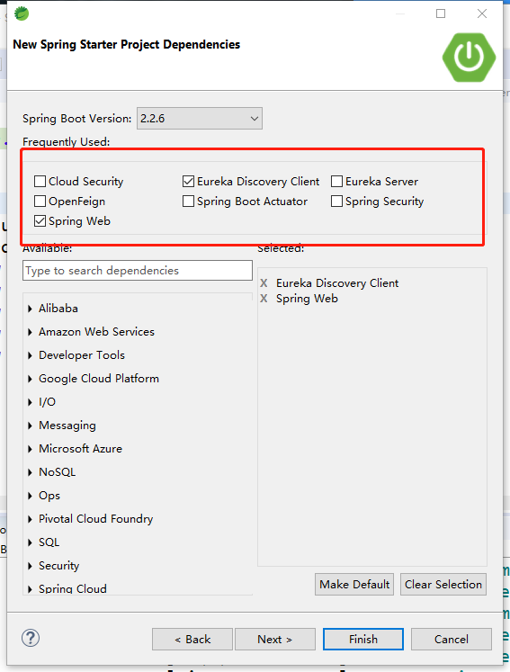
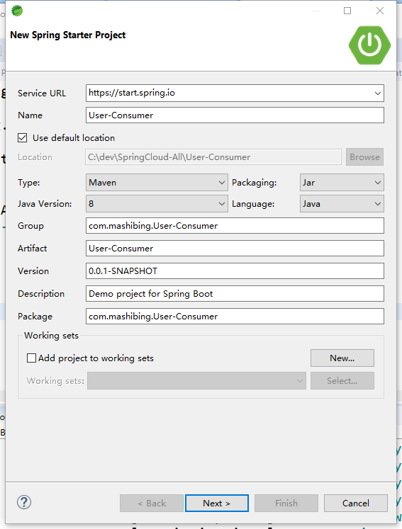
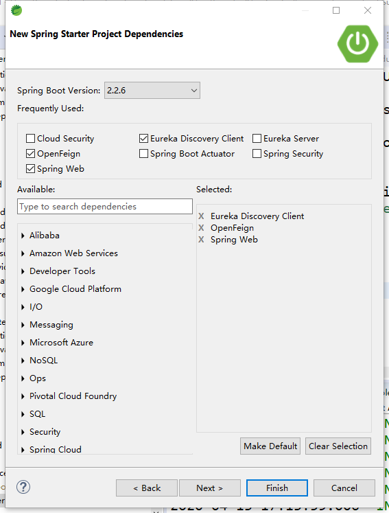

# SpringCloud 05

## Feign

OpenFeign是Netflix 开发的声明式、模板化的HTTP请求客户端。可以更加便捷、优雅地调用http api。

OpenFeign会根据带有注解的函数信息构建出网络请求的模板，在发送网络请求之前，OpenFeign会将函数的参数值设置到这些请求模板中。

feign主要是构建微服务消费端。只要使用OpenFeign提供的注解修饰定义网络请求的接口类，就可以使用该接口的实例发送RESTful的网络请求。还可以集成Ribbon和Hystrix，提供负载均衡和断路器。

英文表意为“假装，伪装，变形”， 是一个 Http 请求调用的轻量级框架，可以以 Java 接口注解的方式调用 Http 请求，而不用像 Java 中通过封装 HTTP 请求报文的方式直接调用。通过处理注解，将请求模板化，当实际调用的时候，传入参数，根据参数再应用到请求上，进而转化成真正的请求，这种请求相对而言比较直观。Feign 封装 了HTTP 调用流程，面向接口编程，回想第一节课的SOP。

### Feign和OpenFeign的关系

Feign本身不支持Spring MVC的注解，它有一套自己的注解

OpenFeign是Spring Cloud 在Feign的基础上支持了Spring MVC的注解，如@RequesMapping等等。
OpenFeign的`@FeignClient`可以解析SpringMVC的@RequestMapping注解下的接口，
并通过动态代理的方式产生实现类，实现类中做负载均衡并调用其他服务。


## 声明式服务调用

provider方提供公用API包，Feign通过SpringMVC的注解来加载URI

### 1.创建项目User-Provider


#### **选择依赖**



### 2.创建项目User-API

依赖 spring-boot-starter-web

#### 创建一个接口 RegisterApi

```java
package com.mashibing.UserAPI;

import org.springframework.web.bind.annotation.GetMapping;
import org.springframework.web.bind.annotation.RequestMapping;

/**
 * 用户操作相关接口
 * @author 一明哥
 *
 */
@RequestMapping("/User")
public interface RegisterApi {

	@GetMapping("/isAlive")
	public String isAlive();
}

```

### 3.User-Provider 实现API

#### 配置文件

```properties
eureka.client.service-url.defaultZone=http://euk1.com:7001/eureka/

server.port=81

spring.application.name=user-provider
```


#### 引入API

1.maven install User-Api项目

2.User-Provider的Pom.xml添加依赖

```xml
		<dependency>
				<groupId>com.mashibing.User-API</groupId>
				<artifactId>User-API</artifactId>
				<version>0.0.1-SNAPSHOT</version>
		</dependency>
```


#### 创建UserController

实现Api的接口

```java
package com.mashibing.UserProvider;

import com.mashibing.UserAPI.RegisterApi;
@RestController
public class UserController implements RegisterApi {

	@Override
	public String isAlive() {
		// TODO Auto-generated method stub
		return "ok";
	}

}

```


### 4.Consumer调用

#### 创建项目User-Consumer



#### 依赖



#### 引入API

Pom.xml添加依赖

```xml
		<dependency>
				<groupId>com.mashibing.User-API</groupId>
				<artifactId>User-API</artifactId>
				<version>0.0.1-SNAPSHOT</version>
		</dependency>
```

#### 配置文件

```properties
eureka.client.service-url.defaultZone=http://euk1.com:7001/eureka/

server.port=90

spring.application.name=consumer
```

#### 创建Service接口

```java
package com.mashibing.UserConsumer;

import org.springframework.cloud.openfeign.FeignClient;

import com.mashibing.UserAPI.RegisterApi;

@FeignClient(name = "user-provider")
public interface UserConsumerService extends RegisterApi {

}

```

#### 创建Controller

```
package com.mashibing.UserConsumer;

import org.springframework.beans.factory.annotation.Autowired;
import org.springframework.web.bind.annotation.GetMapping;
import org.springframework.web.bind.annotation.RestController;

@RestController
public class ConsumerController {

	@Autowired
	UserConsumerService consumerSrv;
	
	@GetMapping("/alive")
	public String alive() {
		
		return consumerSrv.isAlive();
	}
	
}

```

#### 修改启动类

```
package com.mashibing.UserConsumer;

import org.springframework.boot.SpringApplication;
import org.springframework.boot.autoconfigure.SpringBootApplication;
import org.springframework.cloud.openfeign.EnableFeignClients;

@SpringBootApplication
@EnableFeignClients
public class UserConsumerApplication {

	public static void main(String[] args) {
		SpringApplication.run(UserConsumerApplication.class, args);
	}

}

```

### 5.测试

访问 http://localhost:90/alive 即可完成声明式远程服务调用

## Get和Post

Feign默认所有带参数的请求都是Post，想要使用指定的提交方式需引入依赖

```
        <dependency>
            <groupId>io.github.openfeign</groupId>
            <artifactId>feign-httpclient</artifactId>
        </dependency>
```


并指明提交方式

```
@RequestMapping(value = "/alived", method = RequestMethod.POST)
@GetMapping("/findById")
```

### 带参请求

```
	@GetMapping("/findById")
	public Map findById(@RequestParam("id") Integer id);
	
	@PostMapping("/register")
	public Map<String, String> reg(@RequestBody User user);
```

## 权限

feign的默认配置类是：org.springframework.cloud.openfeign.FeignClientsConfiguration。默认定义了feign使用的编码器，解码器等。

允许使用@FeignClient的configuration的属性自定义Feign配置。自定义的配置优先级高于上面的FeignClientsConfiguration。


通过权限的例子，学习feign的自定义配置。

服务提供者。上述例子开放service-valuation的权限 后，访问。

```sh
开放权限：
<!-- 安全认证 -->
<dependency>
	<groupId>org.springframework.boot</groupId>
	<artifactId>spring-boot-starter-security</artifactId>
</dependency>

@Configuration
@EnableWebSecurity
public class WebSecurityConfig extends WebSecurityConfigurerAdapter {

	@Override
	protected void configure(HttpSecurity http) throws Exception {
		// 关闭csrf
		http.csrf().disable();
		// 表示所有的访问都必须认证，认证处理后才可以正常进行
		http.httpBasic().and().authorizeRequests().anyRequest().fullyAuthenticated();
		// 所有的rest服务一定要设置为无状态，以提升操作效率和性能
		http.sessionManagement().sessionCreationPolicy(SessionCreationPolicy.STATELESS);
	}
}
		
spring: 
  security: 
    user: 
      name: root
      password: root
      
      
```

继续feign原来访问，报错。401。


有如下两种方式：

1. 自定义配置类。
2. 增加拦截器。


**自定义配置**

```sh
配置类：
public class FeignAuthConfiguration {
	
	@Bean
	public BasicAuthRequestInterceptor basicAuthRequestInterceptor() {
		return new BasicAuthRequestInterceptor("root", "root");
	}
}

在feign上加配置
@FeignClient(name = "service-valuation",configuration = FeignAuthConfiguration.class)


```

OK，可以正常访问了。


小结：如果在配置类上添加了@Configuration注解，并且该类在@ComponentScan所扫描的包中，那么该类中的配置信息就会被所有的@FeignClient共享。最佳实践是：不指定@Configuration注解（或者指定configuration，用注解忽略），而是手动：

@FeignClient(name = "service-valuation",configuration = FeignAuthConfiguration.class)


**拦截器**

```sh
import feign.RequestInterceptor;
import feign.RequestTemplate;

public class MyBasicAuthRequestInterceptor implements RequestInterceptor {

	@Override
	public void apply(RequestTemplate template) {
		// TODO Auto-generated method stub
		template.header("Authorization", "Basic cm9vdDpyb290");
	}
}

feign:
  client: 
    config:  
      service-valuation: 
        
        request-interceptors:
        - com.online.taxi.passenger.feign.interceptor.MyBasicAuthRequestInterceptor
```


代码中取消上面的配置，访问，报401.用下面的方式。

### 属性定义

1. 接上面例子，此例子和上面例子实现的功能一样。记得两者取一个即可。说明用属性而不是用属性中的configuration。

```sh
定义拦截器
public class MyBasicAuthRequestInterceptor implements RequestInterceptor {

	@Override
	public void apply(RequestTemplate template) {
		// TODO Auto-generated method stub
		template.header("Authorization", "Basic cm9vdDpyb290");
	}
}

配置文件
feign:
  client: 
    config:  
      service-valuation: 
        request-interceptors:
        - com.online.taxi.passenger.feign.interceptor.MyBasicAuthRequestInterceptor
        

```

再次访问，测试Ok。

2. 扩展

指定服务名称配置：

```sh
   feign:
     client: 
       config:  
         service-valuation: 
           connect-timeout: 5000
           read-timeout: 5000
           logger-level: full
           
```

   通用配置

```sh
   feign:
     client: 
       config:  
         default: 
           connect-timeout: 5000
           read-timeout: 5000
           logger-level: full
```

 属性配置比Java代码优先级高。也可通过配置设置java代码优先级高。

```sh
feign:
	client: 
		default-to-properties: false
```

feign在方法上可以设置：@RequestMapping,@ResponseBody。

方法中的参数可以设置：@RequestBody等等，Spring MVC中的注解。


推荐使用yml配置方式，在yml中按 代码提示键，可以看到所有配置。

## 原理

1. 主程序入口添加@EnableFeignClients注解开启对Feign Client扫描加载处理。根据Feign Client的开发规范，定义接口并加@FeignClient注解。
2. 当程序启动时，会进行包扫描，扫描所有@FeignClient注解的类，并将这些信息注入Spring IoC容器中。当定义的Feign接口中的方法被调用时，通过JDK的代理方式，来生成具体的RequestTemplate。当生成代理时，Feign会为每个接口方法创建一个RequestTemplate对象，该对象封装了HTTP请求需要的全部信息，如请求参数名、请求方法等信息都在这个过程中确定。
3. 然后由RequestTemplate生成Request，然后把这个Request交给client处理，这里指的Client可以是JDK原生的URLConnection、Apache的Http Client，也可以是Okhttp。最后Client被封装到LoadBalanceClient类，这个类结合Ribbon负载均衡发起服务之间的调用。

## 压缩

服务端provider配置

```
#服务端开启压缩
server.compression.enabled=true

```

调用方consumer配置

```
#配置请求GZIP压缩
feign.compression.request.enabled=true
#配置响应GZIP压缩
feign.compression.response.enabled=true
#单位是B
feign.compression.request.min-request-size=100
```

