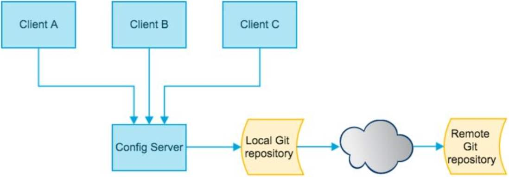

# 配置中心

### 为什么需要配置中心

单体应用，配置写在配置文件中，没有什么大问题。如果要切换环境 可以切换不同的profile（2种方式），但在微服务中。

1. 微服务比较多。成百上千，配置很多，需要集中管理。

2. 管理不同环境的配置。

3. 需要动态调整配置参数，更改配置不停服。

   

### 配置中心介绍

分布式配置中心包括3个部分：

1. 存放配置的地方：git ，本地文件 等。
2. config  server。从 1 读取配置。
3. config client。是 config server 的客户端 消费配置。



## 服务搭建

### 基于GITHUB

#### 1.创建仓库


登录GitHub创建仓库，并上传几个配置文件

#### 2.新建微服务作为配置中心服务

依赖

```
		<dependency>
			<groupId>org.springframework.cloud</groupId>
			<artifactId>spring-cloud-config-server</artifactId>
		</dependency>
		
		<dependency>
			<groupId>org.springframework.cloud</groupId>
			<artifactId>spring-cloud-starter-netflix-eureka-client</artifactId>
		</dependency>
```

配置文件

```
spring.cloud.config.server.git.uri=https://github.com/piziniao/config-center.git
spring.cloud.config.label=master

eureka.client.service-url.defaultZone=http://euk1.com:7002/eureka/
```

启动类

```
package com.mashibing.admin;

import org.springframework.boot.SpringApplication;
import org.springframework.boot.autoconfigure.SpringBootApplication;
import org.springframework.cloud.config.server.EnableConfigServer;
@EnableConfigServer
@SpringBootApplication
public class AConfigApplication {

	public static void main(String[] args) {
		SpringApplication.run(AConfigApplication.class, args);
	}

}
```

#### 3.启动测试拉取

启动服务后访问服务

http://localhost:70/master/config-client-dev.properties

正确配置后能读到来自git的配置文件

### 匹配规则

```
获取配置规则：根据前缀匹配
/{name}-{profiles}.properties
/{name}-{profiles}.yml
/{name}-{profiles}.json
/{label}/{name}-{profiles}.yml

name 服务名称
profile 环境名称，开发、测试、生产：dev qa prd
lable 仓库分支、默认master分支

匹配原则：从前缀开始。
```

### 分支读取

## 客户端配置

### 配置文件

修改 application.properties为bootstrap.properties

```properties
#直接URL方式查找配置中心
spring.cloud.config.uri=http://localhost:9999/
#通过注册中心查找
#spring.cloud.config.discovery.enabled=true
#spring.cloud.config.discovery.service-id=a-config
spring.cloud.config.profile=dev
spring.cloud.config.label=dev
```

### 引入依赖

```
		<dependency>
			<groupId>org.springframework.cloud</groupId>
			<artifactId>spring-cloud-config-client</artifactId>
		</dependency>
```

### 使用远程配置

```
	
	@Value("${config.info}")
	String info;
```

consumer-dev.properties

```
config.info="config-dev,v1"
```

## 刷新配置

### 手动配置热更新

1. 开启actuator中的refresh端点
2. Controller中添加`@RefreshScope`注解
3. 向客户端 url `http://localhost:91/actuator/refresh`发送Post请求

### 自动刷新

#### erlang安装

http://www.erlang.org/downloads

#### RabbitMQ安装

http://www.rabbitmq.com/install-windows.html

#### 环境变量

path中添加 `%ERLANG_HOME%\bin`

```bash
# 开启RabbitMQ节点
rabbitmqctl start_app
# 开启RabbitMQ管理模块的插件，并配置到RabbitMQ节点上
rabbitmq-plugins enable rabbitmq_management
```

#### 管理界面

http://localhost:15672

用户名密码均为guest

#### 服务配置

配置文件

```
spring.rabbitmq.host=localhost
spring.rabbitmq.port=5672
spring.rabbitmq.username=guest
spring.rabbitmq.password=guest
```

依赖

```
		<dependency>
			<groupId>org.springframework.cloud</groupId>
			<artifactId>spring-cloud-starter-bus-amqp</artifactId>
		</dependency>
```

#### 测试

启动两个微服务

修改配置文件后向其中一个端点发送post请求

http://localhost:91/actuator/bus-refresh

观察另一个服务是否也跟着刷新了

## 完整配置

### Config

#### application.properties

```
#################################### common config : ####################################
spring.application.name=a-config
# 应用服务web访问端口
server.port=9999
# ActuatorWeb访问端口
management.server.port=8081
management.endpoints.jmx.exposure.include=*
management.endpoints.web.exposure.include=*
management.endpoint.health.show-details=always

spring.cloud.config.server.git.uri=https://github.com/piziniao/config-center.git
spring.cloud.config.label=master

eureka.client.service-url.defaultZone=http://euk1.com:7002/eureka/


spring.rabbitmq.host=localhost
spring.rabbitmq.port=5672
spring.rabbitmq.username=guest
spring.rabbitmq.password=guest
```

#### 启动类

```
@EnableConfigServer
```

#### 依赖

```
		<dependency>
			<groupId>org.springframework.cloud</groupId>
			<artifactId>spring-cloud-starter-bus-amqp</artifactId>
		</dependency>
		
		
			<dependency>
			<groupId>org.springframework.boot</groupId>
			<artifactId>spring-boot-starter-actuator</artifactId>
		</dependency>
		
		
		<dependency>
			<groupId>org.springframework.cloud</groupId>
			<artifactId>spring-cloud-config-server</artifactId>
		</dependency>
```

### Consumer

#### bootstrap.properties

```
spring.cloud.config.discovery.enabled=true
spring.cloud.config.discovery.service-id=a-config
spring.cloud.config.profile=dev
spring.cloud.config.label=dev


spring.rabbitmq.host=localhost
spring.rabbitmq.port=5672
spring.rabbitmq.username=guest
spring.rabbitmq.password=guest
```

#### 依赖

```
		<dependency>
			<groupId>org.springframework.cloud</groupId>
			<artifactId>spring-cloud-starter-bus-amqp</artifactId>
		</dependency>
		
		<dependency>
			<groupId>org.springframework.boot</groupId>
			<artifactId>spring-boot-starter-actuator</artifactId>
		</dependency>
		
		<dependency>
			<groupId>org.springframework.cloud</groupId>
			<artifactId>spring-cloud-config-client</artifactId>
		</dependency>
```

### 远程配置

#### consumer-dev.properties

```
config.info="config-dev,v8"
```

1