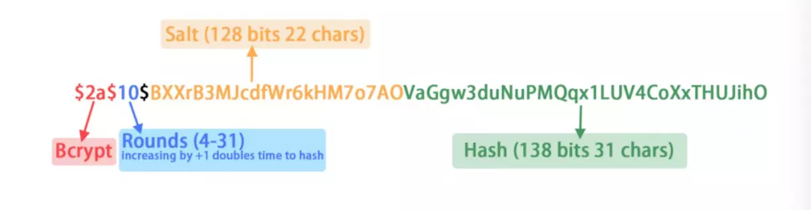
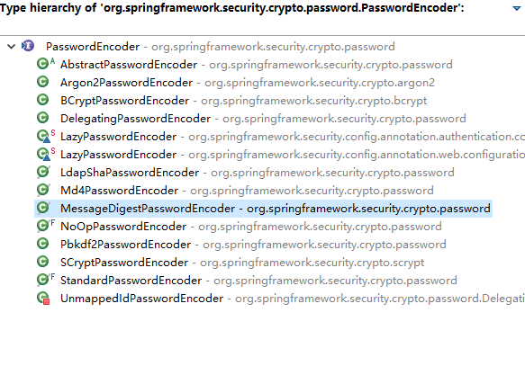
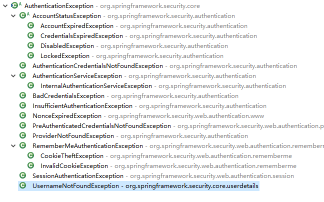

# 会话管理

## 密码存储

### 暴力破解/字典/彩虹表

常见密文存储的几种方式：

- 明文
- hash(明文)
- hash(明文 + 盐)

盐的几种实现：

- 用户名 手机号等 每个账户不一样
- 统一的盐
- 随机盐（保存数据库）
- 随机盐（从密码取）

### 防止破解

没有绝对安全的网络，即使拿不到密码 也可以发送重放攻击

- 多次加盐取hash
- 使用更复杂的单向加密算法比如Bcrypt
- 使用https
- 风控系统
  - 二次安全校验
  - 接口调用安全校验
  - 异地登录等
  - 大额转账

### Bcrypt结构




### 密码加密

接口

PasswordEncoder 

三个方法

```java
	/**
	 * Encode the raw password. Generally, a good encoding algorithm applies a SHA-1 or
	 * greater hash combined with an 8-byte or greater randomly generated salt.
	 用来加密
	 */
	String encode(CharSequence rawPassword);

	/**
	 * Verify the encoded password obtained from storage matches the submitted raw
	 * password after it too is encoded. Returns true if the passwords match, false if
	 * they do not. The stored password itself is never decoded.
	 *
	 * @param rawPassword the raw password to encode and match
	 * @param encodedPassword the encoded password from storage to compare with
	 * @return true if the raw password, after encoding, matches the encoded password from
	 * storage
	 校验密码
	 */
	boolean matches(CharSequence rawPassword, String encodedPassword);

	/**
	 * Returns true if the encoded password should be encoded again for better security,
	 * else false. The default implementation always returns false.
	 * @param encodedPassword the encoded password to check
	 * @return true if the encoded password should be encoded again for better security,
	 * else false.
	 
	 是否需要再次加密
	 */
	default boolean upgradeEncoding(String encodedPassword) {
		return false;
	}
```

实现类



### 认证方式

不加密

```
	@Bean
	PasswordEncoder passwordEncoder() {
		return NoOpPasswordEncoder.getInstance();
	}
```

BCrypt

```
	@Bean
	public BCryptPasswordEncoder passwordEncoder() {
		return new BCryptPasswordEncoder();
	}
```

## 自定义配置

### 指定登录的action

```
.loginProcessingUrl("/login")
```
### 指定登录成功后的页面

			//直接访问登录页面时返回的地址,如果访问的是登录页的话返回指定的地址
			.defaultSuccessUrl("/",true)
			 //必须返回指定地址
			.defaultSuccessUrl("/",true)

### 指定错误页

		//指定错误页
		.failureUrl("/error.html?error1")
### 注销登录

#### 默认方式

```
<a href="/logout">GET logout</a>
<br />
<form action="/logout" method="post">
    <input type="hidden" th:name="${_csrf.parameterName}" th:value="${_csrf.token}" />
    <input type="submit" value="POST Logout"/>
</form>
```

#### 自定义url

```
		.and()
		.logout()
		.logoutUrl("/out")
```

### 增加退出处理器

```

		.addLogoutHandler(new LogoutHandler() {
			
			@Override
			public void logout(HttpServletRequest request, HttpServletResponse response, Authentication authentication) {
				// TODO Auto-generated method stub
				System.out.println("退出1");
			}
		})
		
		
		.addLogoutHandler(new LogoutHandler() {
			
			@Override
			public void logout(HttpServletRequest request, HttpServletResponse response, Authentication authentication) {
				// TODO Auto-generated method stub
				System.out.println("退出2");
			}
		})
```

### 登录成功处理器

不同角色 跳转到不同页面

		.successHandler(new AuthenticationSuccessHandler() {
			
			@Override
			public void onAuthenticationSuccess(HttpServletRequest request, HttpServletResponse response,
					Authentication authentication) throws IOException, ServletException {
				// TODO Auto-generated method stub
				
				System.out.println("登录成功1");
				// 根据权限不同，跳转到不同页面
				request.getSession().getAttribute(name)
				request.getRequestDispatcher("").forward(request, response);
			}
		})
其中 Authentication 参数包含了 用户权限信息

### 登录失败处理器

```
		.failureHandler(new AuthenticationFailureHandler() {
			
			@Override
			public void onAuthenticationFailure(HttpServletRequest request, HttpServletResponse response,
					AuthenticationException exception) throws IOException, ServletException {
				// TODO Auto-generated method stub
				exception.printStackTrace();
				request.getRequestDispatcher(request.getRequestURL().toString()).forward(request, response);
			}
		})
```

可以限制登录错误次数

#### 常见登录异常



**LockedException** 账户被锁定

**CredentialsExpiredException** 密码过期

**AccountExpiredException** 账户过期

**DisabledException** 账户被禁用

**BadCredentialsException** 密码错误

**UsernameNotFoundException** 用户名错误

### 访问权限

#### 

		http.authorizeRequests()
		.antMatchers("/admin/**").hasRole("admin")
		.antMatchers("/user/**").hasRole("user")
	@Bean


权限继承
	

	RoleHierarchy roleHierarchy() {
		
		RoleHierarchyImpl impl = new RoleHierarchyImpl();
		impl.setHierarchy("ROLE_admin > ROLE_user");
		
		return impl;
		
	}