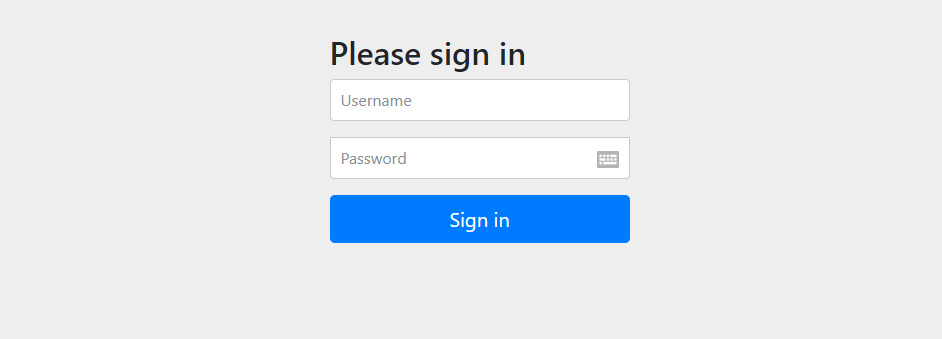

# 会话管理

## 什么是会话？，会话管理的常见技术及框架

### Session与Cookies&Token

### 浏览器同源策略与跨域

#### 同源

域名、协议、端口都会造成不同源

浏览器的同源策略是一种安全功能，同源策略限制了从同一个源加载的文档或脚本如何与来自另一个源的资源进行交互。这是一个用于隔离潜在恶意文件的重要安全机制。所以a.com下的js脚本采用ajax读取b.com里面的文件数据是会报错的。

#### 跨域

<script>、 、<iframe>、<link>、<video>这些标签都可以发起跨域请求

##### jsonp跨域访问原理

此方法只能发起GET请求，通过jsonp发送的请求，会随带 cookie 一起发送。

##### CORS

在浏览器中指定Origin来源，如果在服务器接受范围，请求则成功

CORS与JSONP的使用目的相同，但是比JSONP更强大。

JSONP只支持`GET`请求，CORS支持所有类型的HTTP请求。JSONP的优势在于支持老式浏览器，以及可以向不支持CORS的网站请求数据。

### Shiro

Shiro 是 Java 的一个安全框架。目前，使用 Apache Shiro 的人越来越多，因为它相 当简单，对比 Spring
Security，可能没有 Spring Security 做的功能强大，但是在实际工作时 可能并不需要那么复杂的东西，所以使用小而简单的Shiro 就足够了。


认证

授权

Person  Object

role

#### 核心功能

**Authentication**：身份认证/登录，验证用户是不是拥有相应的身份；

**Authorization**：授权，即权限验证，验证某个已认证的用户是否拥有某个权限；即判断用户是否能做事情，常见的如：验证某个用户是否拥有某个角色。或者细粒度的验证某个用户对某个资源是否具有某个权限；

**Session Manager**：会话管理，即用户登录后就是一次会话，在没有退出之前，它的所有信息都在会话中；会话可以是普通JavaSE环境的，也可以是如Web环境的；

**Cryptography**：加密（解密 摘要算法），保护数据的安全性，如密码加密存储到数据库，而不是明文存储；

**Web Support**：Web支持，可以非常容易的集成到Web环境；

**Caching**：缓存，比如用户登录后，其用户信息、拥有的角色/权限不必每次去查，这样可以提高效率；
**Concurrency**：shiro支持多线程应用的并发验证，即如在一个线程中开启另一个线程，能把权限自动传播过去；

**Testing**：提供测试支持；

**Run As**：允许一个用户假装为另一个用户（如果他们允许）的身份进行访问；

**Remember Me**：记住我，这个是非常常见的功能，即一次登录后，下次再来的话不用登录了。

#### 组件

**Subject**：主体，代表了当前“用户”，这个用户不一定是一个具体的人，与当前应用交互的任何东西都是Subject，如网络爬虫，机器人等；即一个抽象概念；所有Subject都绑定到SecurityManager，与Subject的所有交互都会委托给SecurityManager；可以把Subject认为是一个门面；SecurityManager才是实际的执行者；

**SecurityManager**：安全管理器；即所有与安全有关的操作都会与SecurityManager交互；且它管理着所有Subject；可以看出它是Shiro的核心，它负责与后边介绍的其他组件进行交互，如果学习过SpringMVC，你可以把它看成DispatcherServlet前端控制器；

**Realm**：域，Shiro从从Realm获取安全数据（如用户、角色、权限），就是说SecurityManager要验证用户身份，那么它需要从Realm获取相应的用户进行比较以确定用户身份是否合法；也需要从Realm得到用户相应的角色/权限进行验证用户是否能进行操作；可以把Realm看成DataSource，即安全数据源。

### Spring security

Spring Security是一个能够为基于Spring的企业应用系统提供声明式的安全访问控制解决方案的安全框架。它提供了一组可以在Spring应用上下文中配置的Bean，充分利用了Spring IoC，DI（控制反转Inversion of Control ,DI:Dependency Injection 依赖注入）和AOP（面向切面编程）功能，为应用系统提供声明式的安全访问控制功能，减少了为企业系统安全控制编写大量重复代码的工作。

它是一个轻量级的安全框架，它确保基于Spring的应用程序提供身份验证和授权支持。

它与Spring MVC有很好地集成，并配备了流行的安全算法实现捆绑在一起。安全主要包括两个操作“认证”与“验证”（有时候也会叫做权限控制）。

“认证”是为用户建立一个其声明的角色的过程，这个角色可以一个用户、一个设备或者一个系统。“验证”指的是一个用户在你的应用中能够执行某个操作。在到达授权判断之前，角色已经在身份认证过程中建立了。


Spring Security 前身是Acegi Security

### SSO

SSO 是英文 Single Sign On 的缩写，翻译过来就是单点登录

### Session共享

### Oauth

OAuth在”客户端”与”服务提供商”之间，设置了一个授权层（authorization layer）。”客户端”不能直接登录”服务提供商”，只能登录授权层，以此将用户与客户端区分开来。”客户端”登录授权层所用的令牌（token），与用户的密码不同。用户可以在登录的时候，指定授权层令牌的权限范围和有效期。

“客户端”登录授权层以后，”服务提供商”根据令牌的权限范围和有效期，向”客户端”开放用户储存的资料。

- Spring Social
- Spring Session
- JWT

### CSRF 

CSRF (Cross Site Request Forgery)攻击，中文名：跨站请求伪造。其原理是攻击者构造网站后台某个功能接口的请求地址，诱导用户去点击或者用特殊方法让该请求地址自动加载。用户在登录状态下这个请求被服务端接收后会被误以为是用户合法的操作。对于 GET 形式的接口地址可轻易被攻击，对于 POST 形式的接口地址也不是百分百安全，攻击者可诱导用户进入带 Form 表单可用POST方式提交参数的页面。

### OpenID

系统的第一部分是身份验证，即如何通过 URI 来认证用户身份。目前的网站都是依靠用户名和密码来登录认证，这就意味着大家在每个网站都需要注册用户名和密码，即便你使用的是同样的密码。如果使用 OpenID ，你的网站地址（URI）就是你的用户名，而你的密码安全的存储在一个 OpenID 服务网站上（你可以自己建立一个 OpenID 服务网站，也可以选择一个可信任的 OpenID 服务网站来完成注册）。


### CAS

中心认证服务（Central Authentication Service）SSO 仅仅是一种架构，一种设计，而 CAS 则是实现 SSO 的一种手段


## Spring Security使用

### 官网

https://spring.io/projects/spring-security


### HelloWorld

#### 依赖

```xml
		<dependency>
			<groupId>org.springframework.boot</groupId>
			<artifactId>spring-boot-starter-security</artifactId>
		</dependency>
		<dependency>
			<groupId>org.springframework.security</groupId>
			<artifactId>spring-security-test</artifactId>
			<scope>test</scope>
		</dependency>
```

#### 启动项目



启动成功后会生成一个默认密码

```
Using generated security password: 6e86c6e9-d661-41ae-aabc-bea8817c4f7b
```

接下来访问系统使用用户名 user

UserDetailsServiceAutoConfiguration类

#### 自定义用户名密码

##### 配置文件

```properties
spring.security.user.name=111
spring.security.user.password=111
```

##### 类定义

```java
@Configuration
@EnableWebSecurity
public class MyConfig extends WebSecurityConfigurerAdapter {

	@Override
	protected void configure(AuthenticationManagerBuilder auth) throws Exception {
		// TODO Auto-generated method stub
		
		auth.inMemoryAuthentication()
			.withUser("111")
			.password("222")
			.roles("admin");
	//	super.configure(auth);
	}
	
	@Bean
	PasswordEncoder passwordEncoder() {
		return NoOpPasswordEncoder.getInstance();
	}
}
```

##### 基于内存存储的多用户

```
		auth.inMemoryAuthentication()
			.withUser("111")
			.password("222")
			.roles("admin")
			.and()
			.withUser("333")
			.password("444")
			.roles("xxoo");
```


或者

```
	@Bean
	public UserDetailsService userDetailsService() {
		
		
		InMemoryUserDetailsManager manager = new InMemoryUserDetailsManager();

		User user = new User("a", new BCryptPasswordEncoder().encode("1"), true, true, true, true, Collections.singletonList(new SimpleGrantedAuthority("xx")));
		manager.createUser(user);
		manager.createUser(User.withUsername("yiming").password(new BCryptPasswordEncoder().encode("xx")).roles("xxz").build());
		return manager;
	
	}
```


### Security中的User对象

```java
	private String password;
	private final String username;
	private final Set<GrantedAuthority> authorities;
	private final boolean accountNonExpired;
	private final boolean accountNonLocked;
	private final boolean credentialsNonExpired;
	private final boolean enabled;
```

### Session中存储的对象

```
		Enumeration<String> attributeNames = request.getSession().getAttributeNames();
		
		
//		while (attributeNames.hasMoreElements()) {
//			String string = (String) attributeNames.nextElement();
//			System.out.println(string);
//			System.out.println(request.getSession().getAttribute(string));
//			
//		}
		
		SecurityContext attribute = (SecurityContext)request.getSession().getAttribute("SPRING_SECURITY_CONTEXT");
		System.out.println(attribute.getAuthentication().getAuthorities());
```


### 忽略静态请求

	@Override
	public void configure(WebSecurity web) throws Exception {
		// TODO Auto-generated method stub
		web.ignoring().antMatchers("/img/**","/js/**");
	//	super.configure(web);
	}


### 自定义登录页面

```java
	@Override
	protected void configure(HttpSecurity http) throws Exception {
		// TODO Auto-generated method stub
		http.authorizeRequests()
		//所有请求都需要验证
		.anyRequest().authenticated()
		.and()
		//permitAll 给没登录的 用户可以访问这个地址的权限
		.formLogin().loginPage("/login.html").permitAll();
	}
```

### 自定义表单属性

配置类中

```java
	@Override
	protected void configure(HttpSecurity http) throws Exception {
		// TODO Auto-generated method stub
		http.authorizeRequests()
		//所有请求都需要验证
		.anyRequest().authenticated()
		.and()
		//permitAll 给没登录的 用户可以访问这个地址的权限
		.formLogin().loginPage("/login.html")
		//自定义表单
		.usernameParameter("xx")
		.passwordParameter("oo")
		
		.loginProcessingUrl("/login")
		.failureUrl("/login.html?error")
		.defaultSuccessUrl("/").permitAll()
		.and()
		.csrf().csrfTokenRepository(new HttpSessionCsrfTokenRepository())
		
		;
	}
```

### 